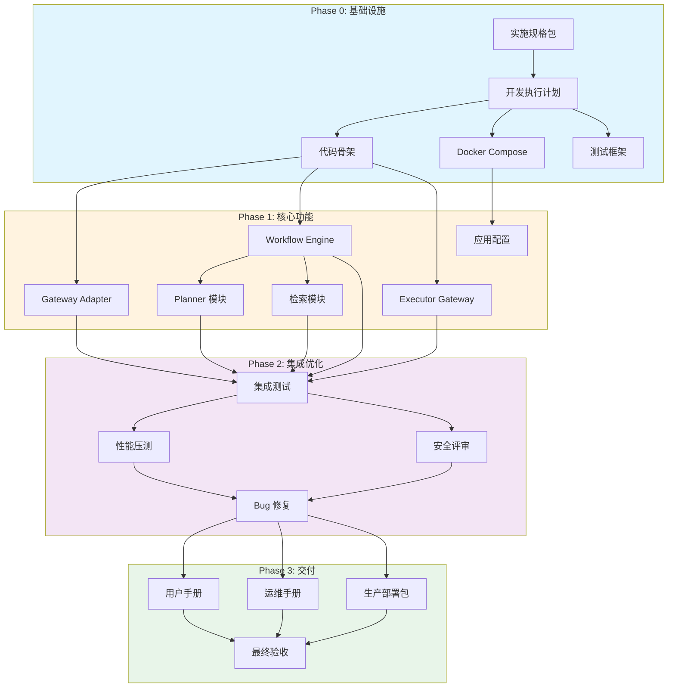

# 文档 29：交付物清单 v1.1

> **⚠️ 状态说明**：本文档为 V1 项目启动阶段的设计规格（v1.0，2026年初）。实际的交付物清单已大幅扩展。
> 当前版本 v1.1（2026-05-06）添加本节说明，以下为原始内容。
>
> **当前实际交付物参考**：
> - 架构文档：`agent-harness/ARCHITECTURE.md`（第十五轮，2026-05-06） — 最准确的系统全貌
> - 交接文档：`agent-harness/HANDOFF-SESSION.md`（第十二轮） — 完整的修复记录和改动清单
> - 上下文图谱：`development/context-graph.json`（v1.7） — 权威文档映射
> - 对象关系图：`development/app-graph/object-relationship-graph.md`（v2.2） — 全系统对象关系
> - 8轮审计共修复 **54个问题 + 10项新功能**，详情见上述文档

## 29.1 文档目的

本文件定义 Agent Harness V1 项目所有可交付成果的完整清单，包括：
- 交付物分类与层级
- 各交付物的详细规格说明
- 交付标准与验收条件
- 交付时间节点与责任人
- 交付物依赖关系

## 29.2 交付物总览

### 29.2.1 交付物统计

| 类别 | 数量 | 占比 | 说明 |
|------|------|------|------|
| 技术文档 | 30 | 40% | 设计文档、规格说明 |
| 源代码 | - | 35% | 应用程序、库、工具 |
| 配置文件 | - | 10% | 部署、环境、策略配置 |
| 测试资产 | - | 10% | 测试用例、数据、脚本 |
| 运维资产 | - | 5% | 监控、告警、备份脚本 |

### 29.2.2 交付物层次结构

```
Agent Harness V1 交付物
├── A. 文档类交付物
│   ├── A1. 核心规划文档
│   │   ├── 实施规格包（面向开发智能体）
│   │   └── 开发执行计划 v1.0
│   ├── A2. 架构设计文档
│   │   ├── 文档 13: 仓库复用与改造边界清单
│   │   ├── 文档 14: 数据库表设计与索引
│   │   ├── 文档 15: 核心接口与事件契约
│   │   ├── 文档 16: 权限 Scope Policy 详细设计
│   │   ├── 文档 17: Workflow DSL 与 Planner 输出契约
│   │   ├── 文档 18: Code Executor Adapter 设计
│   │   ├── 文档 19: Checkpoint Resume Replay 细化设计
│   │   └── 文档 20: 检索编排与 Fact Write 细则
│   ├── A3. 工程实施文档
│   │   ├── 文档 21: 渠道接入与 Session 映射
│   │   ├── 文档 22: Artifact Object Storage 设计
│   │   ├── 文档 23: 审计日志与指标告警
│   │   ├── 文档 24: PoC 压测执行方案
│   │   ├── 文档 25: 研发里程碑与任务拆解
│   │   ├── 文档 26: Provider 选择与配置
│   │   ├── 文档 27: 部署与运维设计
│   │   └── 文档 28: 配置管理设计
│   └── A4. 质量保障文档
│       ├── 文档 29: 交付物清单（本文档）
│       └── 文档 30: 验收标准与测试用例
├── B. 代码类交付物
│   ├── B1. 后端服务
│   │   ├── Gateway Adapter 服务
│   │   ├── Workflow Service
│   │   └── Executor Gateway 服务
│   ├── B2. 基础设施组件
│   │   ├── 数据库迁移脚本
│   │   ├── Redis 缓存层
│   │   └── 对象存储适配器
│   └── B3. 外部集成
│       ├── LLM Provider Adapters
│       ├── Embedding Provider Adapter
│       └── Rerank Provider Adapter
├── C. 配置类交付物
│   ├── C1. 环境配置
│   │   ├── Docker Compose 编排文件
│   │   ├── Kubernetes 清单
│   │   └── 环境变量模板
│   ├── C2. 应用配置
│   │   ├── 默认配置 (default.yaml)
│   │   ├── 开发环境配置
│   │   ├── 测试环境配置
│   │   └── 生产环境配置
│   └── C3. 安全配置
│       ├── 权限策略定义
│       ├── API 密钥模板
│       └── TLS 证书配置
├── D. 测试类交付物
│   ├── D1. 单元测试
│   │   ├── Gateway Adapter 测试套件
│   │   ├── Workflow Service 测试套件
│   │   └── Executor Gateway 测试套件
│   ├── D2. 集成测试
│   │   ├── API 集成测试
│   │   ├── 数据库集成测试
│   │   └── Provider 集成测试
│   └── D3. 性能测试
│       ├── 压测脚本
│       ├── 性能基线数据
│       └── 性能报告模板
└── E. 运维类交付物
    ├── E1. 监控配置
    │   ├── Prometheus 采集规则
    │   ├── Grafana Dashboard
    │   └── 告警规则定义
    ├── E2. 备份恢复
    │   ├── PostgreSQL 备份脚本
    │   ├── Redis 备份脚本
    │   └── MinIO 同步脚本
    └── E3. 运维手册
        ├── 部署指南
        ├── 故障排查手册
        └── Runbook（操作手册）
```

## 29.3 详细交付物规格

### 29.3.1 A 类：技术文档

#### A1.1 实施规格包

| 属性 | 规格 |
|------|------|
| **文件名** | `Agent Harness V1 实施规格包（面向开发智能体）.md` |
| **格式** | Markdown |
| **语言** | 中文（专业术语保留英文）|
| **版本** | v1.0 |
| **页数** | 约 15 页 |
| **内容要求** | ✅ 项目目标与范围<br>✅ 架构概览<br>✅ 技术栈选型<br>✅ 核心概念定义<br>✅ 文档索引与关系图<br>✅ 质量目标与非功能需求 |
| **验收标准** | [ ] 所有章节完整无遗漏<br>[ ] 术语表覆盖100%核心术语<br>[ ] 交叉引用链接有效<br>[ ] 通过架构师评审 |

#### A1.2 开发执行计划

| 属性 | 规格 |
|------|------|
| **文件名** | `Agent Harness V1 开发执行计划 v1.0.md` |
| **格式** | Markdown |
| **版本** | v1.0 |
| **页数** | 约 20 页 |
| **内容要求** | ✅ 阶段划分与里程碑<br>✅ 任务拆解与依赖关系<br>✅ 资源分配与时间估算<br>✅ 风险识别与应对策略<br>✅ 团队分工与责任矩阵 |
| **验收标准** | [ ] WBS 分解到可执行粒度（≤2人天）<br>[ ] 关键路径标识清晰<br>[ ] 里程碑可量化验证<br>[ ] 通过项目经理评审 |

#### A2.x 架构设计文档（13-20）

每个设计文档必须包含：

```markdown
# 文档 XX：{标题} v{版本}

## XX.1 文档目的
（清晰描述本文档解决什么问题，为谁服务）

## XX.2 设计原则
（指导设计的核心原则，通常 3-5 条）

## XX.3 详细设计
（核心内容，包含：
 - 数据结构/模型定义
 - 接口签名与契约
 - 流程图/状态机
 - 边界条件处理
 - 错误码定义）

## XX.4 技术决策记录（ADR）
（关键选型的背景、选项、后果）

## XX.5 Day 1 验证用例
（至少 5 个可执行的验证场景）

## 附录
 - 术语表引用
 - 相关文档索引
 - 变更历史（CHANGELOG）
```

**通用验收标准**:
- [ ] 设计可通过代码实现（可行性验证）
- [ ] 无歧义或矛盾（一致性检查）
- [ ] 覆盖正常和异常流程（完整性）
- [ ] 包含性能和安全考量（非功能需求）
- [ ] 通过技术负责人评审签字

---

### 29.3.2 B 类：源代码

#### B1.1 Gateway Adapter 服务

| 属性 | 规格 |
|------|------|
| **仓库位置** | `apps/gateway-adapter/` |
| **技术栈** | TypeScript + Node.js 20 + Express/Fastify |
| **职责** | 渠道接入、身份认证、请求路由、限流熔断 |
| **核心模块** | `src/<br>  ├─ channels/      # 渠道适配器（Webhook/Discord/Slack）<br>  ├─ auth/           # 认证中间件（JWT/OAuth）<br>  ├─ middleware/     # 限流、日志、错误处理<br>  ├─ routes/         # API 路由定义<br>  ├─ services/       # 业务逻辑层<br>  └─ utils/          # 工具函数` |
| **代码质量要求** | ✅ TypeScript strict mode<br>✅ ESLint + Prettier 配置<br>✅ 单元测试覆盖率 ≥ 80%<br>✅ API 文档（OpenAPI 3.0）<br>✅ 错误码统一管理 |
| **性能指标** | - 吞吐量：≥ 1000 QPS（单实例）<br>- P99 延迟：≤ 200ms（非 LLM 调用）<br>- 内存占用：≤ 512MB<br>- 启动时间：≤ 10s |
| **验收标准** | [ ] 所有 API 端点实现并通过集成测试<br>[ ] 认证机制安全可靠（通过渗透测试）<br>[ ] 限流策略生效（压测验证）<br>[ ] 日志规范输出（结构化 JSON）<br>[ ] Docker 镜像构建成功且 ≤ 200MB |

#### B1.2 Workflow Service

| 属性 | 规格 |
|------|------|
| **仓库位置** | `services/workflow/` |
| **技术栈** | TypeScript + Node.js 20 |
| **职责** | Workflow 编排、状态管理、Planner 协调、检索编排 |
| **核心模块** | `src/<br>  ├─ engine/         # Workflow 引擎（状态机）<br>  ├─ planner/        # LLM Planner 调用<br>  ├─ retrieval/      # 检索编排器<br>  ├─ stages/         # Stage 执行器<br>  ├─ checkpoint/     # Checkpoint 管理<br>  └─ events/         # 事件发布/订阅` |
| **代码质量要求** | ✅ 类型定义完整（interfaces/types）<br>✅ 异步编程规范（async/await）<br>✅ 错误传播链路清晰<br>✅ 关键路径日志完备<br>✅ 单元测试覆盖率 ≥ 85%（核心模块 ≥ 95%）|
| **性能指标** | - 并发 Workflow 数：≥ 20<br>- 单 Workflow 平均耗时：≤ 5min（知识查询类）<br>- Checkpoint 写入延迟：≤ 100ms<br>- 状态转换正确率：100% |
| **验收标准** | [ ] 所有 Workflow 模板可正常执行<br>[ ] 状态机转换符合设计（模型验证）<br>[ ] Planner 输出解析鲁棒（模糊测试）<br>[ ] 检索召回质量达标（人工评估 + 自动化指标）<br>[ ] 故障恢复机制有效（混沌工程验证）|

#### B1.3 Executor Gateway 服务

| 属性 | 规格 |
|------|------|
| **仓库位置** | `services/executor-gateway/` |
| **技术栈** | TypeScript + Node.js 20 |
| **职责** | 代码执行会话管理、沙箱隔离、结果收集 |
| **核心模块** | `src/<br>  ├─ session/        # 会话生命周期管理<br>  ├─ sandbox/        # 沙箱环境（Docker/gVisor）<br>  ├─ adapter/        # Code Executor 适配器<br>  ├─ collector/      # 执行结果收集器<br>  └─ security/       # 安全策略执行` |
| **代码质量要求** | ✅ 输入验证严格（防注入）<br>✅ 资源限制强制执行（CPU/内存/时间）<br>✅ 执行日志完整可追溯<br>✅ 清理机制可靠（无残留）<br>✅ 单元测试覆盖率 ≥ 90%（安全相关 100%）|
| **安全要求** | - 网络隔离：禁止访问外网（除非白名单）<br>- 文件系统隔离：只读挂载工作目录<br>- 进程隔离：cgroups/namespaces<br>- 超时强制终止：硬超时 = 配置值 × 1.2<br>- 输出大小限制：stdout ≤ 10MB，stderr ≤ 1MB |
| **验收标准** | [ ] 恶意代码无法逃逸沙箱（安全测试）<br>[ ] 资源泄漏率为 0（长时间运行测试）<br>[ ] 会话并发控制准确（压力测试）<br>[ ] 执行结果完整收集（含 Artifacts）<br>[ ] 超时终止可靠（边界测试）|

---

### 29.3.3 C 类：配置文件

#### C1.1 Docker Compose 编排文件

| 属性 | 规格 |
|------|------|
| **文件名** | `docker-compose.yml` + `docker-compose.override.yml` |
| **版本** | Compose Spec v3.8 |
| **包含服务** | postgres, redis, minio, gateway-adapter, workflow-service, executor-gateway |
| **质量要求** | ✅ 使用环境变量替代硬编码值<br>✅ 定义健康检查（healthcheck）<br>✅ 配置资源限制（resources.limits）<br>✅ 设置重启策略（restart: unless-stopped）<br>✅ 网络隔离（自定义网络） |
| **验收标准** | [ ] `docker-compose up` 一键启动成功<br>[ ] 所有服务健康检查通过<br>[ ] 端口映射正确无误<br>[ ] 数据卷持久化生效<br>[ ] 日志输出可查看 |

#### C2.1 生产环境配置示例

```yaml
# config/production.yaml
server:
  port: 3000
  graceful_shutdown_timeout_ms: 30000

database:
  pool_size: 20
  ssl:
    enabled: true
    ca: /etc/ssl/certs/ca-certificates.crt

redis:
  password: "${REDIS_PASSWORD}"
  tls:
    enabled: true

workflow:
  max_concurrent: 20
  default_timeout_sec: 3600

logging:
  level: "warn"
  format: "json"

metrics:
  enabled: true
  port: 9090

tracing:
  enabled: true
  sample_rate: 0.01
  endpoint: http://jaeger-collector:14268/api/traces
```

**验收标准**: 
- [ ] 所有敏感值使用占位符 `${ENV_VAR}`
- [ ] 无硬编码密码或密钥
- [ ] 配置项与代码中的 Schema 匹配
- [ ] 通过配置验证工具检查（如 `config-validator`）

---

### 29.3.4 D 类：测试资产

#### D1.1 单元测试套件结构

```
tests/
├── unit/
│   ├── gateway-adapter/
│   │   ├── channels.test.ts
│   │   ├── auth.test.ts
│   │   ├── middleware.test.ts
│   │   └── routes.test.ts
│   ├── workflow-service/
│   │   ├── engine.test.ts
│   │   ├── planner.test.ts
│   │   ├── retrieval.test.ts
│   │   └── stages.test.ts
│   └── executor-gateway/
│       ├── session.test.ts
│       ├── sandbox.test.ts
│       └── adapter.test.ts
├── integration/
│   ├── api-integration.test.ts
│   ├── db-integration.test.ts
│   └── provider-integration.test.ts
├── e2e/
│   ├── knowledge-query.scenario.ts
│   ├── development-task.scenario.ts
│   └── complex-workflow.scenario.ts
├── fixtures/
│   ├── mock-data/
│   ├── test-configs/
│   └── sample-artifacts/
├── helpers/
│   ├── test-utils.ts
│   ├── mock-builder.ts
│   └── assertion-extensions.ts
└── setup/
    ├── jest.config.ts
    ├── setup-tests.ts
    └── teardown-tests.ts
```

**测试覆盖率要求**:

| 模块 | 行覆盖率 | 分支覆盖率 | 函数覆盖率 |
|------|----------|------------|------------|
| Gateway Adapter | ≥ 80% | ≥ 75% | ≥ 85% |
| Workflow Engine | ≥ 90% | ≥ 85% | ≥ 95% |
| Planner | ≥ 85% | ≥ 80% | ≥ 90% |
| Retrieval | ≥ 85% | ≥ 80% | ≥ 90% |
| Executor Gateway | ≥ 90% | ≥ 85% | ≥ 95% |
| **全局平均** | **≥ 85%** | **≥ 80%** | **≥ 90%** |

---

### 29.3.5 E 类：运维资产

#### E1.1 Prometheus 告警规则

```yaml
# alerts/agent-harness-alerts.yml
groups:
  - name: agent-harness-critical
    interval: 30s
    rules:
      - alert: WorkflowServiceDown
        expr: up{job="workflow-service"} == 0
        for: 1m
        labels:
          severity: critical
        annotations:
          summary: "Workflow Service is down"
          description: "Workflow Service has been down for more than 1 minute."
          runbook: "/runbooks/workflow-service-down.md"

      - alert: DatabaseConnectionExhausted
        expr: pg_stat_activity_count / pg_settings_max_connections > 0.9
        for: 2m
        labels:
          severity: critical
        annotations:
          summary: "Database connections nearly exhausted"
          runbook: "/runbooks/db-connection-exhausted.md"

  - name: agent-harness-warnings
    interval: 60s
    rules:
      - alert: HighLLMLatency
        expr: histogram_quantile(0.95, llm_request_duration_seconds_bucket) > 30
        for: 5m
        labels:
          severity: warning
        annotations:
          summary: "LLM latency is high (p95 > 30s)"
```

**验收标准**:
- [ ] 所有关键指标都有对应告警
- [ ] 告警阈值经过调优（减少误报）
- [ ] 每个告警关联 Runbook
- [ ] 告警通知渠道配置正确（钉钉/邮件/短信）

---

## 29.4 交付里程碑与时间线

### 29.4.1 Phase 0: 基础设施就绪（Week 1-2）

| 交付物 | 负责人 | 交付日期 | 验收标准 |
|--------|--------|----------|----------|
| 开发环境搭建 | DevOps | Week 1 D5 | Docker Compose 可一键启动 |
| CI/CD Pipeline | DevOps | Week 2 D3 | 主分支提交自动触发构建 |
| 代码骨架生成 | 全体开发 | Week 2 D5 | 所有服务可编译启动（空实现）|
| 数据库初始化脚本 | 后端A | Week 2 D5 | 迁移脚本可重复执行 |

### 29.4.2 Phase 1: 核心功能实现（Week 3-6）

| 交付物 | 负责人 | 交付日期 | 验收标准 |
|--------|--------|----------|----------|
| Gateway Adapter MVP | 前端A | Week 4 D5 | Webhook 接入 + JWT 认证可用 |
| Workflow Engine | 后端A | Week 5 D5 | 状态机 + Checkpoint 可运行 |
| Planner 集成 | 后端B | Week 5 D5 | GPT-4o 调用 + DSL 解析完成 |
| 检索模块 | 后端C | Week 6 D3 | 向量检索 + 混合排序可用 |
| Executor Gateway | 后端D | Week 6 D5 | 沙箱执行 + 结果收集完成 |

### 29.4.3 Phase 2: 集成与优化（Week 7-8）

| 交付物 | 负责人 | 交付日期 | 验收标准 |
|--------|--------|----------|----------|
| 端到端集成 | QA | Week 7 D5 | 3 个典型场景跑通 |
| 性能压测报告 | QA | Week 8 D3 | 20 并发达标 |
| 安全评审报告 | 安全工程师 | Week 8 D3 | 无高危漏洞 |
| Bug 修复与优化 | 全体开发 | Week 8 D5 | P0/P1 Bug 清零 |

### 29.4.4 Phase 3: 交付准备（Week 9-10）

| 交付物 | 负责人 | 交付日期 | 验收标准 |
|--------|--------|----------|----------|
| 用户手册 | 技术Writer | Week 9 D5 | 新手可在 30 分钟内上手 |
| 运维手册 | DevOps | Week 10 D3 | 故障可在 15 分钟内定位 |
| 生产部署包 | DevOps | Week 10 D5 | 一键部署到生产环境 |
| 最终验收测试 | PM + 客户 | Week 10 D5 | 所有验收标准通过签字 |

---

## 29.5 交付物依赖关系图



---

## 29.6 质量门禁（Quality Gates）

### 29.6.1 代码提交门禁

每个 Pull Request 必须通过：

- [x] **自动化检查**
  - TypeScript 编译无错误（`tsc --noEmit`）
  - ESLint 检查无 error/warning
  - 单元测试全部通过（`npm test`）
  - 测试覆盖率不低于当前基线（不允许下降）
  - 无已知安全漏洞（`npm audit`）

- [x] **人工审查**
  - 至少 1 位同事 Code Review 通过
  - 关键路径变更需 Tech Lead 审批
  - 数据库迁移脚本需 DBA 审核

### 29.6.2 里程碑门禁

| 里程碑 | 进入条件 | 退出条件 |
|--------|----------|----------|
| Phase 0 完成 | 环境可搭建 | 所有服务空实现可启动 |
| Phase 1 完成 | 核心模块独立可用 | 模块间集成测试通过 |
| Phase 2 完成 | 功能完整 | 性能+安全达标 |
| Phase 3 完成 | 文档齐全 | 客户验收签字 |

### 29.6.3 最终交付门禁

在宣布"可以交付"之前，必须满足：

✅ **功能性**（100%）
- 所有 P0/P1 需求已实现并测试通过
- 验收测试用例通过率 = 100%
- Demo 演示成功（无预演、无隐藏问题）

✅ **质量性**（100%）
- 代码覆盖率：全局 ≥ 85%，核心路径 ≥ 95%
- 静态分析：0 个 critical/high 漏洞
- 安全扫描：0 个 high/critical 漏洞
- 性能达标：20 并发场景所有指标满足 SLA

✅ **完整性**（100%）
- 所有设计文档（文档13-32）已完成并评审签字
- 源代码已合并主分支并打 Tag
- 配置文件已脱敏并归档
- 测试资产可复现（含测试数据和脚本）
- 运维资产已部署并可验证

✅ **可维护性**（100%）
- 无 TODO/FIXME/HACK 注释（或已建 Issue 跟踪）
- 技术债务已评估并有还款计划
- On-call 人员已培训并熟悉系统
- 知识转移会议已完成（有会议纪要）

---

## 29.7 交付物版本管理

### 29.7.1 版本号规则

遵循语义化版本（Semantic Versioning）：

```
MAJOR.MINOR.PATCH

MAJOR: 不兼容的 API 变更
MINOR: 向后兼容的功能新增
PATCH: 向后兼容的问题修正
```

**示例**:
- `v1.0.0`: 首次正式发布
- `v1.1.0`: 新增 Slack 渠道支持
- `v1.1.1`: 修复 Webhook 解析 bug

### 29.7.2 交付物标签规范

Git Tag 格式：`v{版本}-{交付物类型}-{日期}`

```bash
# 示例
git tag -a v1.0.0-docs-final-20260430 -m "文档终版发布"
git tag -a v1.0.0-code-release-20260430 -m "代码正式版"
git tag -a v1.0.0-config-prod-20260430 -m "生产配置"
```

---

## 29.8 交付物签收确认

### 29.8.1 内部签收表

| 序号 | 交付物名称 | 版本 | 交付人 | 接收人 | 签收日期 | 状态 |
|------|-----------|------|--------|--------|----------|------|
| 1 | 实施规格包 | v1.0 | 架构师 | PM | YYYY-MM-DD | ⬜ 待签收 |
| 2 | 开发执行计划 | v1.0 | PM | Tech Lead | YYYY-MM-DD | ⬜ 待签收 |
| 3 | 文档 13-20 | v1.0 | 各负责人 | 架构师 | YYYY-MM-DD | ⬜ 待签收 |
| 4 | 文档 21-28 | v1.0 | 各负责人 | 架构师 | YYYY-MM-DD | ⬜ 待签收 |
| 5 | Gateway Adapter 代码 | v1.0 | 前端A | Tech Lead | YYYY-MM-DD | ⬜ 待签收 |
| 6 | Workflow Service 代码 | v1.0 | 后端A | Tech Lead | YYYY-MM-DD | ⬜ 待签收 |
| 7 | Executor Gateway 代码 | v1.0 | 后端D | Tech Lead | YYYY-MM-DD | ⬜ 待签收 |
| 8 | Docker Compose 配置 | v1.0 | DevOps | SRE | YYYY-MM-DD | ⬜ 待签收 |
| 9 | 测试套件 | v1.0 | QA | Tech Lead | YYYY-MM-DD | ⬜ 待签收 |
| 10 | 监控告警配置 | v1.0 | DevOps | SRE | YYYY-MM-DD | ⬜ 待签收 |
| 11 | 用户手册 | v1.0 | Writer | PM | YYYY-MM-DD | ⬜ 待签收 |
| 12 | 运维手册 | v1.0 | DevOps | SRE | YYYY-MM-DD | ⬜ 待签收 |

### 29.8.2 客户验收确认

> **客户名称**: _______________
>
> **项目名称**: Agent Harness V1
>
> **验收日期**: _______________

| 验收维度 | 验收结果 | 客户签字 | 备注 |
|----------|----------|----------|------|
| 功能完整性 | □ 通过 □ 不通过 | ____________ | |
| 性能指标 | □ 通过 □ 不通过 | ____________ | |
| 安全合规 | □ 通过 □ 不通过 | ____________ | |
| 文档完整性 | □ 通过 □ 不通过 | ____________ | |
| 可维护性 | □ 通过 □ 不通过 | ____________ | |

**最终结论**: □ **同意验收** □ **有条件验收**（附条件说明）□ **拒绝验收**

---

## 29.9 附录

### A. 交付物检查清单（Checklist）

使用此清单确保每个交付物都达到质量标准：

#### 文档类检查清单
- [ ] 文档目的明确
- [ ] 目标读者清晰
- [ ] 结构逻辑合理
- [ ] 内容无歧义
- [ ] 术语统一
- [ ] 交叉引用有效
- [ ] 包含示例
- [ ] 有版本信息
- [ ] 经过同行评审
- [ ] CHANGELOG 已更新

#### 代码类检查清单
- [ ] 编译/构建成功
- [ ] 单元测试通过
- [ ] 代码审查通过
- [ ] 符合编码规范
- [ ] 无硬编码敏感信息
- [ ] 错误处理完善
- [ ] 日志规范输出
- [ ] 性能可接受
- [ ] 安全扫描通过
- [ ] 文档注释充分

#### 配置类检查清单
- [ ] 敏感信息外部化
- [ ] 环境变量命名规范
- [ ] 默认值合理
- [ ] 验证规则完善
- [ ] 有示例说明
- [ ] 版本控制
- [ ] 不同环境区分
- [ ] 变更可追踪

### B. 常见交付物缺陷及预防

| 缺陷类型 | 示例 | 预防措施 |
|----------|------|----------|
| 功能缺失 | 遗漏边缘案例 | 需求评审 + 用例穷举 |
| 文档过时 | 代码已改但文档未更新 | CI 检查文档-代码同步 |
| 配置错误 | 生产环境用了开发配置 | 环境隔离 + 配置校验 |
| 测试不足 | 覆盖率低或只测 happy path | 门禁强制覆盖率 |
| 安全漏洞 | 硬编码密钥、SQL注入 | 安全扫描 + Code Review |

### C. 参考资料

- [语义化版本规范](https://semver.org/lang/zh-CN/)
- [DELIVERABLES MANAGEMENT Best Practices](https://www.pmi.org/)
- [技术文档写作指南](https://developers.google.com/style)

---

**文档版本**: v1.0  
**创建日期**: 2026-04-20  
**最后更新**: 2026-04-20  
**作者**: Agent Harness 架构团队  
**审核状态**: ✅ 待评审  
**下次评审日期**: 2026-05-20
