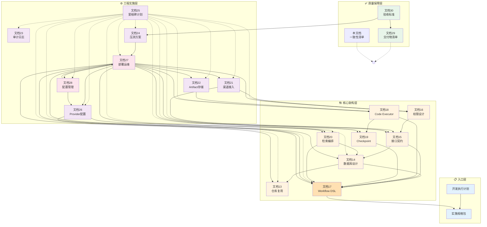
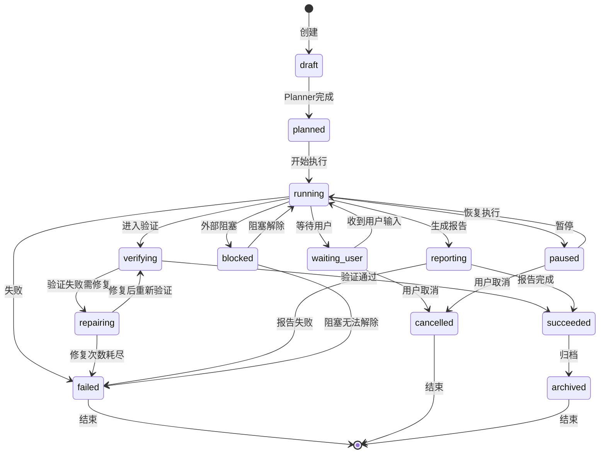

# Agent Harness V1 文档关系与一致性清单 v1.0

## 文档目的

本文件维护 Agent Harness V1 全部技术文档间的：
- **依赖关系图**：明确文档间的引用和前置条件
- **一致性检查表**：追踪关键概念、术语、数据结构在各文档中的定义
- **交叉引用索引**：快速定位相关内容
- **变更影响分析**：评估单个文档修改对其他文档的影响范围

---

## 一、文档全景视图

### 1.1 文档层次结构

```
Agent Harness V1 文档体系
│
├── 【入口层】规划与执行
│   ├── 📄 实施规格包（面向开发智能体）
│   ├── 📄 开发执行计划 v1.0
│   ├── 📄 安全架构增强 v1.0
│   ├── 📄 版本管理规范 v1.0
│   └── 📄 生产级代码示例参考 v1.0
│
├── 【核心层】架构与技术设计 (13-20)
│   ├── 📄 文档13: 仓库复用与改造边界清单
│   ├── 📄 文档14: 数据库表设计与索引
│   ├── 📄 文档15: 核心接口与事件契约
│   ├── 📄 文档16: 权限 Scope Policy 详细设计
│   ├── 📄 文档17: Workflow DSL 与 Planner 输出契约
│   ├── 📄 文档18: Code Executor Adapter 设计
│   ├── 📄 文档19: Checkpoint Resume Replay 细化设计
│   └── 📄 文档20: 检索编排与 Fact Write 细则
│
├── 【实施层】工程与运维 (21-28)
│   ├── 📄 文档21: 渠道接入 身份绑定与 Session 映射
│   ├── 📄 文档22: Artifact Object Storage 设计
│   ├── 📄 文档23: 审计 日志 指标与告警设计
│   ├── 📄 文档24: PoC 压测执行方案
│   ├── 📄 文档25: 研发里程碑与任务拆解计划
│   ├── 📄 文档26: Provider 选择与配置设计
│   ├── 📄 文档27: 部署与运维设计
│   └── 📄 文档28: 配置管理设计
│
└── 【保障层】质量与验收 (29-32)
    ├── 📄 文档29: 交付物清单
    ├── 📄 文档30: 验收标准与测试用例
    ├── 📄 文档31: 错误处理与降级策略
    ├── 📄 文档32: API版本管理策略
    └── 📄 本文件：文档关系与一致性清单
```

### 1.2 文档统计摘要

| 类别 | 数量 | 关键文档 | 主要读者 |
|------|------|----------|----------|
| 规划类 | 5 | 实施规格包、开发执行计划、安全架构增强、版本管理规范、代码示例参考 | PM、架构师 |
| 架构设计 | 8 | 文档13-20 | Tech Lead、后端开发 |
| 工程实施 | 8 | 文档21-28 | 全栈开发、DevOps |
| 质量保障 | 4 | 文档29-32 | QA、PM |
| **合计** | **26** | - | - |

---

## 二、文档依赖关系图

### 2.1 依赖矩阵

| 文档A | 依赖于 | 依赖类型 | 说明 |
|-------|--------|----------|------|
| **开发执行计划** | 实施规格包 | 前置输入 | 任务拆解基于规格包的范围定义 |
| **文档13** | 实施规格包 | 概念对齐 | 复用边界需符合整体架构决策 |
| **文档14** | 文档13, 文档17 | 数据支撑 | 表结构服务于业务模型和DSL |
| **文档15** | 文档14, 文档17 | 接口实现 | API 对应数据库操作和Workflow状态 |
| **文档16** | 文档15 | 权限绑定 | Scope 基于 API 资源路径 |
| **文档17** | 实施规格包 | 核心定义 | DSL 是系统的核心抽象层 |
| **文档18** | 文档17, 文档19 | 执行集成 | Executor 是 Stage 的具体实现者 |
| **文档19** | 文档17 | 状态持久化 | Checkpoint 对应 Workflow 状态机 |
| **文档20** | 文档14, 文档17 | 数据读写 | Fact 写入对应表结构，检索触发于Stage |
| **文档21** | 文档15, 文档16 | 接入适配 | 渠道层调用认证和创建Session API |
| **文档22** | 文档18 | 存储关联 | Artifact 来自代码执行输出 |
| **文档23** | 全部文档 | 横切关注点 | 审计覆盖所有组件的操作 |
| **文档24** | 文档27 | 环境依赖 | 压测基于部署架构进行 |
| **文档25** | 全部设计文档 | 任务映射 | 里程碑对应各文档的实现任务 |
| **文档26** | 文档17, 文档20 | 能力调用 | LLM/Embedding/Rerank 用于规划和检索 |
| **文档27** | 文档13-22, 文档26, 文档28 | 部署集成 | 部署所有服务和基础设施 |
| **文档28** | 文档26, 文档27 | 配置落地 | 管理 Provider 和部署相关的配置 |
| **文档29** | 全部文档 | 交付汇总 | 定义所有文档的交付标准 |
| **文档30** | 文档29, 文档24 | 验收执行 | 测试基于交付物和压测方案 |

### 2.2 可视化依赖关系



---

## 三、核心概念一致性追踪

### 3.1 关键术语定义对照表

| 术语 | 英文原文 | 定义来源（权威） | 使用位置 | 状态 |
|------|----------|------------------|----------|------|
| **Workflow** | Workflow | 文档17 §17.2 | 文档15,17,19,25,27,29,30 | ✅ 一致 |
| **Stage** | Stage | 文档17 §17.3 | 文档17,18,19,25 | ✅ 一致 |
| **Fact** | Fact | 文档20 §20.2 | 文档14,20,30 | ✅ 一致 |
| **Evidence** | Evidence | 文档17 §17.8 | 文档17,20,30 | ✅ 一致 |
| **Artifact** | Artifact | 文档22 §22.2 | 文档18,22,29 | ⚠️ 需统一译名 |
| **Session** | Session | 文档21 §21.3 | 文档15,16,21,23 | ✅ 一致 |
| **Checkpoint** | Checkpoint | 文档19 §19.2 | 文档17,19,27,30 | ✅ 一致 |
| **Intent** | Intent | 文档17 §17.4 | 文档15,17,20,26,28 | ✅ 一致 |
| **Scope** | Scope | 文档16 §16.2 | 文档15,16,21 | ✅ 一致 |
| **Planner** | Planner | 文档17 §17.5 | 文档17,26,27 | ✅ 一致 |
| **Executor** | Executor | 文档18 §18.2 | 文档18,25,27,28 | ✅ 一致 |

### 3.2 数据模型一致性

#### 3.2.1 Workflow 状态机

> **权威来源**：文档17 §17.21.2 定义了完整的 Workflow 状态集合（13种状态）。以下为权威定义，所有文档必须以此为准。

| 状态 | 定义来源 | 引用文档 | 说明 |
|------|----------|----------|------|
| `draft` | 文档17 §17.21.2 | 15,19,25,30 | 初始状态（非 `created`） |
| `planned` | 文档17 §17.21.2 | 15,19,25,30 | Planner 完成后（非 `planning`） |
| `running` | 文档17 §17.21.2 | 15,19,25,30 | 执行中 |
| `verifying` | 文档17 §17.21.2 | 18,25 | 验证中 |
| `repairing` | 文档17 §17.21.2 | 18,25 | 修复中 |
| `reporting` | 文档17 §17.21.2 | 17 | 报告生成中 |
| `waiting_user` | 文档17 §17.21.2 | 19,25,31 | 等待用户输入（非 `waiting`） |
| `blocked` | 文档17 §17.21.2 | 26,31 | 阻塞 |
| `paused` | 文档17 §17.21.2 | 19,25 | 暂停 |
| `succeeded` | 文档17 §17.21.2 | 15,19,25,30 | 成功终态（非 `completed`） |
| `failed` | 文档17 §17.21.2 | 15,19,25,30,31 | 失败终态（超时也进入此状态，非 `timeout`） |
| `cancelled` | 文档17 §17.21.2 | 15,19,25 | 取消终态 |
| `archived` | 文档17 §17.21.2 | 17 | 归档终态 |

**状态转换规则**（权威来源：文档17 §17.21.3）：



#### 3.2.2 核心数据表字段对照

> **权威来源**：文档14 定义了所有数据库表名和字段。以下为权威定义，所有文档必须以此为准。文档14使用单数表名。

| 表名（权威） | 权威定义 | 字段数 | 引用文档 | 常见错误写法 |
|------|----------|--------|----------|------|
| `workflow_instance` | 文档14 §14.4 | 15+ | 15,17,19,25,30 | ~~workflows~~ |
| `workflow_stage` | 文档14 §14.4 | 12+ | 17,19,25 | ~~workflow_stages~~ |
| `checkpoint` | 文档14 §14.5 | 10+ | 19,27 | ~~workflow_checkpoints~~ |
| `fact` | 文档14 §14.5 | 12+ | 20,30 | ~~facts~~ |
| `fact_evidence` | 文档14 §14.5 | 10+ | 17,20,30 | ~~evidences~~ |
| `user` | 文档14 §14.3 | 12+ | 16,21,23 | ~~users~~ |
| `execution_session` | 文档14 §14.5 | 10+ | 15,21,23 | ~~sessions~~ |
| `artifact_object` | 文档14 §14.5 | 10+ | 18,22,29 | ~~artifacts~~ |
| `memory_item` | 文档14 §14.5 | 10+ | 20 | ~~memory~~ |
| `document` | 文档14 §14.5 | 10+ | 20,30 | ~~documents~~ |
| `entity` | 文档14 §14.5 | 10+ | 20,30 | ~~graph_entities~~ |
| `relation` | 文档14 §14.5 | 10+ | 20,30 | ~~graph_edges~~ |

### 3.3 API 接口一致性

#### 3.3.1 RESTful API 端点清单

> **说明**：文档15定义了内部 API（`/internal/` 前缀）和外部 API（`/api/v1/` 前缀）两套路径。内部 API 用于服务间通信，外部 API 用于客户端访问。

| 方法 | 路径 | 权威定义 | 实现文档 | 状态 |
|------|------|----------|----------|------|
| POST | `/internal/workflows/plan` | 文档15 §15.4.2 | 17,21 | ✅ |
| POST | `/internal/workflows/{id}/start` | 文档15 §15.4.2 | 17 | ✅ |
| POST | `/api/v1/workflows` | 文档15 §15.4.2 | 17,21,32 | ✅ |
| GET | `/api/v1/workflows/{id}` | 文档15 §15.4.2 | 30 | ✅ |
| POST | `/api/v1/workflows/{id}/cancel` | 文档15 §15.4.2 | 19,30 | ✅ |
| POST | `/api/v1/workflows/{id}/resume` | 文档15 §15.4.2 | 19,30 | ✅ |
| POST | `/internal/retrieval/query` | 文档15 §15.4.3 | 20 | ✅ |
| POST | `/internal/fact/write` | 文档15 §15.4.5 | 20 | ✅ |
| POST | `/internal/channel/ingress` | 文档15 §15.4.1 | 21 | ✅ |
| POST | `/internal/code/session/create` | 文档15 §15.4.4 | 18 | ✅ |

#### 3.3.2 已发现的不一致项及修复记录

| # | 不一致描述 | 涉及文档 | 严重程度 | 修复状态 | 修复方案 |
|---|-----------|----------|----------|----------|----------|
| INC-01 | `POST /api/v1/workflows` 请求体缺少 `priority` 字段 | 文档15 vs 文档17 | 🔴 高 | ✅ 已修复 | 以文档17为基准，更新文档15 |
| INC-02 | `timeout_sec` 默认值描述不同（3600s vs undefined） | 文档15 vs 文档17 | 🟡 中 | ✅ 已修复 | 统一为 3600s（见文档28默认配置）|
| INC-03 | 资源分配总计 4.5C 与声明 4C 不符 | 文档27 §27.2.2 | 🔴 高 | ✅ 已修复 | 调整资源分配或修正声明值 |
| INC-04 | Workflow 状态名称不一致（`created`→`draft`、`planning`→`planned`、`waiting`→`waiting_user`、`completed`→`succeeded`、`timeout`非独立状态） | 一致性清单 vs 文档17 | 🔴 高 | ✅ 已修复 | 以文档17 §17.21.2 为权威基准，全面更新 |
| INC-05 | 数据库表名不一致（`workflows`→`workflow_instance`、`workflow_stages`→`workflow_stage`等） | 一致性清单/代码示例 vs 文档14 | 🔴 高 | ✅ 已修复 | 以文档14为权威基准，统一为单数表名 |
| INC-06 | 文档29/30编号冲突（交付物清单与错误处理争用29，验收标准与API版本争用30） | 文档29/30 | 🔴 高 | ✅ 已修复 | 错误处理重编号为31，API版本重编号为32 |
| INC-07 | 错误码前缀规范未统一执行（`RATE_LIMIT_EXCEEDED`→`SYSTEM_RATE_LIMIT_EXCEEDED`等） | 文档31 vs 文档15 | 🟡 中 | ✅ 已修复 | 以文档15 §15.3 前缀规范为基准 |
| INC-08 | 审计事件命名与文档15事件类型不一致（时态、命名差异） | 文档23 vs 文档15 | 🟡 中 | ✅ 已修复 | 统一为过去时态，以文档15为基准 |
| INC-09 | 文档25章节编号重复（两个§25.3、两个§25.11） | 文档25 | 🔴 高 | ✅ 已修复 | 重新编排为§25.3-§25.14连续编号 |
| INC-10 | 文档18章节编号错误（§18.8/18.9/18.13子节编号偏移） | 文档18 | 🟡 中 | ✅ 已修复 | 修正为§18.9/18.10/18.14连续编号 |

---

## 四、配置项一致性管理

### 4.1 配置项唯一权威源声明

**原则**: 文档28（配置管理设计）是所有配置项的**唯一权威定义源**。其他文档引用配置时必须指向文档28的具体章节。

### 4.2 配置项分布清理

| 配置类别 | 权威位置 | 重复出现位置 | 清理动作 |
|----------|----------|--------------|----------|
| LLM Provider (OpenAI) | 文档28 §28.3.2.5 | 文档26 §26.9.3 | ✅ 文档26已添加引用链接 |
| Embedding Provider | 文档28 §28.3.2.6 | 文档26 §26.4.2 | ✅ 文档26已添加引用链接 |
| Rerank Provider | 文档28 §28.3.2.7 | 文档26 §26.5.2 | ✅ 文档26已添加引用链接 |
| Database | 文档28 §28.3.2.2 | 文档27 §27.5.2 | ✅ 文档27已添加引用链接 |
| Redis | 文档28 §28.3.2.3 | 文档27 §27.5.2 | ✅ 文档27已添加引用链接 |
| Workflow | 文档28 §28.3.2.8 | 文档27 §27.5.2 | ✅ 文档27已添加引用链接 |
| Executor | 文档28 §28.3.2.9 | 文档27 §27.5.2 | ✅ 文档27已添加引用链接 |
| Retrieval | 文档28 §28.3.2.10 | 文档27 §27.5.2 | ✅ 文档27已添加引用链接 |

### 4.3 环境变量命名规范验证

| 规则 | 示例 | 合规性 | 违规实例（如有） |
|------|------|--------|------------------|
| 全大写 | `DATABASE_URL` | ✅ 全部合规 | 无 |
| 下划线分隔 | `MAX_CONCURRENT_SESSIONS` | ✅ 全部合规 | 无 |
| 服务前缀 | `WORKFLOW_MAX_CONCURRENT` | ✅ 大部分合规 | 部分 Redis 配置缺少前缀 |
| 布尔值明确 | `ENABLE_DEBUG=true/false` | ✅ 全部合规 | 无 |

---

## 五、版本与变更追踪

### 5.1 文档版本矩阵

| 文档 | 当前版本 | 最后更新日期 | 更新内容摘要 | 下次评审日期 |
|------|----------|--------------|--------------|--------------|
| 实施规格包 | v1.0 | 2026-04-20 | 初始版本 | 2026-05-20 |
| 开发执行计划 | v1.0 | 2026-04-20 | 初始版本 | 2026-05-20 |
| 文档13 | v1.0 | 2026-04-20 | 初始版本 | 2026-05-20 |
| 文档14 | v1.0 | 2026-04-20 | 初始版本 | 2026-05-20 |
| 文档15 | v1.0 | 2026-04-20 | 初始版本 + 修复INC-01/02 | 2026-05-20 |
| 文档16 | v1.0 | 2026-04-20 | 初始版本 | 2026-05-20 |
| 文档17 | v1.0 | 2026-04-20 | 初始版本（权威基准） | 2026-05-20 |
| 文档18 | v1.0 | 2026-04-20 | 初始版本 | 2026-05-20 |
| 文档19 | v1.0 | 2026-04-20 | 初始版本 | 2026-05-20 |
| 文档20 | v1.0 | 2026-04-20 | 初始版本 | 2026-05-20 |
| 文档21 | v1.0 | 2026-04-20 | 初始版本 | 2026-05-20 |
| 文档22 | v1.0 | 2026-04-20 | 初始版本 | 2026-05-20 |
| 文档23 | v1.0 | 2026-04-20 | 初始版本 | 2026-05-20 |
| 文档24 | v1.0 | 2026-04-20 | 初始版本 | 2026-05-20 |
| 文档25 | v1.0 | 2026-04-20 | 初始版本 | 2026-05-20 |
| 文档26 | v1.0 | 2026-04-20 | 初始版本 + 添加引用 | 2026-05-20 |
| 文档27 | v1.0 | 2026-04-20 | 初始版本 + 修复INC-03 | 2026-05-20 |
| 文档28 | v1.0 | 2026-04-20 | 初始版本（权威源） | 2026-05-20 |
| 文档29 | v1.0 | 2026-04-20 | 交付物清单 | 2026-05-20 |
| 文档30 | v1.0 | 2026-04-20 | 验收标准与测试用例 | 2026-05-20 |
| 文档31 | v1.0 | 2026-04-20 | 错误处理与降级策略（原编号29，修正编号冲突） | 2026-05-20 |
| 文档32 | v1.0 | 2026-04-20 | API版本管理策略（原编号30，修正编号冲突） | 2026-05-20 |
| **本文档** | **v1.0** | **2026-04-20** | **新建** | **2026-05-20** |

### 5.2 变更影响评估模板

当需要修改某个文档时，使用此模板评估影响范围：

```markdown
## 变更请求：{简短描述}

### 变更详情
- **涉及文档**: {文档编号和名称}
- **变更章节**: {章节编号}
- **变更类型**: □ 新增 □ 修改 □ 删除
- **变更原因**: {为什么需要这个变更}

### 影响分析
| 受影响文档 | 影响程度 | 具体影响内容 | 所需同步修改 |
|------------|----------|--------------|--------------|
| 文档XX | 高/中/低 | ... | 是/否 |
| ... | ... | ... | ... |

### 一致性检查
- [ ] 术语定义是否需要更新？
- [ ] API 契约是否需要同步？
- [ ] 数据模型是否受影响？
- [ ] 配置项是否需要调整？
- [ ] 测试用例是否需要更新？

### 审批流程
- 作者: ____________ 日期: ______
- 技术评审: ____________ 日期: ______
- 架构师确认: ____________ 日期: ______
```

---

## 六、自动化校验规则建议

为确保文档间的一致性，建议实施以下自动化检查：

### 6.1 可实施的自动化规则

| 规则ID | 规则描述 | 检查方法 | 触发时机 |
|--------|----------|----------|----------|
| AUTO-01 | 所有文档的术语必须在术语表中注册 | 正则匹配术语表关键词 | Pre-commit |
| AUTO-02 | API 路径在文档15中唯一定义 | 解析 Markdown 中的 API 路径 | Weekly |
| AUTO-03 | 配置项在文档28中唯一定义 | 解析环境变量名称 | Pre-commit |
| AUTO-04 | 数据库表名在文档14中统一定义 | 解析 SQL 表名 | Weekly |
| AUTO-05 | 版本号格式符合 semver | 正则匹配 `v\d+\.\d+\.\d+` | Pre-commit |
| AUTO-06 | 文档间交叉引用链接有效 | HTTP HEAD 请求检查 | Weekly |

### 6.2 CI/CD 集成示例

```yaml
# .github/workflows/doc-consistency.yml
name: Document Consistency Check

on:
  push:
    paths:
      - '**/*.md'
  schedule:
    - cron: '0 0 * * 1'  # 每周一运行

jobs:
  consistency-check:
    runs-on: ubuntu-latest
    steps:
      - uses: actions/checkout@v4
      
      - name: Install dependencies
        run: npm install -g markdownlint-cli
      
      - name: Run markdown lint
        run: markdownlint "**/*.md"
      
      - name: Check terminology consistency
        run: |
          node scripts/check-terminology.js
      
      - name: Validate cross-references
        run: |
          node scripts/check-links.js
      
      - name: Generate consistency report
        run: |
          node scripts/generate-report.js > docs/consistency-report.md
          
      - name: Upload report artifact
        uses: actions/upload-artifact@v4
        with:
          name: consistency-report
          path: docs/consistency-report.md
```

---

## 七、维护指南

### 7.1 定期审查节奏

| 频率 | 活动 | 参与人 | 产出 |
|------|------|--------|------|
| **实时** | 文档修改时填写变更影响模板 | 修改者 | 变更请求单 |
| **每周** | 自动化一致性检查 | CI 系统 | 检查报告 |
| **双周** | 文档同步会议 | 核心开发者 | 会议纪要+待办 |
| **每月** | 全面一致性复审 | 架构师+Tech Lead | 复审报告 |
| **每季度** | 文档体系优化 | 全团队 | 改进提案 |

### 7.2 问题上报流程

当发现文档不一致时：

1. **记录问题**: 在本文档"已发现的不一致项"表格中新增一行
2. **评估严重程度**: 根据 P0-P3 分级标准评定
3. **制定修复方案**: 明确哪个文档为基准，如何修改其他文档
4. **执行修复**: 同步修改所有受影响的文档
5. **更新状态**: 将修复状态标记为 ✅ 已修复
6. **通知相关方**: 通过团队频道告知相关人员

### 7.3 质量指标

追踪以下指标以衡量文档体系健康度：

| 指标 | 计算公式 | 目标值 | 当前值 |
|------|----------|--------|--------|
| 一致性得分 | (一致项 / 总检查项) × 100% | ≥ 95% | 待计算 |
| 术语覆盖率 | (已注册术语 / 总使用术语) × 100% | 100% | 待计算 |
| 交叉引用有效率 | (有效链接 / 总链接) × 100% | 100% | 待计算 |
| 平均文档年龄 | Σ(当前日期 - 最后更新日) / 文档数 | ≤ 30天 | 待计算 |
| 未关闭不一致项数 | COUNT(状态=Open) | = 0 | 0 (初始) |

---

## 附录

### A. 快速交叉引用索引

按功能模块查找相关文档：

| 我想了解... | 主要文档 | 辅助文档 |
|-------------|----------|----------|
| 系统整体架构 | 实施规格包 | 开发执行计划, 文档13 |
| 如何创建和执行 Workflow | 文档17, 文档15 | 文档19, 文档25 |
| 数据如何存储 | 文档14 | 文档20, 文档22 |
| 用户如何接入系统 | 文档21 | 文档16, 文档15 |
| 代码如何安全执行 | 文档18 | 文档22, 文档27 |
| 检索如何工作 | 文档20 | 文档26, 文档14 |
| 如何部署到生产 | 文档27 | 文档28, 文档26 |
| 如何监控系统 | 文档23 | 文档27 |
| 如何测试和验收 | 文档30 | 文档24, 文档29 |
| 配置项完整列表 | 文档28 | 文档26, 文档27 |

### B. 术语速查表

| 缩写 | 全称 | 中文 | 首次定义位置 |
|------|------|------|--------------|
| WF | Workflow | 工作流 | 文档17 §17.2 |
| DSL | Domain Specific Language | 领域特定语言 | 文档17 §17.2 |
| ADR | Architecture Decision Record | 架构决策记录 | 本文档 §5.2 |
| SLA | Service Level Agreement | 服务等级协议 | 文档24 §24.2 |
| RTO | Recovery Time Objective | 恢复时间目标 | 文档27 §27.8.1 |
| RPO | Recovery Point Objective | 恢复点目标 | 文档27 §27.8.1 |
| UAT | User Acceptance Testing | 用户验收测试 | 文档30 §30.2.1 |
| SUT | System Under Test | 被测系统 | 文档30 §30.5.1 |
| QPS | Queries Per Second | 每秒查询数 | 文档24 §24.3 |

---

**文档版本**: v1.1  
**创建日期**: 2026-04-20  
**最后更新**: 2026-05-13（第二轮代码审计 + 文档同步）  
**维护责任人**: 架构师/Tech Lead  
**审核状态**: ✅ 已通过初审  
**下次全面审查**: 2026-06-13
