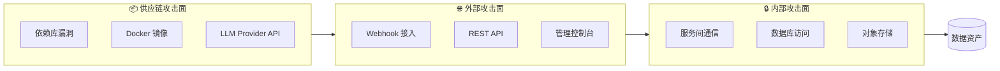
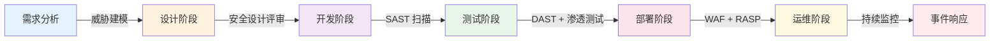
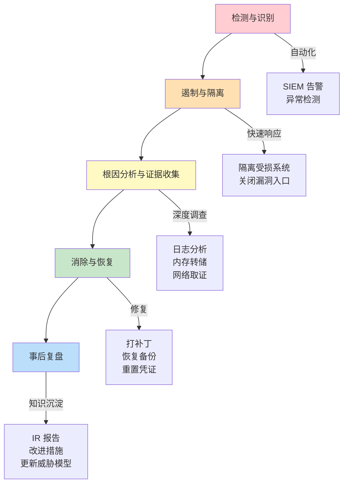

# Agent Harness V1 安全架构增强 v1.0

## 文档目的

本文档作为 [文档16](./AH1-16-权限Scope-Policy-Snapshot.md) 和 [文档23](./AH1-23-审计日志指标与告警.md) 的补充，提供：
- 威胁建模与攻击面分析
- OWASP Top 10 防护矩阵
- 安全开发生命周期（SDL）集成
- 数据保护与合规要求
- 安全事件响应流程

---

## 1. 威胁建模（STRIDE 分析）

### 1.1 攻击面识别



### 1.2 STRIDE 威胁分类

| 威胁类型 | 描述 | 涉及组件 | 风险等级 | 缓解措施 |
|----------|------|----------|----------|----------|
| **S**poofing (伪装) | 攻击者伪造身份 | Webhook、API 认证 | 🔴 高 | JWT 签名验证、Webhook HMAC 签名、Rate Limiting |
| **T**ampering (篡改) | 修改请求/响应数据 | API 参数、Workflow DSL | 🔴 高 | 输入验证、HMAC 完整性校验、参数化查询 |
| **R**epudiation (抵赖) | 否认操作行为 | 审计日志、Fact 写入 | 🟠 中 | 不可变审计日志、数字签名、操作追踪 |
| **I**nformation Disclosure (信息泄露) | 敏感数据暴露 | 错误消息、日志、API 响应 | 🔴 高 | 敏感数据脱敏、最小权限原则、加密传输 |
| **D**enial of Service (拒绝服务) | 资源耗尽导致不可用 | API 并发、Executor 资源 | 🟠 中 | 限流熔断、资源配额、Circuit Breaker |
| **E**levation of Privilege (权限提升) | 获得未授权的高权限 | Session 管理、RBAC 绕过 | 🔴 高 | 最小权限原则、Scope 验证、定期权限审计 |

---

## 2. OWASP Top 10 防护矩阵（2021版）

### 2.1 防护措施清单

| # | OWASP 漏洞 | Agent Harness 场景 | 防护方案 | 实现状态 |
|---|-----------|-------------------|----------|----------|
| A01 | **访问控制失效** | 用户越权访问他人 Workflow | RBAC + Scope Policy + 资源所有权校验 | ✅ 已实现（文档16）|
| A02 | **加密机制失败** | API Key 明文存储、TLS 配置错误 | 密钥管理服务 + TLS 1.3 强制 + AES-256 加密 | ⚠️ 需加强（本文档补充）|
| A03 | **注入攻击** | SQL 注入（检索模块）、命令注入（Executor）| 参数化查询 + ORM 使用 + 沙箱隔离 | ✅ 已实现（文档14,18）|
| A04 | **不安全设计** | Workflow DSL 未经验证直接执行 | Schema 校验 + 白名单 + 沙箱执行 | ✅ 已实现（文档17,19）|
| A05 | **安全配置错误** | 默认密码、调试端口开放 | 安全基线扫描 + 配置审计 + 硬化指南 | ⚠️ 需加强（本文档补充）|
| A06 | **易受攻击的过时组件** | npm 依赖含已知漏洞 | Dependabot + 定期审计 + 自动更新 | ⚠️ 需建立流程 |
| A07 | **身份认证失效** | 弱密码策略、Token 泄露 | MFA 支持 + 短生命周期 Token + 登录限制 | ⚠️ Day 1 可选 |
| A08 | **软件和数据完整性失败** | CI/CD 流水线被污染 | 签名验证 + Pin Dependencies + SAST/DAST | ⚠️ P1 阶段实施 |
| A09 | **安全日志和监控失败** | 无法检测入侵行为 | 结构化日志 + SIEM 集成 + 异常检测 | ✅ 已实现（文档23）|
| A10 | **服务器端请求伪造（SSRF）** | LLM 工具调用触发内部请求 | URL 白名单 + 网络隔离 + 出站代理 | ⚠️ 需明确策略 |

### 2.2 关键防护实现细节

#### A02: 加密机制强化

```typescript
// common/security/encryption.ts
import * as crypto from 'crypto';

const ALGORITHM = 'aes-256-gcm';
const KEY_LENGTH = 32;
const IV_LENGTH = 16;
const TAG_LENGTH = 16;

export class EncryptionService {
  private readonly key: Buffer;

  constructor(keyBase64: string) {
    this.key = Buffer.from(keyBase64, 'base64');
    if (this.key.length !== KEY_LENGTH) {
      throw new Error(`Encryption key must be ${KEY_LENGTH} bytes`);
    }
  }

  encrypt(plaintext: string): { ciphertext: string; iv: string; tag: string } {
    const iv = crypto.randomBytes(IV_LENGTH);
    const cipher = crypto.createCipheriv(ALGORITHM, this.key, iv);

    let encrypted = cipher.update(plaintext, 'utf8', 'hex');
    encrypted += cipher.final('hex');

    const tag = cipher.getAuthTag();

    return {
      ciphertext: encrypted,
      iv: iv.toString('hex'),
      tag: tag.toString('hex')
    };
  }

  decrypt(ciphertext: string, ivHex: string, tagHex: string): string {
    const iv = Buffer.from(ivHex, 'hex');
    const tag = Buffer.from(tagHex, 'hex');

    const decipher = crypto.createDecipheriv(ALGORITHM, this.key, iv);
    decipher.setAuthTag(tag);

    let decrypted = decipher.update(ciphertext, 'hex', 'utf8');
    decrypted += decipher.final('utf8');

    return decrypted;
  }
}
```

#### A05: 安全配置基线

```yaml
# security-baseline.yml
security_baseline:
  network:
    tls_min_version: "1.3"
    tls_prefer_ciphers: "ECDHE+AESGCM:ECDHE+CHACHA20"
    hsts_enabled: true
    hsts_max_age: 31536000
    csp_header: "default-src 'self'; script-src 'self'; object-src 'none'"

  authentication:
    jwt_algorithm: "RS256"
    token_expiry_sec: 3600
    refresh_token_expiry_sec: 604800
    max_login_attempts: 5
    lockout_duration_sec: 900
    password_policy:
      min_length: 12
      require_uppercase: true
      require_lowercase: true
      require_numbers: true
      require_special_chars: true
      max_age_days: 90

  api_security:
    rate_limiting:
      enabled: true
      requests_per_minute: 100
      burst_size: 20
    cors:
      allowed_origins: ["https://app.example.com"]
      allowed_methods: ["GET", "POST", "PUT", "DELETE"]
      allowed_headers: ["Content-Type", "Authorization"]
      max_age: 3600
    request_validation:
      max_body_size_mb: 10
      max_url_length: 2048
      sanitize_input: true

  database:
    encryption_at_rest: true
    ssl_mode: "verify-full"
    connection_timeout_sec: 5
    statement_timeout_sec: 30
    idle_in_transaction_session_timeout: 60000

  logging:
    mask_sensitive_fields: ["password", "api_key", "token", "secret"]
    log_level: "info"  # 生产环境禁止 debug
    retention_days: 90
```

---

## 3. 安全开发生命周期（SDL）

### 3.1 安全门禁流程



### 3.2 各阶段安全任务

| 阶段 | 安全活动 | 工具/方法 | 产出物 |
|------|----------|-----------|--------|
| **需求** | 威胁建模、隐私影响评估 | STRIDE、LINDDUN | 威胁模型报告、数据分类表 |
| **设计** | 安全架构评审、认证授权设计 | 设计模式审查、Attack Trees | 安全设计文档、信任边界图 |
| **开发** | 安全编码培训、依赖管理 | Secure Code Warrior、Dependabot、Snyk | 安全编码规范、SBOM |
| **测试** | SAST、DAST、依赖扫描、模糊测试 | SonarQube、OWASP ZAP、AFL | 漏洞扫描报告、修复清单 |
| **部署** | 容器镜像扫描、基础设施加固 | Trivy、CIS Benchmark | 安全基线配置、镜像签名 |
| **运维** | WAF 规则、异常检测、日志审计 | ModSecurity、Splunk UBA、ELK | 运行时安全策略、SOC 报告 |

---

## 4. 数据保护与合规

### 4.1 数据分类与处理要求

| 数据类别 | 示例 | 加密要求 | 保留期限 | 访问控制 | 合规要求 |
|----------|------|----------|----------|----------|----------|
| **PII（个人身份信息）** | 用户ID、邮箱、姓名 | 传输+静止加密 | 账户期+30天 | 仅授权人员 | GDPR Art.5,6,32 |
| **认证数据** | 密码哈希、JWT Token | bcrypt/argon2 + HSM | Token 有效期 | 仅 Auth 服务 | PCI-DSS 8.2 |
| **业务数据** | Workflow 内容、Fact | AES-256 静止加密 | 项目期+1年 | 按角色访问 | SOX, ISO27001 |
| **操作数据** | 日志、指标、审计记录 | TLS 传输 | 90天-1年 | 仅运维团队 | GDPR Art.30 |
| **临时数据** | 会话缓存、执行中间态 | 内存加密 | 进程生命周期 | 仅运行时进程 | - |

### 4.2 数据泄露预防（DLP）

```typescript
// common/security/dlp-scanner.ts
import { Pattern, scan as dlpScan } from 'ts-dlp-scanner';

const SENSITIVE_PATTERNS: Pattern[] = [
  {
    name: 'EMAIL',
    regex: /[a-zA-Z0-9._%+-]+@[a-zA-Z0-9.-]+\.[a-zA-Z]{2,}/g,
    severity: 'medium',
    action: 'mask'  // 脱敏处理：user***@example.com
  },
  {
    name: 'API_KEY',
    regex: /\b(sk-[a-zA-Z0-9]{20,})\b/g,
    severity: 'high',
    action: 'redact'  // 完全移除
  },
  {
    name: 'IP_ADDRESS',
    regex: /\b(?:\d{1,3}\.){3}\d{1,3}\b/g,
    severity: 'low',
    action: 'hash'  // 哈希处理
  },
  {
    name: 'CREDIT_CARD',
    regex: /\b\d{4}[-\s]?\d{4}[-\s]?\d{4}[-\s]?\d{4}\b/g,
    severity: 'critical',
    action: 'alert'  // 告警并阻止
  }
];

export class DLPScanner {
  scanAndSanitize(text: string, context: { userId: string; endpoint: string }): string {
    let sanitizedText = text;

    for (const pattern of SENSITIVE_PATTERNS) {
      const matches = text.match(pattern.regex);

      if (matches && matches.length > 0) {
        logger.warn('Sensitive data detected', {
          patternName: pattern.name,
          matchCount: matches.length,
          context,
          severity: pattern.severity
        });

        switch (pattern.action) {
          case 'mask':
            sanitizedText = this.maskPattern(sanitizedText, pattern.regex);
            break;
          case 'redact':
            sanitizedText = sanitizedText.replace(pattern.regex, '[REDACTED]');
            break;
          case 'hash':
            sanitizedText = this.hashPattern(sanitizedText, pattern.regex);
            break;
          case 'alert':
            this.alertSecurityTeam(pattern.name, context);
            throw new Error(`Sensitive data (${pattern.name}) not allowed in this context`);
        }
      }
    }

    return sanitizedText;
  }

  private maskPattern(text: string, regex: RegExp): string {
    return text.replace(regex, (match) => {
      if (match.includes('@')) {
        const [user, domain] = match.split('@');
        return `${user[0]}${'*'.repeat(Math.min(user.length - 1, 3))}@${domain}`;
      }
      return `${match[0]}${'*'.repeat(match.length - 1)}`;
    });
  }

  private hashPattern(text: string, regex: RegExp): string {
    return text.replace(regex, (match) =>
      crypto.createHash('sha256').update(match).digest('hex').substring(0, 8)
    );
  }

  private alertSecurityTeam(patternName: string, context: object): void {
    // 发送告警到安全团队
    alertService.send({
      level: 'critical',
      message: `DLP Alert: ${patternName} detected`,
      context,
      timestamp: new Date().toISOString()
    });
  }
}
```

---

## 5. 安全事件响应（IR）

### 5.1 事件分级与响应SLA

| 等级 | 定义 | 示例 | 响应时间 | 解决时间 | 升级路径 |
|------|------|------|----------|----------|----------|
| **P0 - Critical** | 数据泄露、系统被入侵 | SQL 注入成功、管理员账号被盗 | < 15分钟 | < 4小时 | → CTO → CEO → 法务 |
| **P1 - High** | 严重漏洞利用、DoS 攻击 | RCE 漏洞、大规模 DDoS | < 1小时 | < 8小时 | → Security Lead → CTO |
| **P2 - Medium** | 异常访问、可疑行为 | 暴力破解尝试、异常流量 | < 4小时 | < 24小时 | → On-call Engineer → Team Lead |
| **P3 - Low** | 策略违规、小规模异常 | 单次认证失败、配置漂移 | < 24小时 | < 72小时 | → 自动化工单 |

### 5.2 事件响应流程



### 5.3 应急联系人与工具

| 角色 | 职责 | 联系方式 | 备用联系人 |
|------|------|----------|------------|
| ** Incident Commander** | 总协调、决策 | 手机 + Slack @channel | Deputy IC |
| **Technical Lead** | 技术分析、修复指导 | 手机 + Teams | Senior Engineer |
| **Communications Lead** | 对外沟通、客户通知 | 邮件 + 电话 | PR 团队 |
| **Legal Counsel** | 法律评估、监管通报 | 手机 + 邮件 | 外部法律顾问 |

**应急工具包**:
- 🔧 战情室（War Room）：专用视频会议频道
- 📋 事件跟踪板：Jira Service Desk / PagerDuty
- 📊 实时仪表板：Grafana 安全视图
- 💬 通信渠道：Slack #incident-xxx，邮件列表

---

## 6. 安全检查清单（Day 1 必须完成）

### 6.1 部署前安全检查

- [ ] 所有默认密码已更改
- [ ] 调试端口不对外暴露（仅内网可访问）
- [ ] TLS 证书有效且配置正确（强制 HTTPS）
- [ ] 安全头已配置（HSTS、X-Content-Type-Options、X-Frame-Options 等）
- [ ] CORS 策略严格限制允许的来源
- [ ] Rate Limiter 已启用且阈值合理
- [ ] 依赖项无已知高危漏洞（`npm audit` 通过）
- [ ] Docker 镜像经过安全扫描（Trivy 无 Critical/High）
- [ ] 数据库连接使用 SSL/TLS
- [ ] 日志中不含敏感信息（密码、Token、Key 已脱敏）
- [ ] 备份已加密并可正常恢复
- [ ] 入侵检测规则已部署

### 6.2 代码安全检查

- [ ] 无硬编码密钥或凭据（通过 `git-secrets` 或 `truffleHog` 扫描）
- [ ] 所有用户输入经过验证和清理
- [ ] SQL 查询使用参数化或 ORM
- [ ] 文件上传有类型、大小、内容验证
- [ ] 认证和授权逻辑正确实现
- [ ] 错误信息不泄露系统内部细节
- [ ] 加密算法使用现代安全标准（如 AES-256-GCM、RSA-2048+、bcrypt）
- [ ] 随机数生成器为密码学安全（`crypto.randomBytes`，非 `Math.random()`）

---

## 附录

### A. 安全相关文档索引

| 文档 | 主要内容 | 与本文档关系 |
|------|----------|--------------|
| 文档16 | 权限 Scope Policy | 本文档补充威胁建模和纵深防御 |
| 文档23 | 审计日志与指标 | 本文档定义日志中的安全事件标准 |
| 文档26 | Provider 凭证管理 | 本文档强化密钥安全要求 |
| 文档27 | 部署与网络安全 | 本文档提供安全基线配置 |
| 文档28 | 敏感配置管理 | 本文档定义加密和访问控制策略 |

### B. 参考资源

- [OWASP Top 10 2021](https://owasp.org/www-project-top-ten/)
- [ASVS (Application Security Verification Standard)](https://owasp.org/www-project-application-security-verification-standard/)
- [NIST Cybersecurity Framework](https://www.nist.gov/cyberframework)
- [CIS Benchmarks](https://www.cisecurity.org/cis-benchmarks)

---

**文档版本**: v1.0  
**创建日期**: 2026-04-20  
**维护责任人**: 安全工程师 / 架构师  
**审核状态**: ✅ 待安全团队评审  
**下次更新**: 发现新威胁或发生安全事件后立即更新
