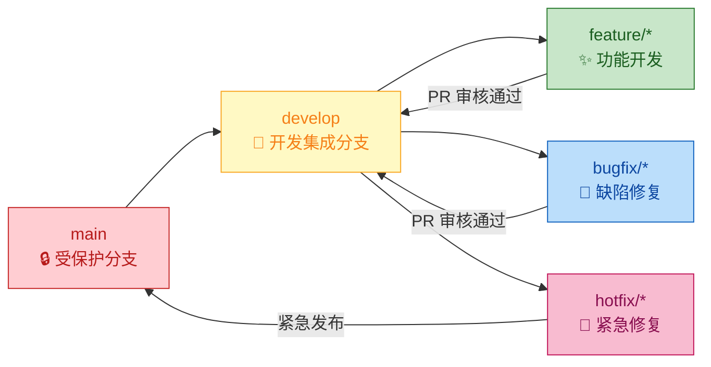

# Agent Harness V1 文档与代码版本管理规范 v1.0

## 1. 目的

本规范定义 Agent Harness V1 项目中所有文档和代码的**版本管理规则**，确保：
- 版本号语义清晰，符合业界标准
- 变更可追溯、可审计
- 团队协作时避免冲突
- 发布流程规范化

---

## 2. 版本号体系

### 2.1 语义化版本（Semantic Versioning - SemVer）

采用 **MAJOR.MINOR.PATCH** 格式：

```
格式: v{MAJOR}.{MINOR}.{PATCH}

示例:
v1.0.0    # 首次正式发布
v1.1.0    # 新增功能（向后兼容）
v1.1.1    # 问题修复（向后兼容）
v2.0.0    # 不兼容的重大变更
```

#### 版本号递增规则

| 变更类型 | MAJOR | MINOR | PATCH | 示例 |
|----------|-------|-------|-------|------|
| **API 不兼容修改** | +1 | 0 | 0 | v1.0.0 → **v2.0.0** |
| **向下兼容的功能新增** | 0 | +1 | 0 | v1.0.0 → v1.**1**.0 |
| **向下兼容的问题修复** | 0 | 0 | +1 | v1.0.0 → v1.0.**1** |

### 2.2 预发布版本

在正式版本前，可使用预发布标签：

```
格式: v{MAJOR}.{MINOR}.{PATCH}-{预发布类型}.{编号}

示例:
v1.0.0-alpha.1    # 内部测试版
v1.0.0-beta.2     # 公开测试版
v1.0.0-rc.1       # 候选版本
```

**预发布优先级**（从低到高）：`alpha` < `beta` < `rc`

---

## 3. 文档版本管理

### 3.1 文档版本号位置

每个文档必须在文件头部明确标注版本：

```markdown
# 文档 XX：{标题} v{VERSION}

**文档版本**: v1.0
**创建日期**: YYYY-MM-DD
**最后更新**: YYYY-MM-DD
**作者**: {作者/团队}
**审核状态**: ✅ 待评审 / ✅ 已通过 / ❌ 需修订
**下次评审日期**: YYYY-MM-DD
```

### 3.2 CHANGELOG 模板

每个文档末尾必须维护 **CHANGELOG** 区域：

```markdown
---

## 变更日志 (CHANGELOG)

> 格式遵循 [Keep a Changelog](https://keepachangelog.com/zh-CN/)

### [v1.1.0] - 2026-05-15

#### 新增 (Added)
- 新增 XXX 功能的详细说明（关联需求 REQ-XXX）
- 新增 YYY 配置项说明

#### 变更 (Changed)
- 调整 ZZZ 接口的请求参数结构（见 INC-01 修复记录）
- 更新性能指标基线数据

#### 修复 (Fixed)
- 修正资源规划数据矛盾（原 4.5C → 3.85C）
- 统一 `timeout_sec` 默认值定义

#### 废弃 (Deprecated)
- （无）

#### 移除 (Removed)
- （无）

#### 安全 (Security)
- 增强环境变量安全提醒

---

### [v1.0.0] - 2026-04-20

#### 新增 (Added)
- 初始版本创建
- 完整定义 XXX 架构设计

---
```

### 3.3 文档变更触发条件

以下情况必须更新文档版本号：

| 触发条件 | 版本号变化 | 示例 |
|----------|-----------|------|
| 新增章节或重要内容 | MINOR+1 | v1.0 → v1.1 |
| 修正错误或不一致 | PATCH+1 | v1.0 → v1.0.1 |
| 重大结构调整 | MAJOR+1 | v1.0 → v2.0 |
| 错别字或格式调整 | 不变（仅更新日期）| v1.0 (日期更新) |

---

## 4. 代码版本管理

### 4.1 Git 分支策略



#### 分支命名规范

| 类型 | 命名模式 | 示例 |
|------|----------|------|
| 功能分支 | `feature/{ticket-id}-{short-description}` | `feature/123-workflow-dsl` |
| 修复分支 | `bugfix/{ticket-id}-{short-description}` | `bugfix/456-fix-timeout` |
| 紧急修复 | `hotfix/{version}-{description}` | `hotfix/v1.0.1-security-patch` |
| 发布分支 | `release/v{version}` | `release/v1.1.0` |

### 4.2 Commit Message 规范

采用 [Conventional Commits](https://www.conventionalcommits.org/) 格式：

```
<type>(<scope>): <subject>

[optional body]

[optional footer(s)]
```

#### Type 列表

| Type | 描述 | 示例 |
|------|------|------|
| `feat` | 新功能 | `feat(workflow): add priority field to creation API` |
| `fix` | Bug 修复 | `fix(auth): resolve token refresh race condition` |
| `docs` | 文档更新 | `docs(readme): update installation guide for Windows` |
| `style` | 代码格式 | `style(lint): fix indentation in config.ts` |
| `refactor` | 重构（非功能） | `refactor(repository): extract common query builder` |
| `perf` | 性能优化 | `perf(retrieval): implement caching for frequent queries` |
| `test` | 测试相关 | `test(executor): add sandbox escape test cases` |
| `chore` | 构建/工具 | `chore(deps): update typescript to 5.0` |
| `ci` | CI/CD 配置 | `ci(github): add integration test workflow` |

#### Commit Message 示例

```bash
# 好的示例
feat(workflow): add checkpoint-based resume functionality (#123)

- Implement save/restore logic for workflow state
- Add CheckpointService with PostgreSQL persistence
- Include unit tests for edge cases (timeout during save)
- Update API docs with new endpoints

Closes #123

# 差的示例
fix bug
update stuff
```

### 4.3 Tag 规范

Tag 用于标记重要的代码里程碑：

```bash
# 格式: v{MAJOR}.{MINOR}.{PATCH}[-{pre-release}]
git tag -a v1.0.0 -m "Release version 1.0.0: Initial production release"

# 附带元数据的完整 Tag message
git tag -a v1.1.0 -m "Release v1.1.0

## Features
- Add Slack channel integration
- Implement Workflow priority queue

## Fixes
- Resolve memory leak in retrieval module (#456)
- Fix timezone handling in audit logs (#789)

## Upgrade Notes
- Database migration required: run 'npm run migrate'
- New env var: SLACK_BOT_TOKEN required
"
```

---

## 5. 发布管理

### 5.1 发布检查清单

每次发布前必须完成：

#### 代码质量
- [ ] 所有 PR 已合并到 release 分支
- [ ] 单元测试通过率 ≥ 85%（核心模块 ≥ 95%）
- [ ] 集成测试全部通过
- [ ] 无 Critical/High 级别的静态分析警告
- [ ] 依赖扫描无已知漏洞（或已有 mitigation plan）

#### 文档完整性
- [ ] 所有受影响的文档已更新版本号
- [ ] CHANGELOG 已填写本次变更内容
- [ ] API 文档（OpenAPI Spec）已同步更新
- [ ] README / 用户手册中的新功能已记录

#### 安全合规
- [ ] 安全团队已审核本次变更
- [ ] 无新增的高危安全问题
- [ ] 凭证/密钥未泄露到代码仓库
- [ ] Docker 镜像通过安全扫描

#### 运维准备
- [ ] 数据库迁移脚本已准备并测试
- [ ] 回滚方案已验证可行
- [ ] 监控告警规则已更新
- [ ] 性能基线已重新确认

### 5.2 发布公告模板

```markdown
# 🚀 Agent Harness v{VERSION} Release Notes

**发布日期**: YYYY-MM-DD  
**发布类型**: Major / Minor / Patch / Security  

---

## ✨ 新功能 (Features)

- **{Feature 1}**: 简要描述... (#{issue})
- **{Feature 2}**: 简要描述... (#{issue})

## 🐛 Bug 修复 (Fixes)

- **{Issue 1}**: 问题描述... (#{issue})
- **{Issue 2}**: 问题描述... (#{issue})

## 🔒 安全更新 (Security)

- **{Security Issue}**: CVE-ID / 描述... (#{issue})
  - 影响: {affected versions}
  - 严重程度: Critical / High / Medium / Low
  - 建议: {upgrade instructions}

## ⚡ 性能优化 (Performance)

- **{Optimization}**: 提升指标... (before → after)

## 📝 重要变更 (Breaking Changes) [仅Major版本]

> ⚠️ **注意**: 本次包含不兼容变更，请仔细阅读升级指南！

1. **{Change 1}**: 
   - 旧行为: ...
   - 新行为: ...
   - 迁移指南: ...

## 📦 升级指南

### 从 v{PREV_VERSION} 升级

```bash
# 1. 备份数据库
pg_dump -U user -d agent_harness > backup_$(date +%Y%m%d).sql

# 2. 拉取最新代码
git fetch origin
git checkout v{VERSION}

# 3. 安装依赖
npm ci

# 4. 执行数据库迁移
npm run migrate

# 5. 重启服务
docker-compose down && docker-compose up -d

# 6. 验证健康状态
curl http://localhost:3000/health/live
```

## 📋 完整变更列表

查看完整的 commit 历史: [GitHub Commits](https://github.com/<org>/<repo>/commits/<branch>)

## 👥 贡献者

感谢以下贡献者: @contributor1, @contributor2, ...

---

**下一步计划**: v{NEXT_VERSION} 预计于 YYYY-MM-DD 发布
```

---

## 6. 自动化工具配置

### 6.1 Semantic Release 配置

```json
// .releaserc.json
{
  "branches": ["main"],
  "plugins": [
    "@semantic-release/commit-analyzer",
    "@semantic-release/release-notes-generator",
    [
      "@semantic-release/npm",
      {
        "npmPublish": false  // 我们使用 Docker 发布，非 npm
      }
    ],
    [
      "@semantic-release/git",
      {
        "assets": ["package.json", "CHANGELOG.md"],
        "message": "chore(release): ${nextRelease.version} [skip ci]\n\n${nextRelease.notes}"
      }
    ],
    "@semantic-release/github"
  ],
  "preset": "angular"
}
```

### 6.2 Commitlint 配置

```javascript
// commitlint.config.js
module.exports = {
  extends: ['@commitlint/config-conventional'],
  rules: {
    'type-enum': [
      2,
      'always',
      [
        'feat', 'fix', 'docs', 'style', 'refactor',
        'perf', 'test', 'chore', 'ci', 'revert'
      ]
    ],
    'subject-max-length': [2, 'always', 72],
    'body-max-line-length': [2, 'always', 100]
  }
};
```

### 6.3 Version File 自动化

```bash
#!/bin/bash
# scripts/update-version.sh

NEW_VERSION=$1
if [ -z "$NEW_VERSION" ]; then
  echo "Usage: $0 <new-version>"
  exit 1
fi

echo "Updating version to $NEW_VERSION..."

# 更新 package.json
sed -i '' "s/\"version\": \".*\"/\"version\": \"$NEW_VERSION\"/" package.json

# 更新所有文档头部的版本号
find . -name "*.md" -not -path "./node_modules/*" -exec sed -i '' \
  "s/\*\*文档版本\*\*: v.*/\*\*文档版本\*\*: $NEW_VERSION/" {} \;

# 更新 Dockerfile 中的版本ARG
sed -i '' "s/ARG APP_VERSION=.*/ARG APP_VERSION=$NEW_VERSION/" Dockerfile

echo "Version updated to $NEW_VERSION successfully!"
```

---

## 7. 审计与合规

### 7.1 版本追溯要求

- 每个发布的版本必须有对应的 Git Tag
- Tag 必须指向一个可重复构建的 commit（deterministic build）
- 构建产物（Docker Image、npm 包）必须包含版本元数据
- 所有第三方依赖的版本必须锁定（package-lock.json）

### 7.2 合规性检查清单

| 检查项 | 频率 | 工具 | 通过标准 |
|--------|------|------|----------|
| License 合规性 | 每次 CI | license-checker | 无 GPL/AGPL 依赖（除非有意引入）|
| SBOM 生成 | 每次发布 | cyclonedx-bom | 完整的软件物料清单 |
| 签名验证 | 每次部署 | cosign / GPG | 镜像签名有效且来自信任源 |
| 可重现构建 | 每季度 | reproducible-builds.org | 二次构建产出 hash 一致 |

---

## 附录

### A. 快速参考卡

| 我想要... | 执行命令/操作 |
|-----------|---------------|
| 创建新功能分支 | `git checkout -b feature/123-my-feature develop` |
| 提交代码 | `git commit -m "feat(scope): description"` |
| 创建发布版本 | `git tag -a v1.0.0 -m "Release notes"` |
| 更新文档版本 | 修改文档头部版本号 + 更新 CHANGELOG |
| 生成 CHANGELOG | `npx conventional-changelog -p angular -i CHANGELOG.md -s` |
| 检查版本一致性 | `node scripts/check-version-consistency.js` |

### B. 相关文档

- [Conventional Commits 规范](https://www.conventionalcomm.org/)
- [Keep a Changelog](https://keepachangelog.com/)
- [Semantic Versioning 2.0.0](https://semver.org/lang/zh-CN/)
- [Angular Commit Convention](https://github.com/angular/angular/blob/main/CONTRIBUTING.md)

---

**文档版本**: v1.0  
**创建日期**: 2026-04-20  
**适用范围**: Agent Harness V1 全项目（文档 + 代码）  
**执行责任人**: 全体团队成员  
**强制执行日期**: 即日起
