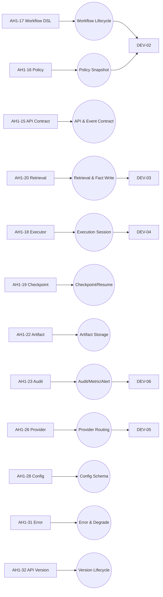

# Agent Harness V1 文件内容与依赖对象图谱

> 目标：把“文件 -> 内容对象 -> 依赖关系”结构化，供后续开发按需加载上下文，避免一次性塞入全部文档。

---

## 1) 图谱范围与使用方式

- 范围：`AH1-00` 到 `AH1-38` 及 `development/DEV-00` 到 `DEV-16`
- 粒度：文件级 + 核心对象级（Workflow、Policy、Retrieval、Executor、Artifact、Audit 等）
- 用法：开发某功能时，只加载“对象权威源 + 直接依赖 + 对应开发计划文档”三组上下文

---

## 2) 对象模型（Graph Schema）

```yaml
node_types:
  - FileDoc        # 文档文件节点
  - DomainObject   # 领域对象节点
  - Contract       # 接口/事件/错误码契约节点
  - RuntimePolicy  # 运行期策略节点（权限/限流/降级/版本）

edge_types:
  - defines        # FileDoc -> DomainObject/Contract
  - depends_on     # FileDoc -> FileDoc
  - constrained_by # DomainObject -> RuntimePolicy
  - implemented_by # DomainObject -> 开发阶段(DEV-xx)
  - validated_by   # DomainObject -> 验收/压测文档
```

---

## 3) 文件节点清单（最小可用）

| file_id | 路径 | 主要产出（defines） | 关键依赖（depends_on） |
|---|---|---|---|
| F00 | `AH1-00-实施规格包.md` | 总体目标、统一约束、PoC目标 | - |
| F13 | `AH1-13-仓库复用与改造边界.md` | 复用边界、改造边界 | F00 |
| F14 | `AH1-14-数据库表设计与索引.md` | 物理表、索引、扩展 | F00, F16, F17, F20 |
| F15 | `AH1-15-核心接口与事件契约.md` | API/事件信封/错误码 | F00, F16, F17, F20, F21 |
| F16 | `AH1-16-权限Scope-Policy-Snapshot.md` | Scope/Policy Snapshot/RBAC | F00 |
| F17 | `AH1-17-Workflow-DSL与Planner契约.md` | Workflow DSL、状态机、Stage 契约 | F00, F16 |
| F18 | `AH1-18-Code-Executor与执行会话.md` | Execution Session、隔离执行 | F13, F15, F16, F17, F19, F22, F26 |
| F19 | `AH1-19-Checkpoint-Resume-Replay.md` | Checkpoint/Resume/Replay | F16, F17, F18, F22, F23 |
| F20 | `AH1-20-检索编排与Fact-Write.md` | Retrieval Plan、Evidence Pack、Fact Write | F14, F15, F16, F26 |
| F21 | `AH1-21-渠道接入与Session映射.md` | Channel ingress、身份绑定、Session 映射 | F15, F16 |
| F22 | `AH1-22-Artifact-Object-Storage.md` | Artifact 类型、对象存储策略 | F14, F16, F18, F19, F20, F21 |
| F23 | `AH1-23-审计日志指标与告警.md` | 审计事件、日志、指标、告警 | F15, F16, F19, F20, F21, F22, F29 |
| F24 | `AH1-24-PoC压测执行方案.md` | P0 PoC与压测路径 | F13-F23, F26-F30 |
| F25 | `AH1-25-研发里程碑与任务拆解.md` | 里程碑/WBS/交付节奏 | F13-F24, F26-F30 |
| F26 | `AH1-26-Provider选择与配置.md` | LLM/Embedding/Rerank Provider 策略 | F00, F15 |
| F27 | `AH1-27-部署与运维.md` | 部署拓扑、运维基线 | F13, F14, F23, F26, F28 |
| F28 | `AH1-28-配置管理.md` | 配置层级、环境变量、热更新 | F00, F26 |
| F29 | `AH1-29-交付物清单.md` | 交付清单、质量门禁 | F15, F16, F18, F20, F26 |
| F30 | `AH1-30-验收标准与测试用例.md` | 功能/性能/安全验收 | F15, F16, F17, F18, F19, F20, F21, F24, F29 |
| F31 | `AH1-31-错误处理与降级策略.md` | 错误分类、重试、降级熔断 | F15, F16, F18, F20, F26 |
| F32 | `AH1-32-API版本管理策略.md` | 版本生命周期与兼容策略 | F15 |
| F33 | `AH1-33-文档关系与一致性清单.md` | 文档依赖矩阵、一致性索引 | 全局文档索引 |
| F34 | `AH1-34-安全架构增强.md` | SDL/威胁建模/安全基线 | F16, F23 |
| F35 | `AH1-35-版本管理规范.md` | SemVer/分支/发布规范 | 全局文档索引 |
| F36 | `AH1-36-生产级代码示例参考.md` | 代码参考实现模式 | F15, F17, F18, F20, F31 |
| F37 | `AH1-37-架构审计报告.md` | 架构风险与修复建议 | 全局文档索引 |
| F38 | `AH1-38-文档审计报告.md` | 文档问题审计与修复跟踪 | 全局文档索引 |
| D00 | `development/DEV-00-开发索引.md` | 研发执行入口与门槛 | F25 |
| D01 | `development/DEV-01-M0开发准备.md` | M0基线冻结任务 | F14, F15, F16, F17, F23, F26, F27, F28 |
| D02 | `development/DEV-02-M1接入层Workflow主链路.md` | 接入+Workflow主链路 | F15, F16, F17, F19, F21 |
| D03 | `development/DEV-03-M2事实层检索主链路.md` | 检索与事实写回主链路 | F14, F20, F23, F26 |
| D04 | `development/DEV-04-M3CodeExecutor集成.md` | Executor集成与上下文隔离 | F17, F18, F19, F22 |
| D05 | `development/DEV-05-M4Hermes增强接入.md` | Hermes增强接入 | F20, F26 |
| D06 | `development/DEV-06-M5容量验证收口.md` | 收口、压测、告警、限流 | F23, F24, F27, F31 |
| D07 | `development/DEV-07-主仓库骨架结构.md` | 工程目录与模块边界 | F13, F25 |
| D14 | `development/DEV-14-Day1-渠道配置说明.md` | 渠道接入配置步骤 | F21 |
| D14b| `development/DEV-14-2026-04-24-3天执行计划.md` | 三天执行计划 | F21, F25 |
| D14c| `development/DEV-14-Day3-监督与落盘说明.md` | 监督与落盘机制 | F17, F19, F21 |
| D15 | `development/DEV-15-控制台优化与标准测试故事线.md` | 控制台优化与测试故事线 | F21, F30 |
| D16 | `development/DEV-16-UX审计修复交接.md` | UX审计与修复交接 | F21, F15 |

---

## 4) 核心内容对象（DomainObject）

| object_id | 对象 | 权威定义文件 | 直接消费者 |
|---|---|---|---|
| O-WF | WorkflowInstance/StageLifecycle | `AH1-17-Workflow-DSL与Planner契约.md` | F15, F19, D02, D04 |
| O-POL | PolicySnapshot/ScopeModel | `AH1-16-权限Scope-Policy-Snapshot.md` | F14, F15, F17, F18, F20, F21, D02 |
| O-API | Internal API + Event Envelope + ErrorCode | `AH1-15-核心接口与事件契约.md` | F21, F23, F30, D01-D05 |
| O-RET | RetrievalPlan/EvidencePack/FactWrite | `AH1-20-检索编排与Fact-Write.md` | F17, F30, D03, D05 |
| O-EXE | ExecutionSession/SubagentLoop | `AH1-18-Code-Executor与执行会话.md` | F19, F22, F30, D04 |
| O-CKP | Checkpoint/Resume/Replay | `AH1-19-Checkpoint-Resume-Replay.md` | F18, F30, D02, D04 |
| O-ART | ArtifactObject/StoragePolicy | `AH1-22-Artifact-Object-Storage.md` | F18, F19, F23, D04 |
| O-AUD | AuditEvent/LogMetricAlert | `AH1-23-审计日志指标与告警.md` | F24, F27, D06 |
| O-PVD | ProviderRouting/BudgetFallback | `AH1-26-Provider选择与配置.md` | F20, F27, F28, D05 |
| O-CFG | ConfigLayer/EnvSchema | `AH1-28-配置管理.md` | F26, F27, D01 |
| O-ERR | ErrorTaxonomy/DegradePolicy | `AH1-31-错误处理与降级策略.md` | F23, D06 |
| O-VER | API Version Lifecycle | `AH1-32-API版本管理策略.md` | F30 |

---

## 5) 可视化关系（Mermaid）



---

## 6) 按任务加载的最小上下文包（防上下文泛滥）

| 开发任务 | 必读（最小） | 次读（仅冲突时） |
|---|---|---|
| 接入层 + 创建 Workflow | `AH1-21`, `AH1-15`, `AH1-16`, `AH1-17`, `DEV-02` | `AH1-23`, `AH1-28` |
| 检索与事实写回 | `AH1-20`, `AH1-14`, `AH1-16`, `AH1-15`, `DEV-03` | `AH1-26`, `AH1-23` |
| Code Executor 集成 | `AH1-18`, `AH1-17`, `AH1-19`, `AH1-22`, `DEV-04` | `AH1-16`, `AH1-31` |
| Provider 切换/预算治理 | `AH1-26`, `AH1-28`, `AH1-15`, `DEV-05` | `AH1-31`, `AH1-23` |
| 压测收口与告警 | `AH1-24`, `AH1-23`, `AH1-27`, `AH1-31`, `DEV-06` | `AH1-29`, `AH1-30` |

---

## 7) 机器可读索引（可直接被 Agent 消费）

```json
{
  "graph_version": "v1.1",
  "entry": "development/DEV-00-开发索引.md",
  "authority": {
    "workflow": "AH1-17-Workflow-DSL与Planner契约.md",
    "policy": "AH1-16-权限Scope-Policy-Snapshot.md",
    "contract": "AH1-15-核心接口与事件契约.md",
    "retrieval": "AH1-20-检索编排与Fact-Write.md",
    "executor": "AH1-18-Code-Executor与执行会话.md",
    "checkpoint": "AH1-19-Checkpoint-Resume-Replay.md",
    "artifact": "AH1-22-Artifact-Object-Storage.md",
    "audit": "AH1-23-审计日志指标与告警.md",
    "provider": "AH1-26-Provider选择与配置.md",
    "config": "AH1-28-配置管理.md",
    "error": "AH1-31-错误处理与降级策略.md",
    "versioning": "AH1-32-API版本管理策略.md",
    "security": "AH1-34-安全架构增强.md",
    "code_ref": "AH1-36-生产级代码示例参考.md",
    "arch_audit": "AH1-37-架构审计报告.md",
    "doc_audit": "AH1-38-文档审计报告.md"
  },
  "dev_mapping": {
    "M0": "development/DEV-01-M0开发准备.md",
    "M1": "development/DEV-02-M1接入层Workflow主链路.md",
    "M2": "development/DEV-03-M2事实层检索主链路.md",
    "M3": "development/DEV-04-M3CodeExecutor集成.md",
    "M4": "development/DEV-05-M4Hermes增强接入.md",
    "M5": "development/DEV-06-M5容量验证收口.md",
    "D14": "development/DEV-14-Day1-渠道配置说明.md",
    "D15": "development/DEV-15-控制台优化与标准测试故事线.md",
    "D16": "development/DEV-16-UX审计修复交接.md"
  },
  "source_code_mapping": {
    "gateway-adapter": ["AH1-21", "AH1-15", "AH1-16"],
    "workflow": ["AH1-17", "AH1-19"],
    "fact-retrieval": ["AH1-20", "AH1-14"],
    "executor-gateway/generic": ["AH1-18", "AH1-17"],
    "executor-gateway/code": ["AH1-18", "AH1-31"],
    "rate-limit": ["AH1-31"],
    "security-check": ["AH1-34"],
    "embedding": ["AH1-26", "AH1-31"],
    "web-portal": ["AH1-21"]
  }
}
```

---

## 8) 维护规则

1. 新增文档时必须补齐：`file_id`、`defines`、`depends_on`、`dev_mapping`。
2. 若对象权威源发生变更，必须同步更新第 4 节和第 7 节。
3. 每次里程碑变更后，先更新本图谱，再更新 `DEV-00`。
4. 审计时优先检查：悬挂引用、错误权威源、开发任务映射缺失。

---

## 9) 依赖分层（架构师执行标准）

> 结论：仅有“文件索引”不够。要避免上下文腐烂，必须显式分层并限制跨层读取。

| 层级 | 作用 | 文档集合 | 允许依赖 |
|---|---|---|---|
| L0-Authority | 权威定义层（单一事实源） | `AH1-14/15/16/17/18/19/20/21/22/23/26/28/31/32` | 仅同层内最小交叉引用 |
| L1-Execution | 开发执行层（如何做） | `development/DEV-01..07` | 允许读取 L0，不反向改写 L0 |
| L2-Governance | 计划与验收层（做成什么样） | `AH1-24/25/29/30/33/34/35/37/38` | 读取 L0/L1，不能作为实现权威源 |

分层规则：

1. 实施时，**实现判断必须回到 L0**（契约、状态机、权限、错误码）。
2. L1 如与 L0 冲突，按 L0 修正 L1，不得相反。
3. L2 仅做治理与审计，不承载运行时契约。

---

## 10) 上下文防腐策略（Context Rot Guard）

### 10.1 权威源优先（Authority First）

- 每个领域对象仅允许一个权威文件（见第 4 节）。
- 在任务上下文中，权威文件必须排在首位。

### 10.2 分层加载预算（Budgeted Context）

- 默认只加载：`1 个对象权威源 + <=2 个直接依赖 + 1 个 DEV 执行文档`。
- 出现冲突再增量加载次读文档；禁止一次性全量加载。

### 10.3 变更失效机制（Invalidation）

触发任一条件时，已有任务上下文立即失效并重建：

1. 权威文件发生变更；
2. `AH1-15`（契约）或 `AH1-16`（权限）发生变更；
3. 任务涉及的 `DEV-0x` 文档发生变更。

### 10.4 冲突处理顺序（Conflict Order）

1. `AH1-15/16/17`（契约/权限/状态机）
2. 具体领域权威（如 `AH1-18/20/22/23`）
3. `development/DEV-0x`
4. 验收与审计文档（`AH1-24/29/30/33/38`）

---

## 11) 任务级上下文包模板（强制）

```yaml
task_context_manifest:
  task_id: "M3-Executor-Integration"
  objective: "实现执行会话与隔离执行"
  authority_docs:
    - AH1-18-Code-Executor与执行会话.md
    - AH1-17-Workflow-DSL与Planner契约.md
  direct_dependencies:
    - AH1-19-Checkpoint-Resume-Replay.md
    - AH1-22-Artifact-Object-Storage.md
  execution_doc:
    - development/DEV-04-M3CodeExecutor集成.md
  optional_docs:
    - AH1-16-权限Scope-Policy-Snapshot.md
    - AH1-31-错误处理与降级策略.md
  load_budget:
    max_docs: 6
    max_rounds: 2
  invalidation_watch:
    - AH1-18-Code-Executor与执行会话.md
    - AH1-17-Workflow-DSL与Planner契约.md
    - development/DEV-04-M3CodeExecutor集成.md
```
## 12) 落地建议

1. 每个开发任务开始前先生成 `task_context_manifest`。
2. 提交前做一次"权威源回归检查"：实现是否与 L0 一致。
3. 审计时检查"是否越层引用"（L1/L2 覆盖 L0）。
4. 将第 7 节 JSON 拆到独立文件以便自动校验（见 `development/context-graph.json`）。
5. 每次代码修复后检查 `context-graph.json` 中 `source_to_authority` 映射是否完整。
6. 修复变更记录在 `context-graph.json` 的 `fix_changelog` 中持久化。

---
<div align="center">
<b><i>v1.1 — 2026-05-06 R4: 新增 DEV-14/15/16 文件节点、source_to_authority 映射规则、fix_changelog 持久化机制</i></b>
</div>
