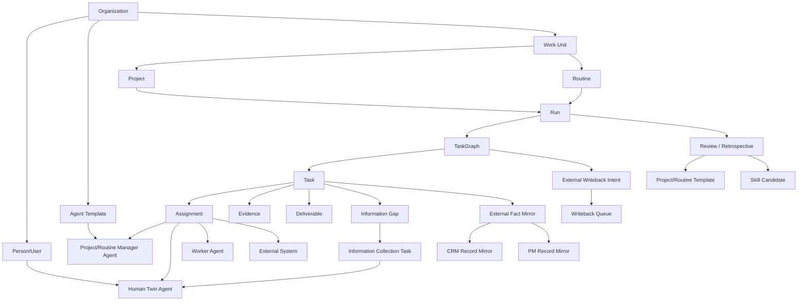
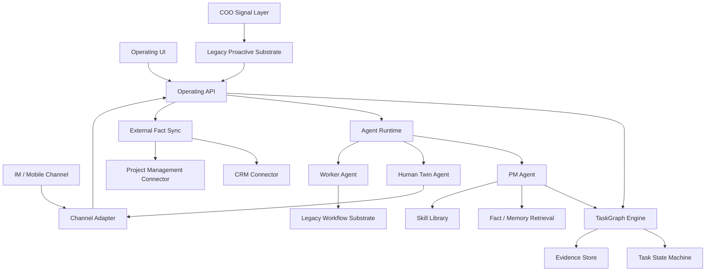
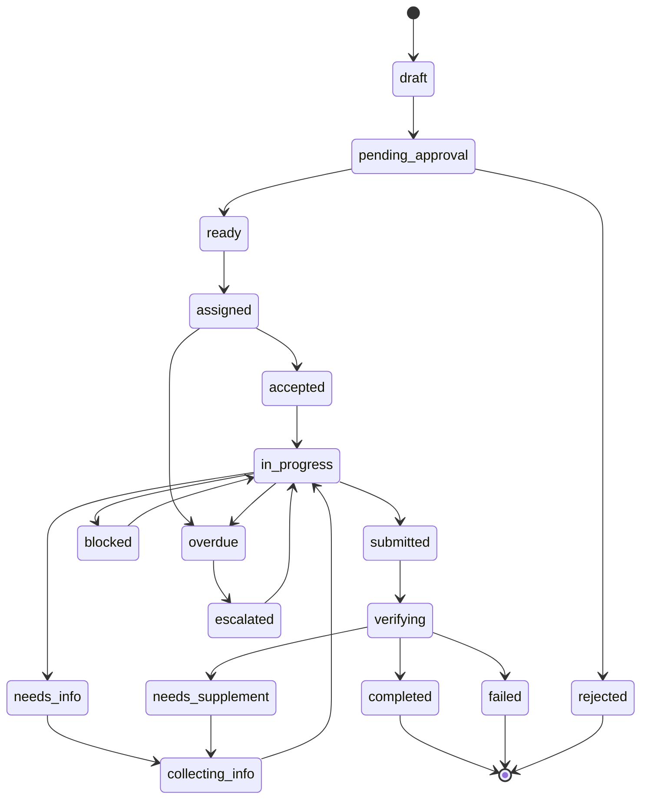
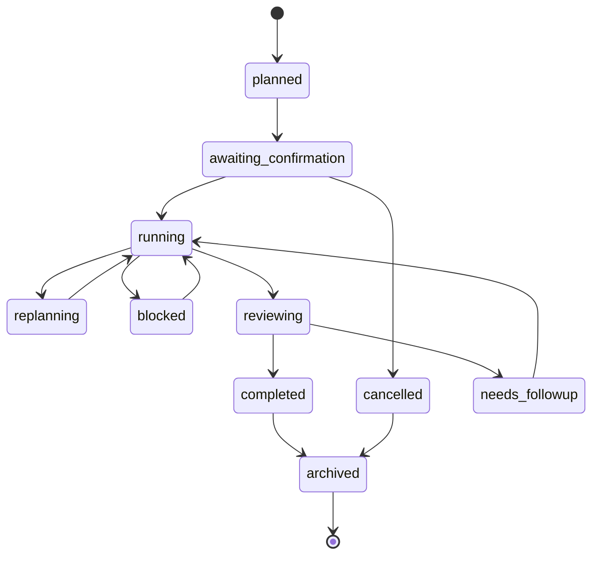
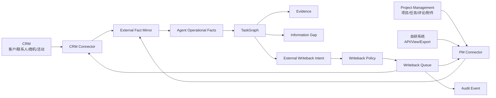
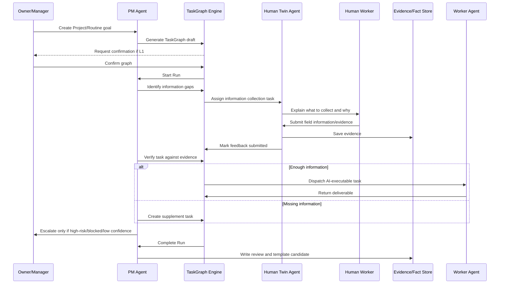

# DEV-26 对象依赖与系统图谱

> 状态：研发前架构图谱
> 读者：架构、后端、前端、Agent 编排、测试
> 依赖：DEV-23、DEV-24、DEV-25、DEV-29、DEV-31、DEV-32、DEV-33

## 1. 设计原则

AI 原生运营系统需要一层新的运营对象模型。旧 JueYing v1 的 workflow、proactive、org_task、skill、fact 和 memory 是可复用底座，但不能直接作为产品主对象。

原则：

- `TaskGraph` 是运营执行的事实中心。
- `Workflow` 是可调用的执行底座，不是运营主抽象。
- `Human Twin Agent` 是真人的系统接口，不是真人本身。
- `Evidence` 是 Agent 判断质量的基础，不是附件附属品。
- `Run` 是复盘和归因的基本单位。
- 所有自治行为必须带授权、审计和回滚/撤销策略。

## 2. 核心对象依赖

## 3. 系统分层

## 4. 对象定义

| 对象 | 必要字段 | 说明 |
|---|---|---|
| Organization | id, name, policy, channels | 组织边界和权限边界。 |
| Person/User | id, org_id, role, channel_identities | 真人账户。 |
| Human Twin Agent | id, user_id, permissions, skills, channels, working_hours | 真人的信息接口和授权代理。 |
| Agent Template | id, type, prompt, tools, autonomy_defaults, knowledge_refs | PM/COO/Worker/Twin 模板。 |
| Work Unit | id, org_id, type, title, owner_id, status | Project/Routine 的统一父对象。 |
| Project | work_unit_id, goal, success_criteria, deadline | 一次性事项。 |
| Routine | work_unit_id, schedule, recurrence_policy, active_window | 周期性事项。 |
| Run | id, work_unit_id, sequence, status, started_at, finished_at | 一次执行实例。 |
| TaskGraph | id, run_id, version, status, generated_by, autonomy_level | 动态施工图谱。 |
| Task | id, graph_id, parent_id, title, status, owner_agent_id, acceptance | 可验收任务。 |
| Dependency | from_task_id, to_task_id, dependency_type | 任务间依赖。 |
| Assignment | id, task_id, assignee_type, assignee_id, status, due_at | 派发实例。 |
| Information Gap | id, task_id, question, reason, required_schema, priority | Agent 判断缺失的信息。 |
| Evidence | id, task_id, source_type, uri, summary, quality_score | 判断和验收证据。 |
| Deliverable | id, task_id, artifact_ref, summary, accepted_at | 交付物。 |
| Review | id, run_id, result, lessons, template_candidate | 复盘。 |
| External Fact Mirror | id, connection_id, system_type, object_type, external_id, external_url, mirrored_at, field_snapshot | CRM、项目管理系统等外部事实的本地快照。 |
| External Writeback Intent | id, connection_id, system_type, target, operation, payload, source, risk_level, idempotency_key | Agent 写回外部系统前的可审计意图。 |
| Writeback Queue | id, intent_id, status, attempts, last_error, external_result | CRM/项目管理系统写回执行队列。 |

## 5. Task 状态机

TaskGraph 需要独立状态机，不能复用 legacy workflow 的整体生命周期。

## 6. Run 状态机

## 7. 与 JueYing v1 的依赖映射

| 新系统对象/能力 | 旧 JueYing v1 可复用项 | 接入方式 | 风险 |
|---|---|---|---|
| Worker Agent 执行 | workflow-service, executor-gateway | Task 调用 legacy workflow 执行复杂任务 | stage_chain 线性，不支持 TaskGraph 原生依赖 |
| 信息通知 | gateway-adapter, Feishu/WeCom | Human Twin Agent 通过旧渠道发消息 | 需要新增授权和上下文追问 |
| 事实召回 | fact-retrieval | PM Agent 查询证据和组织知识 | 旧事实模型不等于现场证据模型 |
| 记忆召回 | hermes-adapter | PM/Twin Agent 读取上下文和历史 | 需防止越权读取个人记忆 |
| 主动信号 | proactive-orchestrator | COO Signal Layer 触发 TaskGraph | 当前只能生成 insight/mission |
| skill 沉淀 | skill-library | Run 复盘生成 skill/template candidate | 缺岗位扩散规则 |
| 审计 | audit_event | 记录授权、派发、验收、重规划 | 新事件类型需扩展 |

## 7A. 外部事实层接入图

CRM 与项目管理系统都属于外部事实层。系统内部不直接吞并它们，而是通过镜像、写回意图、策略、队列和审计保持一致。

## 8. 数据依赖与信息流

## 9. UI 依赖图

| UI | 依赖对象 | 必须支持的动作 |
|---|---|---|
| Home / Operating Console | Work Unit, Run, TaskGraph | 查看进行中事项、异常、待确认 |
| AI PM Builder | Agent Template, Work Unit | 创建 PM Agent、设自治等级、可用资源 |
| Human Twin Console | User, Human Twin Agent | 设置授权、渠道、工作时间、skill |
| TaskGraph View | Run, TaskGraph, Task, Dependency | 看任务、依赖、状态、证据、阻塞 |
| Information Gap Inbox | Information Gap, Assignment, Evidence | 查看缺口、发送采集任务、追问补充 |
| Evidence Review | Evidence, Deliverable, Acceptance | 验收、退回、标记需补充 |
| External Sync Console | External Connection, Mirror, Writeback Intent, Queue | 查看 CRM/项目管理连接、同步状态、反写队列、冲突 |
| Retrospective | Run, Review, Skill Candidate | 复盘、生成模板、推荐 skill |
| Admin / Governance | Org, Policy, Audit, Agent Template | 权限、审计、模板发布、集成配置 |

## 10. 研发前依赖顺序

1. 确认对象命名和边界。
2. 定义 TaskGraph 最小 schema。
3. 定义 Task/Run 状态机。
4. 定义 Human Twin Agent 授权模型。
5. 定义 Evidence 和 Information Gap schema。
6. 定义 PM Agent 输入输出契约。
7. 定义 CRM 与项目管理系统 External Fact Sync 接入点。
8. 定义旧 JueYing v1 substrate 接入点。
9. 设计 MVP UI。
10. 设计端到端验收数据。
11. 再进入代码实现。
