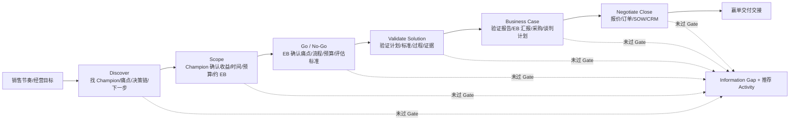
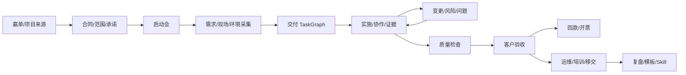

# DEV-28 场景故事库：销售与项目交付

> 状态：研发前场景穷举基准
> 读者：产品、设计、前后端、Agent 编排、测试
> 依赖：DEV-23、DEV-25、DEV-26、DEV-29、DEV-30、DEV-32、DEV-33
> 核心目的：把“销售”和“项目交付”拆到足够细，避免后续研发靠补丁理解业务。

## 1. 使用原则

本文不是行业模板库，而是研发前的场景故事库。它要回答：真实业务里，用户会在什么节点找系统，Agent 需要知道什么信息，真人需要补充什么现场事实，系统要生成什么任务、证据、验收和复盘。

“穷举”在这里指穷举首批产品边界内的业务分岔，而不是穷举所有行业特例。每条故事都必须能映射到：

| 维度 | 必须回答的问题 |
|---|---|
| 用户意图 | 谁在什么场景下想推进什么结果。 |
| Agent 判断 | Agent 需要做什么判断，缺什么信息。 |
| 人类采集 | 真人需要补充哪些听到、看到、问到、拍到、确认到的信息。 |
| 系统对象 | 关联 Work Unit、Project/Routine、Run、TaskGraph、Task、Assignment、Information Gap、Evidence 中的哪些对象。 |
| 界面动作 | 用户在 Operating Console、TaskGraph View、Information Gap Inbox、Human Twin Console 等界面做什么动作。 |
| 验收条件 | 什么证据足以让 Agent 或人类判断该故事闭环完成。 |

重要边界：

- Agent 可以成为大量日常运营判断的主体，但必须承认传感器不足。
- 真人不是“被管理的工具”，而是责任主体、现场执行者和信息采集者。
- Human Twin Agent 默认只做 `notify + collect + draft`，不能默认替真人承诺、确认完成或提交高风险结果。
- 销售与交付不是独立产品烟囱，而是同一套 Work Unit / TaskGraph / Evidence / Review 能力在不同场景下的视角。

## 2. 共用角色

| 角色 | 销售场景中的诉求 | 项目交付场景中的诉求 |
|---|---|---|
| 企业负责人 | 看收入预测、重点商机、利润和回款风险 | 看交付风险、客户满意度、回款节点和资源瓶颈 |
| 销售负责人 | 管线节奏、客户跟进、成交预测、销售动作质量 | 把已成交项目顺利交给交付，不让承诺失真 |
| 销售人员 | 今天跟谁、问什么、怎么推进、如何记录 | 解释前期承诺，补充客户背景 |
| 交付负责人 | 范围、资源、风险、验收、变更和复盘 | 管理多个交付项目的健康度 |
| 项目经理 | 拆解任务、协调客户和内部资源、处理阻塞 | 让 TaskGraph 真实推进，而不是只写计划 |
| 一线执行者 | 收到清楚任务，知道交付标准和证据要求 | 采集现场信息、提交交付物、反馈阻塞 |
| 客户联系人 | 看到清楚的下一步、材料、会议和验收动作 | 减少重复沟通，确认需求和验收 |
| 财务/法务 | 关注报价、合同、付款和风险条款 | 关注开票、收款、合同变更和责任边界 |
| Admin/IT | 管组织、渠道、权限、审计、集成 | 防止越权、错发、漏发和敏感信息泄露 |
| PM Agent | 生成并推进 TaskGraph | 按证据判断、追问、验收、重规划 |
| Human Twin Agent | 提醒销售或交付人员补信息 | 整理反馈、检查完整性、生成草稿 |
| Worker Agent | 写纪要、方案、报价、邮件、分析 | 生成计划、材料、报告、验收文档 |
| COO Agent | 看跨商机和跨项目风险 | 发现资源冲突、延期趋势和复盘机会 |

## 3. 故事写法

本文每条故事采用压缩格式：

| 字段 | 含义 |
|---|---|
| 触发 | 用户或系统在什么情况下进入这个故事。 |
| Agent 动作 | PM/COO/Worker/Human Twin Agent 要做什么。 |
| 信息缺口 | Agent 默认可能缺什么现场或业务信息。 |
| 证据 | 支撑判断的照片、文本、文件、会议纪要、客户原话、系统记录等。 |
| 验收 | 故事闭环完成的最低标准。 |

## 4. 销售场景总图

销售场景的权威阶段主干见 [DEV-30-销售六步法Gate驱动运营设计.md](./DEV-30-销售六步法Gate驱动运营设计.md)。本文中的 `SS-*` 故事是六步法的支撑故事，不是阶段模型。后续销售研发必须优先说明它服务哪个六步法阶段和 Gate。

销售场景的核心不是把 CRM 字段搬进系统，也不是泛化地判断“温度”。核心是让 Agent 持续判断：这个机会当前处于六步法哪个阶段，哪些 Gate 已经达成，哪些 Gate 缺证据，缺口应该由谁补、怎么补、补完后是否足以推进阶段。

## 5. 销售故事库

### 5.1 经营目标、销售节奏与六步法巡检

| ID | 故事 | 触发 | Agent 动作 | 信息缺口 | 证据 | 验收 |
|---|---|---|---|---|---|---|
| SS-01 | 设定销售周期目标 | 负责人设定月/季度销售目标 | COO/PM Agent 把目标拆成线索量、跟进量、商机阶段、成交和回款任务 | 团队人数、客单价、历史转化、毛利底线 | 历史成交表、目标口径、团队名单 | 生成销售 Routine 和本周期 Run |
| SS-02 | 拆解到每日销售节奏 | 销售负责人要知道今天做什么 | Agent 按商机温度、阶段停留时间、下次动作生成每日优先级 | 最近跟进、客户回复、约定事项 | 跟进记录、IM/电话摘要、日程 | 每名销售收到不超过可执行容量的任务 |
| SS-03 | 配置线索来源 | 新增渠道或活动 | Agent 建议字段、去重规则、归属规则和首触达 SLA | 来源质量、字段完整度、归属人 | 表单、活动名单、渠道说明 | 新线索可自动进入待分配池 |
| SS-04 | 销售容量与分配策略 | 线索进入过多或人员变动 | Agent 根据人均容量、行业经验、客户类型建议分配 | 销售擅长领域、当前负载、客户区域 | 人员画像、当前任务量、历史胜率 | 分配策略可解释并留审计 |
| SS-05 | 周销售复盘 | 每周结束 | Agent 汇总新增、推进、停滞、赢单、输单、回款和下周动作 | 真实跟进行为是否完整记录 | 活动日志、客户反馈、阶段变化 | 输出本周风险和下周 TaskGraph |
| SS-05A | 六步法 Gate 巡检 | 每日/每周扫描活跃机会 | Agent 按 Discover、Scope、Go/No-Go、Validate Solution、Business Case、Negotiate Close 检查 gates | 当前阶段 gate 状态、缺口证据、下一步动作 | CRM、拜访纪要、客户确认、销售补充 | 每个活跃机会输出缺失 Gate、建议 Activity 和责任人 |

### 5.2 线索入库与清洗

| ID | 故事 | 触发 | Agent 动作 | 信息缺口 | 证据 | 验收 |
|---|---|---|---|---|---|---|
| SS-06 | 新线索快速入库 | 销售口头或 IM 发来客户信息 | Human Twin Agent 结构化公司、联系人、来源、需求线索 | 公司全称、联系人职务、联系方式、来源 | 销售原话、名片、聊天截图 | 创建 Account/Contact/Opportunity 草稿 |
| SS-07 | 线索去重 | 新线索疑似重复 | Agent 比对公司名、电话、联系人、历史项目 | 历史客户别名、集团关系 | 旧客户记录、发票抬头、合同名 | 合并或创建新记录并说明理由 |
| SS-08 | 线索质量初判 | 线索入库后 | Agent 判断是否值得首触达，给出置信度 | 行业、规模、预算信号、需求真实性 | 官网、销售补充、来源上下文 | 进入待触达、待补充或暂缓池 |
| SS-09 | 缺字段追问 | 线索字段不足 | Human Twin Agent 向销售追问最少必要字段 | 缺失字段和补充方式 | 销售回复、截图、语音转文字 | 字段完整性达到启动首触达阈值 |
| SS-10 | 线索归属争议 | 两名销售都声称归属 | Agent 拉取首次接触、最近跟进和规则 | 首触达证据、客户真实关系 | IM 记录、电话记录、活动报名 | 生成归属建议，需负责人确认 |

### 5.3 Discover：首触达、资格确认与痛点地图

| ID | 故事 | 触发 | Agent 动作 | 信息缺口 | 证据 | 验收 |
|---|---|---|---|---|---|---|
| SS-11 | 生成首触达目标 | 销售准备联系客户 | Agent 明确本次只要达成一个目标，如确认痛点或约会议 | 客户角色、来源语境、可能痛点 | 线索资料、行业知识 | 生成触达脚本和记录模板 |
| SS-12 | 首触达后记录 | 电话/微信/会议结束 | Human Twin Agent 要求销售 10 分钟内记录结果 | 客户原话、是否有兴趣、下一步 | 语音摘要、文字纪要 | Opportunity 阶段和下一步被更新 |
| SS-13 | 未接通/未回复处理 | 首触达失败 | Agent 生成重试节奏和替代渠道 | 是否错号、客户忙碌原因、可联系时间 | 通话记录、消息已读状态 | 自动派生下次触达任务 |
| SS-14 | 需求发现 | 客户愿意沟通 | Agent 给销售生成问题清单，要求问痛点、现状、影响和期望 | 真实痛点、业务场景、当前替代方案 | 会议纪要、客户原话 | 至少形成 3 条可验证需求 |
| SS-15 | Discover Gate 判断 | 初步需求明确 | Agent 按 D-G1 至 D-G7 判断是否可进入 Scope | Champion、关注点、组织分工、EB、痛点、竞争、下一步 | 客户反馈、会议纪要、销售补充 | Discover gates 达成或生成补充任务 |
| SS-16 | 客户沟通风格识别 | 销售需要沟通策略 | Agent 基于记录推断客户偏好：结果型、关系型、稳健型、分析型 | 客户反应、关注点、沟通节奏 | 对话摘要、会议表现 | 下一次沟通建议可被销售采纳或修正 |
| SS-17 | 暂不合格线索处理 | Agent 判断暂不值得推进 | Agent 说明不合格原因并设置再唤醒条件 | 未来时机、业务变化、预算周期 | 客户说明、行业季节性 | 进入 nurture 或 lost，并记录原因 |

### 5.4 Scope 与 Go/No-Go：Champion、EB 与商机推进

| ID | 故事 | 触发 | Agent 动作 | 信息缺口 | 证据 | 验收 |
|---|---|---|---|---|---|---|
| SS-18 | 建立客户决策链 | 商机进入 qualified | Agent 生成 stakeholder map 任务 | 谁发起、谁使用、谁拍板、谁否决、谁采购 | 销售拜访纪要、客户组织图 | 决策链至少标明关键角色和未知项 |
| SS-19 | 识别关键痛点 | 需求信息分散 | Agent 把客户原话归纳成痛点、影响、优先级 | 痛点是否真实、是否有经济影响 | 客户原话、数据、案例 | 每个痛点绑定来源证据 |
| SS-20 | 判断推进温度 | 每日/每周管线扫描 | Agent 按阶段、最近联系、客户主动性、金额和时间压力评分 | 最近真实互动、客户内部动作 | 跟进记录、日程、客户回复 | 输出绿/黄/红风险和下一步 |
| SS-21 | 发现推进阻塞 | 商机停滞 | Agent 诊断是需求不清、决策链缺失、预算缺失、竞品、报价还是时机 | 阻塞原因证据 | 沟通记录、未回复天数、客户反馈 | 派生一个最小干预任务 |
| SS-22 | 客户会议准备 | 预约会议前 | Agent 生成会议目标、问题、材料、角色分工 | 参会人角色、会议成功标准 | 日程、参会名单、历史记录 | 销售会前确认会议计划 |
| SS-23 | 会议纪要结构化 | 会议结束 | Worker/Twin Agent 结构化痛点、承诺、问题、下一步和负责人 | 客户原话是否准确、承诺是否明确 | 录音摘要、销售补充 | 纪要可直接更新 TaskGraph |
| SS-24 | 会后缺口追问 | 纪要不足以判断 | PM Agent 生成信息缺口，Human Twin 追问销售 | 未问到的预算、竞品、决策人、时间表 | 销售补充、客户二次确认 | 缺口被关闭或转为下一次客户任务 |
| SS-24A | Scope Gate 判断 | Discover 后进入范围定义 | Agent 按 S-G1 至 S-G5 检查 Champion 是否确认收益、时间、预算、书面确认并帮助约 EB | Champion 成色、收益、时间、预算、书面确认、EB 会议 | 微信/邮件/会议纪要/现场板书/日程 | Scope gates 达成或生成测试 Champion/约 EB 任务 |
| SS-24B | Go/No-Go Gate 判断 | 准备投入验证资源前 | Agent 按 G-G1 至 G-G4 检查 EB 是否确认痛点、优先级、收益、流程、预算和评估标准 | EB 确认、预算、评估标准、验证后会议 | EB 会议纪要、客户原话、日程 | 给出 Go、No-Go、回退或需负责人确认 |

### 5.5 Validate Solution 与 Business Case：验证、报告与采购

| ID | 故事 | 触发 | Agent 动作 | 信息缺口 | 证据 | 验收 |
|---|---|---|---|---|---|---|
| SS-25 | 方案匹配 | 客户需求明确 | Worker Agent 生成方案草稿，PM Agent 检查是否对应痛点 | 产品边界、客户约束、成功指标 | 需求清单、产品资料、案例 | 方案每一部分都能映射客户痛点 |
| SS-26 | 售前支持派单 | 需要技术/方案人员 | PM Agent 创建售前任务和证据要求 | 售前资源、客户技术问题、交付可行性 | 客户问题清单、内部评估 | 售前输出可被销售用于下一步 |
| SS-27 | 验证计划设计 | 客户要求验证或 Go/No-Go 通过 | Agent 按 V-G1 至 V-G3 生成验证目标、步骤、双方责任、数据、成功标准和证据要求 | 验证形式、客户环境、成功标准、客户责任 | 验证计划、客户确认、环境说明 | 验证计划和标准被 Champion 书面确认 |
| SS-28 | 报价策略 | 进入报价 | Agent 检查毛利底线、折扣权限、付款条件和竞争态势 | 成本、交付工作量、竞品价格、客户预算 | 成本表、历史报价、客户反馈 | 报价建议含利润和风险说明 |
| SS-29 | 报价审批 | 折扣或条款超阈值 | Agent 升级给负责人/财务/法务 | 授权边界、例外理由 | 报价草案、利润测算、客户承诺 | 审批记录完整后才能发出 |
| SS-30 | 合同条款核对 | 客户进入签约 | Worker Agent 提取风险条款，法务/负责人确认 | 付款、违约、交付范围、验收口径 | 合同草案、报价、方案 | 高风险条款被标记并确认 |
| SS-31 | 发客户材料 | 需要邮件/IM 跟进 | Worker Agent 起草发送内容，Human Twin 提醒销售确认 | 收件人、附件、承诺事项 | 邮件草稿、附件清单 | 发送前销售确认，发送后记录回写 |
| SS-31A | Business Case Gate 判断 | 验证完成后 | Agent 按 B-G1 至 B-G4 检查是否与 Champion 回顾报告、向 EB 汇报、引荐采购、制定谈判计划 | 验证报告、EB 确认、采购联系人、谈判计划 | Business Case、会议纪要、邮件、内部评审 | Business Case gates 达成或生成补充任务 |

### 5.6 Negotiate Close：报价、订单、SOW、CRM 与回款

| ID | 故事 | 触发 | Agent 动作 | 信息缺口 | 证据 | 验收 |
|---|---|---|---|---|---|---|
| SS-32 | 异议处理 | 客户提出价格、时机、信任或产品异议 | Agent 归类异议并生成回应建议 | 异议是真原因还是挡箭牌 | 客户原话、历史沟通 | 下一步回应有明确目标 |
| SS-33 | 竞品对比 | 客户提到竞品 | Worker Agent 生成对比，PM Agent 检查客观性和风险 | 竞品方案、客户评价、关键差异 | 客户原话、公开资料、案例 | 对比材料不夸大、不越权承诺 |
| SS-34 | 逼近成交承诺 | 商机进入 closing | Agent 要求销售争取明确 YES/NO 或下一步承诺 | 决策会时间、签约流程、最后顾虑 | 客户确认、会议安排 | 商机不允许长期停在模糊状态 |
| SS-35 | 赢单交接 | N-G1 至 N-G4 达成后 | PM Agent 生成销售到交付 handoff package | 合同范围、承诺、关键人、风险、付款节点、SOW | 合同、报价、SOW、会议纪要、CRM 链接 | 交付 PM 确认接收并可追问 |
| SS-36 | 输单复盘 | 客户明确拒绝或长期无效 | Agent 归因输单原因并沉淀经验 | 真实原因、竞品、时机、销售动作质量 | 客户反馈、跟进记录 | lost reason 可用于模板/skill 改进 |
| SS-37 | 回款节点跟进 | 合同签署后 | Agent 创建开票、付款、催收和风险提醒 | 发票信息、付款流程、客户财务联系人 | 合同、付款条款、开票资料 | 回款任务进入 Routine，异常升级 |
| SS-38 | 成交后客户成功跟进 | 交付启动或完成后 | Agent 安排满意度、复购和转介绍触点 | 客户使用效果、满意度、潜在需求 | 交付复盘、客户反馈 | 生成续费/复购候选机会 |
| SS-38A | Negotiate Close Gate 判断 | 商机进入谈判签约 | Agent 按 N-G1 至 N-G4 检查报价、订单、SOW 和 CRM 状态 | 报价、订单检查、SOW 交付确认、CRM 链接 | 报价、订单清单、SOW、CRM 截图或链接 | 任一缺失不得判定 Closed-Won |

### 5.7 销售管理与人员成长

| ID | 故事 | 触发 | Agent 动作 | 信息缺口 | 证据 | 验收 |
|---|---|---|---|---|---|---|
| SS-39 | 销售每日打卡 | 每天下班前 | Human Twin Agent 收集今日客户数、结果、困难和明日计划 | 是否真实跟进、是否有下一步 | 跟进记录、客户反馈 | 销售负责人看到异常而非流水账 |
| SS-40 | 管线健康扫描 | 每日/每周 | COO Agent 找出冷却商机、阶段停留过久、无下一步商机 | 最近互动、承诺事项 | Opportunity 状态、活动日志 | 输出需干预清单 |
| SS-41 | 销售预测 | 周会/月会前 | Agent 基于阶段、温度、金额和风险生成预测 | 关键商机真实性、付款概率 | 商机数据、销售确认 | 预测区间可解释，低置信度显式标记 |
| SS-42 | 话术与技能辅导 | 销售表现低或输单频发 | Agent 从记录中找出提问、推进、异议处理弱点 | 真实对话质量 | 会议纪要、销售补充 | 生成个人 skill 建议和训练任务 |
| SS-43 | 利润与提成风险 | 报价/成交后 | Agent 检查低毛利、坏账、回款与提成规则 | 成本、毛利、付款状态 | 报价、合同、回款记录 | 高风险订单进入负责人确认 |
| SS-44 | 客户资源交接 | 销售离职或转岗 | Agent 生成客户交接清单和风险任务 | 未完成承诺、关键联系人、关系温度 | 客户记录、跟进日志 | 新负责人接收并确认下一步 |

## 6. 项目交付场景总图

交付场景的核心不是把项目计划做得漂亮，而是让 Agent 持续维护“范围、证据、风险、变更、验收”之间的关系。交付最容易失败的地方通常不是任务没人写，而是现场信息不足、客户承诺没被转译、变更没有被识别、验收口径不清。

## 7. 项目交付故事库

### 7.1 销售到交付交接

| ID | 故事 | 触发 | Agent 动作 | 信息缺口 | 证据 | 验收 |
|---|---|---|---|---|---|---|
| PD-01 | 创建交付 Project | 赢单或负责人手动创建 | PM Agent 从销售 handoff 创建 Delivery Project | 合同范围、客户目标、关键节点 | 合同、报价、方案、销售纪要 | 生成交付 Work Unit 和初始 Run |
| PD-02 | 交接包完整性检查 | 销售提交 handoff | Agent 检查承诺、范围、联系人、风险、付款节点是否完整 | 未写入合同的口头承诺 | 销售原话、客户确认、合同 | 不完整则向销售追问 |
| PD-03 | 合同范围解析 | 项目启动前 | Worker Agent 抽取范围、排除项、验收和付款条款 | 条款歧义、附件缺失 | 合同文本、报价附件 | 范围清单可被交付 PM 确认 |
| PD-04 | 客户关系图谱 | 项目启动前 | Agent 建立客户 sponsor、使用方、IT、采购、验收人 | 谁拍板、谁配合、谁可能阻塞 | 销售纪要、客户通讯录 | 每个关键角色有联系人或缺口 |
| PD-05 | 交付风险基线 | 项目启动前 | Agent 识别高风险承诺、紧工期、模糊验收、资源不足 | 真实资源、客户预期、技术不确定性 | 合同、售前评估、销售补充 | 输出风险清单和缓解任务 |

### 7.2 启动、需求与现场信息采集

| ID | 故事 | 触发 | Agent 动作 | 信息缺口 | 证据 | 验收 |
|---|---|---|---|---|---|---|
| PD-06 | 启动会准备 | 项目要开 kickoff | Agent 生成议程、参会人、确认事项和会后任务模板 | 客户参会角色、启动目标 | 合同、客户名单 | 启动会目标和问题清单被确认 |
| PD-07 | 启动会纪要结构化 | 启动会结束 | Worker/Twin Agent 结构化目标、范围、里程碑、责任人、风险 | 客户原话、决策结论、未决问题 | 录音摘要、会议纪要 | 纪要进入 TaskGraph 并等待确认 |
| PD-08 | 需求采集任务 | 需求不完整 | PM Agent 指定谁问、问什么、用什么表单、何时反馈 | 业务流程、用户角色、边界条件 | 访谈记录、流程图、截图 | 需求项绑定来源和确认状态 |
| PD-09 | 现场/环境采集 | 需要现场条件 | Human Twin Agent 指导人员拍照、截图、测量、记录环境 | 网络、设备、权限、空间、温度等现场事实 | 照片、截图、表格、录屏 | 现场信息达到实施判断阈值 |
| PD-10 | 权限与接入清单 | 需要系统对接或部署 | Agent 生成账号、接口、白名单、证书、测试环境清单 | 客户 IT 流程、审批周期 | 账号申请记录、接口文档 | 权限任务可跟踪，阻塞可升级 |
| PD-11 | 第三方依赖识别 | 交付依赖外部厂商 | Agent 创建外部依赖任务和责任人 | 厂商联系人、SLA、交付时间 | 邮件、合同、客户确认 | 依赖状态可见并纳入风险 |
| PD-12 | 需求冲突检测 | 多方需求不一致 | Agent 标记冲突并要求客户责任人确认 | 谁有最终解释权 | 会议纪要、需求记录 | 冲突有决策人、截止时间和结论 |

### 7.3 计划、资源与验收口径

| ID | 故事 | 触发 | Agent 动作 | 信息缺口 | 证据 | 验收 |
|---|---|---|---|---|---|---|
| PD-13 | 生成交付 TaskGraph | 范围和需求初步明确 | PM Agent 拆解任务、依赖、负责人、证据和验收规则 | 资源可用性、任务先后关系 | 范围清单、需求清单 | TaskGraph 可被 PM 和客户理解 |
| PD-14 | 关键路径识别 | TaskGraph 生成后 | Agent 标出关键依赖和延期影响 | 任务工期、外部依赖 | 计划、历史项目 | 关键路径风险进入 Operating Console |
| PD-15 | 资源分配 | 任务需要内部人员 | Agent 根据技能、负载、时间建议分配 | 人员技能、当前负载、请假 | 人员日程、历史任务 | 分配不超容量，冲突显式提示 |
| PD-16 | 客户侧责任分配 | 客户也要配合 | Agent 给客户侧生成待办清单 | 客户负责人、提交格式、截止时间 | 会议结论、客户确认 | 客户责任任务可被跟进 |
| PD-17 | 验收标准冻结 | 开始实施前 | Agent 汇总验收项、证据、责任人、例外条件 | 客户验收口径、样例、边界 | 合同、需求确认、客户回复 | 验收标准被客户或负责人确认 |
| PD-18 | 沟通节奏设置 | 项目进入执行 | Agent 建议周会、日报、异常升级路径 | 客户偏好、内部汇报要求 | 日程、项目章程 | Routine 自动生成会议和报告任务 |

### 7.4 执行、证据与质量

| ID | 故事 | 触发 | Agent 动作 | 信息缺口 | 证据 | 验收 |
|---|---|---|---|---|---|---|
| PD-19 | 派发执行任务 | TaskGraph 启动 | PM Agent 将任务派给 Worker Agent、Human Twin 或真人 | 任务上下文、验收证据 | TaskGraph、需求、附件 | 执行者收到清楚任务和截止时间 |
| PD-20 | 每日/每周进度采集 | 项目执行中 | Human Twin Agent 收集进度、阻塞、风险、需客户配合事项 | 实际进度、未记录阻塞 | 执行者反馈、提交物 | PM 看到异常，不读流水账 |
| PD-21 | 交付物提交 | 执行者完成任务 | 系统要求绑定文件、链接、截图、说明或测试结果 | 交付物位置、版本、完成标准 | 文档、代码、截图、测试报告 | Task 进入 submitted/verifying |
| PD-22 | Agent 质量检查 | 交付物提交后 | PM/Worker Agent 按验收规则检查并给出缺陷 | 检查规则、客户口径 | 交付物、验收标准 | 通过、需补充或失败有理由 |
| PD-23 | 客户确认任务 | 需要客户反馈 | Human Twin Agent 或 PM Agent 生成客户确认消息草稿 | 客户联系人、确认问题 | 交付物、说明文档 | 客户反馈被结构化记录 |
| PD-24 | 缺陷整改闭环 | 质量检查失败 | Agent 派生整改任务，绑定缺陷和证据 | 缺陷根因、影响范围 | 缺陷截图、日志、客户反馈 | 整改后重新验收 |
| PD-25 | 安全/合规检查 | 涉及敏感数据或权限 | Agent 标记需人工确认的动作 | 数据范围、权限级别、客户制度 | 权限申请、脱敏说明 | 高风险动作不自动执行 |
| PD-26 | 现场实施异常 | 现场人员发现情况变化 | Human Twin Agent 指导拍照、描述、定位影响 | 现场真实状态、临时决策 | 照片、视频、现场记录 | Agent 判断继续、暂停或升级 |

### 7.5 变更、风险与异常升级

| ID | 故事 | 触发 | Agent 动作 | 信息缺口 | 证据 | 验收 |
|---|---|---|---|---|---|---|
| PD-27 | 识别范围蔓延 | 客户提出新增要求 | Agent 判断是否超出范围并建议变更流程 | 原合同范围、新需求价值、工作量 | 合同、需求、客户原话 | 新需求进入 Change Request |
| PD-28 | 变更评估 | Change Request 创建 | Agent 评估影响：工期、成本、风险、回款、资源 | 工作量、客户优先级、商业价值 | 评估表、任务依赖 | 变更需负责人/客户确认后执行 |
| PD-29 | 延期风险 | 任务逾期或关键路径受影响 | Agent 判断延期原因并升级 | 真实阻塞、责任方、影响范围 | 任务状态、反馈、外部依赖 | 输出恢复计划或延期确认 |
| PD-30 | 资源冲突 | 同一人员被多个项目占用 | COO Agent 发现冲突并建议调整 | 项目优先级、人员技能替代 | 任务负载、项目优先级 | 冲突被负责人处理 |
| PD-31 | 客户不配合 | 客户未提供信息或环境 | Agent 生成客户侧提醒和升级路径 | 客户内部原因、可替代方案 | 邮件、IM、会议记录 | 客户责任明确，内部风险可解释 |
| PD-32 | 低置信度判断 | Agent 不能判断是否继续 | Agent 必须说明不确定原因并请求人类补信息 | 缺少关键证据或专业判断 | 当前证据包 | 不允许伪装为确定结论 |

### 7.6 验收、回款、移交与复盘

| ID | 故事 | 触发 | Agent 动作 | 信息缺口 | 证据 | 验收 |
|---|---|---|---|---|---|---|
| PD-33 | 预验收检查 | 准备客户验收 | Agent 按验收标准生成 checklist 和缺口 | 未完成项、证据缺失、客户疑虑 | 交付物、测试结果、确认记录 | 预验收通过后进入正式验收 |
| PD-34 | 验收材料生成 | 客户需要材料 | Worker Agent 生成验收报告、清单、操作说明 | 客户格式要求、签字流程 | 项目证据、模板 | 材料被 PM 确认后发出 |
| PD-35 | 正式验收 | 客户验收会议或签字 | Agent 跟踪结论、遗留项、签字和付款触发 | 客户签署人、遗留问题 | 验收单、会议纪要 | 验收状态和付款节点更新 |
| PD-36 | 遗留项闭环 | 验收后仍有问题 | Agent 建立 punch list，明确是否影响回款 | 遗留项优先级、责任方 | 客户反馈、缺陷记录 | 遗留项有截止和验收方式 |
| PD-37 | 开票与回款触发 | 达到付款节点 | Agent 创建财务任务并提醒材料 | 发票信息、付款条件、客户流程 | 合同、验收单、开票资料 | 财务任务可追踪，逾期升级 |
| PD-38 | 运维/使用移交 | 项目交付完成 | Agent 生成账号、文档、培训、支持边界清单 | 客户接收人、运维流程 | 培训记录、移交文档 | 接收人确认并进入支持 Routine |
| PD-39 | 客户满意度采集 | 交付完成后 | Human Twin Agent 采集满意度、问题、复购机会 | 客户真实评价、未说出口的不满 | 问卷、访谈纪要 | 满意度和风险进入复盘 |
| PD-40 | 项目复盘 | Run 完成 | Agent 总结范围、工期、风险、变更、质量、利润和经验 | 实际成本、团队反馈、客户反馈 | TaskGraph、证据、财务记录 | 输出模板候选和 Skill 候选 |
| PD-41 | 模板沉淀 | 同类项目可能复用 | Agent 建议把 TaskGraph 和验收规则转为模板 | 哪些步骤具有复用性 | 成功项目复盘 | 模板经人确认后发布 |
| PD-42 | 交付能力扩散 | 某人/团队表现稳定 | Agent 抽取方法论为岗位 Skill | 成功原因、可迁移条件 | 多次任务结果、复盘 | Skill 候选进入审核 |
| PD-43 | 外部项目系统同步 | 客户或团队已有 Jira、禅道、TAPD、飞书项目、Teambition、Asana、Monday、ClickUp、Linear、MS Project 或自研项目管理系统 | Agent 读取项目、任务、评论、附件和里程碑，建立 PMRecordMirror，并对照 TaskGraph 判断状态差异 | 外部系统字段含义、状态映射、负责人映射、权限范围 | 外部项目链接、任务快照、评论、附件、字段映射 | 外部项目事实可被 Agent 引用，且不与 TaskGraph 混同 |
| PD-44 | 外部项目系统反写 | Agent 发现信息缺口、风险、验收结论或需要客户/内部补动作 | Agent 生成 PMWritebackIntent，按策略写评论、Evidence 链接、子任务或风险摘要 | 是否允许写回、写哪些字段、是否需要确认、是否涉及敏感信息 | 写回意图、策略结果、外部返回 ID、审计记录 | 低风险评论/链接可闭环，高风险状态/负责人/截止时间不被静默覆盖 |

## 8. 跨场景故事

| ID | 故事 | 触发 | Agent 动作 | 验收 |
|---|---|---|---|
| XS-01 | 新员工进入系统 | 员工入职 | Admin 创建 Person 和 Human Twin Agent，默认权限为 `notify + collect + draft` | 员工能接收任务，权限边界可见 |
| XS-02 | 通知渠道不可达 | IM 发送失败或未读 | 系统切换备用渠道或升级给负责人 | 失败原因、重试和升级有审计 |
| XS-03 | 信息过载控制 | Agent 追问过多 | 系统按优先级合并问题并限制频率 | 用户收到的是必要问题，不是碎片轰炸 |
| XS-04 | 敏感信息处理 | 涉及合同、价格、个人信息 | Agent 标记敏感级别并限制可见范围 | 未授权人员不可见，访问有审计 |
| XS-05 | Agent 判断争议 | 人类不同意 Agent 验收或建议 | 系统记录反驳理由，更新规则或保留人工结论 | 争议可追溯，不覆盖事实 |
| XS-06 | 低风险任务自动化 | 同类任务多次稳定完成 | 系统建议从 L1 升到 L2 | 升级需人确认，回滚路径明确 |
| XS-07 | 组织经验回流 | 多次复盘形成共性方法 | Agent 推荐模板或 Skill | 发布前有人审核，来源证据清楚 |
| XS-08 | 旧系统能力调用 | 某任务可由 legacy workflow 完成 | PM Agent 把 Task 派给 Worker Agent/legacy workflow substrate | 返回结果映射为 Deliverable 和 Evidence |

## 9. 信息采集模板

### 9.1 销售信息缺口类型

| 类型 | Agent 应问什么 | 推荐证据 | 不足时状态 |
|---|---|---|---|
| 客户身份 | 公司全称、联系人、职务、联系方式、影响力 | 名片、官网、聊天截图 | needs_info |
| 需求痛点 | 客户原话、现状、影响、期望结果 | 会议纪要、录音摘要 | needs_supplement |
| 预算与付款 | 预算区间、采购流程、付款节奏 | 客户确认、历史采购、合同草案 | escalated if high risk |
| 决策链 | 使用者、影响者、决策者、采购、反对者 | 组织图、销售拜访记录 | needs_info |
| 竞争态势 | 竞品、客户评价、关键差异 | 客户原话、公开资料 | needs_supplement |
| 下一步承诺 | 下次会议、材料、签约、付款、负责人 | 日程、客户回复 | blocked if overdue |
| 输单原因 | 价格、产品、时机、关系、竞品、预算 | 客户反馈、销售复盘 | review_required |

### 9.2 交付信息缺口类型

| 类型 | Agent 应问什么 | 推荐证据 | 不足时状态 |
|---|---|---|---|
| 范围 | 包含项、排除项、边界、口头承诺 | 合同、报价、销售纪要 | needs_info |
| 需求 | 业务流程、角色、数据、边界条件 | 访谈、流程图、截图 | needs_supplement |
| 现场环境 | 网络、设备、权限、空间、版本、限制 | 照片、截图、录屏、清单 | blocked if required |
| 客户责任 | 谁提供信息、谁确认、谁验收 | 客户通讯录、会议纪要 | needs_info |
| 第三方依赖 | 厂商、接口、SLA、时间 | 邮件、合同、接口文档 | blocked/escalated |
| 质量验收 | 标准、样例、测试方式、签字人 | 验收清单、测试报告 | pending_approval |
| 变更 | 新需求、影响、成本、客户确认 | Change Request、客户原话 | pending_approval |

## 10. 界面推导

| 界面/视角 | 必须承接的故事 | 关键动作 |
|---|---|---|
| Operating Console | SS-02、SS-20、SS-40、PD-14、PD-29、PD-30 | 看今日重点、异常、风险、待确认 |
| AI PM Builder | SS-01、SS-03、PD-01、PD-13 | 创建 Project/Routine，设置自治等级和资源 |
| TaskGraph View | SS-21、SS-24、PD-13、PD-19、PD-24 | 看依赖、状态、派生任务、重规划原因 |
| Information Gap Inbox | SS-09、SS-18、SS-24、PD-08、PD-09、PD-32 | 查看缺什么、为什么缺、谁去采、怎么采 |
| Human Twin Console | SS-12、SS-39、PD-20、PD-26、XS-01 | 权限、提醒、追问、反馈整理 |
| Evidence Review | SS-23、SS-28、PD-21、PD-22、PD-33 | 验收证据、退回补充、标记风险 |
| Sales Six-Step Lens | SS-05A、SS-15、SS-24A、SS-24B、SS-27、SS-31A、SS-38A | 按六步法阶段、Gate、证据、缺口、推荐 Activity 查看同一套 TaskGraph |
| Delivery Control Lens | PD-01 至 PD-44 | 按范围、里程碑、风险、验收、外部项目系统同步查看同一套 TaskGraph |
| External Sync Console | SS-05A、SS-38A、PD-43、PD-44 | 看 CRM/项目管理连接、镜像新鲜度、字段映射、反写队列和冲突 |
| Retrospective | SS-05、SS-36、SS-42、PD-40、PD-41、PD-42 | 复盘、模板候选、Skill 候选 |

`Sales Six-Step Lens` 和 `Delivery Control Lens` 不是独立烟囱模块，而是同一套运营对象在不同场景中的过滤、排序和动作布局。销售侧阶段推进以 DEV-30 的 Gate 模型为准。

外部项目管理系统也不是独立烟囱。Jira、禅道、TAPD、飞书项目或客户自研系统中的任务状态是外部项目事实；Agent 的 TaskGraph 状态是运营验收事实。二者必须通过 DEV-33 的 PMRecordMirror、PMWritebackIntent、Policy、Queue 和 Audit 保持一致。

## 11. 研发验收闸门

进入销售或交付研发前，必须满足：

| 闸门 | 要求 |
|---|---|
| 故事映射 | 每个功能至少引用一个 SS/PD/XS 故事 ID。 |
| 销售 Gate 映射 | 销售功能必须引用 DEV-30 中的阶段或 Gate ID；只引用泛化 SS 故事不够。 |
| 信息缺口 | 任何 Agent 判断都必须能说明依赖哪些信息，缺什么信息。 |
| 人类采集 | 每个需要真人补充的任务都有采集说明、格式、截止和用途。 |
| 证据绑定 | completed/accepted 状态必须绑定 Evidence 或明确免证据理由。 |
| 重规划 | 新增任务、修改依赖、延期都必须记录原因。 |
| 场景视角 | 销售和交付视角不得绕过 TaskGraph 和 Evidence 自建孤立状态。 |
| 审计 | 授权、派发、验收、升级、重规划、敏感查看都要可追溯。 |
| 外部系统一致性 | 涉及 CRM 的销售功能遵守 DEV-32，涉及项目管理系统的交付功能遵守 DEV-33。 |

## 12. 后续拆分建议

本文已经足够作为研发前故事库，但后续可以继续拆成三类更细文档：

| 文档 | 用途 |
|---|---|
| 销售 Pipeline 详细模板 | 深化 SS-01 至 SS-44 的字段、话术、阶段规则和预测规则。 |
| 项目交付 TaskGraph 模板 | 深化 PD-01 至 PD-44 的范围、验收、变更、风险和外部项目系统同步规则。 |
| Human Twin 信息采集话术库 | 深化不同角色、不同渠道、不同信息缺口的追问方式。 |
