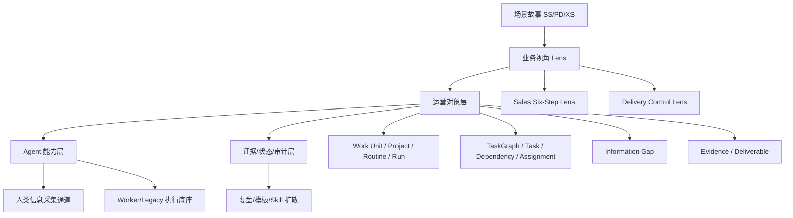

# DEV-29 能力覆盖矩阵与研发补洞清单

> 状态：研发前能力覆盖基准
> 读者：负责人、产品、设计、架构、前后端、Agent 编排、测试
> 依赖：DEV-23、DEV-26、DEV-28、DEV-30、DEV-32、DEV-33
> 核心目的：把销售与项目交付故事反推为系统能力、对象字段、Agent 契约、界面和测试要求。

## 1. 结论

DEV-28 说明了销售和项目交付的真实故事线。本文回答研发前更硬的问题：为了让这些故事线畅通，系统必须具备哪些能力；哪些能力属于 P1 必须做，哪些可以 P2/P3；哪些对象字段如果不提前设计，后面一定会反复打补丁。

当前最重要的设计结论：

- `TaskGraph` 必须成为销售、交付、行政 Routine 的统一运营事实中心。
- 销售视角和交付视角只是不同 Lens，不能自建两套孤立任务系统；销售侧 Lens 必须以 DEV-30 的六步法 Gate 为主干。
- `Information Gap` 必须是一等对象，否则“Agent 传感器不足”无法被产品化。
- `Evidence` 必须是一等对象，否则 Agent 的验收和复盘都会变成不可解释文本。
- `Human Twin Agent` 必须有权限、渠道、采集 schema、工作时间和确认记录，否则会越权或打扰过度。
- 研发前必须定义 `Business Object` 适配层，用来表达客户、联系人、商机、合同、交付范围、变更等业务实体。
- CRM 事实层与 Agent 事实层必须通过 Mirror、Writeback Intent、Policy、Queue、Audit 保持一致，不能让 Agent 自己维护一套与 CRM 分裂的销售事实。
- 项目管理事实层与 Agent TaskGraph 事实层也必须通过 Mirror、Writeback Intent、Policy、Queue、Audit 保持一致，不能让 Jira、禅道、TAPD、飞书项目或客户自研系统里的项目状态与 Agent 判断分裂。

## 2. 能力分层

## 3. 能力域清单

| 能力域 | 定义 | 支撑故事 | 优先级 |
|---|---|---|---|
| Work Unit 管理 | 创建 Project/Routine/Run，承载业务目标 | SS-01、SS-03、PD-01、PD-13 | P1 |
| TaskGraph Engine | 生成、校验、确认、启动、推进、重规划 | SS-21、SS-24、PD-13、PD-24 | P1 |
| Information Gap Engine | 识别、派发、追问、关闭信息缺口 | SS-09、SS-18、PD-08、PD-09、PD-32 | P1 |
| Evidence Engine | 收集、归档、评分、绑定任务和验收 | SS-23、SS-28、PD-21、PD-22、PD-33 | P1 |
| Human Twin Agent | 通知、采集、整理、追问、草稿，不默认提交 | SS-12、SS-39、PD-20、PD-26、XS-01 | P1 |
| PM Agent Planner | 从目标、资源、证据生成 TaskGraph | SS-01、SS-11、PD-13、PD-17 | P1 |
| PM Agent Verifier | 按证据和验收规则判断状态 | SS-15、SS-25、PD-22、PD-33 | P1 |
| Operating Console | 汇总异常、待确认、今日重点 | SS-02、SS-40、PD-14、PD-29 | P1 |
| Sales Six-Step Gate Engine | 检查 Discover、Scope、Go/No-Go、Validate Solution、Business Case、Negotiate Close 的 gates | D-G1 至 N-G4、SS-05A、SS-38A | P1 |
| CRM Fact Sync | 读取 CRM、镜像记录、反写任务/纪要/摘要、处理冲突 | DEV-32、SS-05A、SS-38A、N-G4 | P1 |
| Project Management Fact Sync | 读取项目管理系统、镜像项目/任务/评论/附件、反写评论/任务/摘要、处理冲突 | DEV-33、PD-01、PD-13、PD-20、PD-22、PD-33、PD-43、PD-44 | P1 |
| Sales Six-Step Lens | 用六步法阶段、Gate、证据、缺口和推荐 Activity 查看机会 | D-G1 至 N-G4、SS-05A、SS-15、SS-24A、SS-24B、SS-27、SS-31A、SS-38A | P2 |
| Delivery Control Lens | 用交付语义查看范围、风险、验收、变更和外部项目系统同步 | PD-01 至 PD-44 | P2 |
| Legacy Workflow Adapter | Task 调用旧 workflow 作为 Worker substrate | XS-08、SS-25、PD-34 | P2 |
| COO Signal Layer | 跨事项发现冷却、延期、资源冲突 | SS-40、SS-41、PD-29、PD-30 | P2 |
| Review & Template | Run 复盘、模板候选、Skill 候选 | SS-36、SS-42、PD-40、PD-41 | P2 |
| Governance & Audit | 权限、敏感信息、审计、越权防护 | SS-29、PD-25、XS-04、XS-05 | P1 |

## 4. 核心对象补充

DEV-26 已定义基础运营对象。销售和交付场景会引入业务对象，但这些业务对象不应取代 TaskGraph。

### 4.1 Business Object 适配层

| 对象 | 用途 | 与运营对象关系 | 优先级 |
|---|---|---|---|
| Account | 客户公司或组织 | 可关联多个 Work Unit / Opportunity / Project | P2 |
| Contact | 客户联系人 | 可作为 Information Gap 的信息来源或客户侧负责人 | P2 |
| Opportunity | 销售商机 | 是 Project 类型 Work Unit 的业务上下文，不是 TaskGraph | P2 |
| SalesGateCheck | 六步法 Gate 检查项 | 关联 Opportunity/Task/Information Gap/Evidence，控制阶段推进 | P1 |
| SalesActivityRecommendation | Gate 未达成时的推荐动作 | 由 Gate 缺口派生为 Task 或 Human Twin 追问 | P1 |
| ChampionProfile | Champion 或目标 Champion 成色 | 支撑 Discover/Scope 的 Champion 识别、测试和维系 | P1 |
| EconomicBuyerProfile | EB、预算权、优先级、评估标准 | 支撑 Go/No-Go 和 Business Case | P1 |
| Interaction | 电话、会议、微信、邮件等互动 | 产生 Evidence、更新 Information Gap | P1 |
| Proposal | 方案/报价 | Deliverable 的业务类型，可触发审批 | P2 |
| Contract | 合同及条款 | Evidence + Business Object，触发交付 Project | P2 |
| Payment Milestone | 付款节点 | 可生成财务 Task/Routine | P2 |
| Delivery Scope | 交付范围 | Project 的成功标准和验收规则来源 | P1 |
| Change Request | 变更请求 | 派生 TaskGraph 修改和审批 | P2 |
| Risk | 风险项 | 可以从 Task/Gap/Evidence 派生，也可以独立跟踪 | P1 |
| Stakeholder Map | 客户/内部角色关系 | 支撑销售决策链和交付责任链 | P2 |
| ValidationPlan | 验证计划、标准、双方责任和证据 | 支撑 Validate Solution | P1 |
| BusinessCase | Before/After、能力、指标、方案、差异和证据 | 支撑 Business Case | P2 |
| NegotiationPlan | 谈判底线、交换条件、盟友、阻力和流程 | 支撑 Business Case 到 Negotiate Close | P2 |
| OrderChecklist | 报价、订单、合同、PO、付款、开票、收入确认 | 支撑 Negotiate Close | P2 |
| SOWCheck | 范围、排除项、验收、交付资源、风险确认 | 支撑 Negotiate Close 与交付衔接 | P2 |
| CRMConnection | 外部 CRM 连接、能力、权限和同步状态 | 支撑 CRM 读取与反写 | P1 |
| CRMRecordMirror | 外部 CRM 记录快照 | 支撑 Agent 判断和事实追溯 | P1 |
| CRMWritebackIntent | Agent 写回 CRM 的意图 | 支撑确认、策略、幂等和审计 | P1 |
| CRMWritebackQueue | 待执行、成功、失败、冲突的反写队列 | 支撑可靠写回 | P1 |
| CRMFieldMapping | CRM 字段与标准业务对象映射 | 支撑泛化 CRM 适配 | P2 |
| PMConnection | 外部项目管理系统连接、能力、权限和同步状态 | 支撑 Jira、禅道、TAPD、飞书项目、自研系统读取与反写 | P1 |
| PMRecordMirror | 外部项目、任务、评论、附件、里程碑快照 | 支撑 Agent 判断和事实追溯 | P1 |
| PMWritebackIntent | Agent 写回项目管理系统的意图 | 支撑确认、策略、幂等和审计 | P1 |
| PMWritebackQueue | 待执行、成功、失败、冲突的项目管理反写队列 | 支撑可靠写回 | P1 |
| PMFieldMapping | 项目管理系统字段与标准交付对象映射 | 支撑泛化项目管理适配和自研系统接入 | P2 |
| ExternalFactMirror | CRMRecordMirror 与 PMRecordMirror 的抽象父模式 | 支撑未来 ERP、合同、工单等外部事实层接入 | P2 |

### 4.2 不要犯的对象错误

| 错误 | 后果 | 正确做法 |
|---|---|---|
| 把 Opportunity 当 Project | 销售阶段和执行任务混乱 | Opportunity 是业务上下文，Project/Run/TaskGraph 是运营执行 |
| 把销售阶段当 Gate | CRM 阶段会虚高，赢率判断失真 | 阶段推进必须看 SalesGateCheck 状态和证据 |
| 把 Agent 事实当 CRM 事实 | 销售、经理、报表看到的事实不一致 | CRM 事实通过 Mirror 同步，Agent 判断通过 Writeback Intent 回写摘要或任务 |
| 直接覆盖 CRM 关键字段 | 可能污染金额、阶段、预测和经营报表 | amount/stage/close_date 等需确认和审计 |
| 把外部项目任务当 Agent Task | 外部状态完成但缺证据，Agent 仍会误判交付完成 | 外部 issue/task 是项目管理事实，TaskGraph Task 是运营验收事实 |
| 直接覆盖外部项目关键字段 | 可能改变客户承诺、负责人、截止时间和团队排序 | status/assignee/due_date/priority 等需确认和审计 |
| 把 Champion 友好当 Champion 成立 | Coach 被误判为 Champion，后期无法见 EB | ChampionProfile 必须记录 EB access、个人成功和内部销售能力 |
| 把合同当附件 | 条款无法触发任务和风险 | Contract 既是 Evidence，也是业务对象 |
| 把客户反馈写成备注 | Agent 不能引用和验收 | Interaction/Evidence 结构化入库 |
| 把变更写成任务标题 | 无法计算范围、成本和授权 | Change Request 独立建模并驱动重规划 |
| 把风险写在复盘里 | 无法提前干预 | Risk 应在执行中持续更新 |

## 5. TaskGraph 最小能力矩阵

| 能力 | 最小要求 | 支撑故事 | P1/P2 |
|---|---|---|---|
| 任务依赖 | 至少支持 finish_to_start 和 blocks | PD-13、PD-14 | P1 |
| 并行任务 | 支持多个 ready task 同时派发 | SS-02、PD-19 | P1 |
| 任务派生 | Agent 可因缺口、缺陷、变更新增任务 | SS-24、PD-24、PD-27 | P1 |
| 重规划原因 | 每次新增/改期/改依赖必须有 reason | SS-21、PD-28、PD-29 | P1 |
| 执行主体 | 支持 PM Agent、Worker Agent、Human Twin、真人、外部系统 | SS-26、PD-19 | P1 |
| 证据要求 | 每个可验收任务可声明 required_evidence | SS-14、PD-21 | P1 |
| 验收规则 | 任务可声明 acceptance_criteria | SS-25、PD-17、PD-33 | P1 |
| 信息缺口 | Task 可绑定 Information Gap | SS-18、PD-08、PD-32 | P1 |
| Gate 驱动 | SalesGateCheck 可派生 Information Gap、Activity、Task 和阶段推进建议 | D-G1 至 N-G4 | P1 |
| CRM 镜像 | Task 可引用 crm_mirror_id、crm_external_id、crm_url 和 crm_snapshot | N-G4、DEV-32 | P1 |
| 风险标记 | Task/Run 可标记 risk_level 和 escalation_rule | SS-29、PD-25 | P1 |
| 业务引用 | Task 可关联 Account/Opportunity/Contract/Scope 等 | SS-35、PD-03 | P2 |
| 版本化 | TaskGraph 有 version，重规划产生新版本 | PD-28、XS-05 | P1 |
| Lens 过滤 | 同一图谱可按销售/交付/行政视角过滤 | SS/PD 全部 | P2 |
| 项目系统镜像 | Task 可引用 pm_mirror_id、pm_external_id、pm_url 和 pm_snapshot | PD-13、PD-20、PD-22、DEV-33 | P1 |

## 6. Information Gap 设计要求

Information Gap 是 Agent 传感器不足的产品化表达。它不能只是聊天追问。

### 6.1 必要字段

| 字段 | 含义 |
|---|---|
| id | 缺口 ID |
| task_id | 关联任务 |
| run_id | 关联执行实例 |
| gap_type | 例如 customer_identity、budget、scope、onsite_environment |
| question | Agent 要问的问题 |
| reason | 为什么这个信息影响判断 |
| required_schema | 期望返回结构 |
| suggested_collector | 建议由谁采集 |
| collection_channel | IM、任务页、会议后补录等 |
| priority | low / medium / high / critical |
| due_at | 期望反馈时间 |
| status | open / assigned / collecting / submitted / closed / waived |
| confidence_impact | 该信息对 Agent 判断置信度的影响 |
| escalation_rule | 逾期或高风险如何升级 |

### 6.2 Gap 类型优先级

| 场景 | P1 必做类型 | P2 类型 |
|---|---|---|
| 销售 | 六步法 Gate 缺口、Champion、EB、需求痛点、下一步承诺、预算/付款、决策链、验证标准、报价/SOW/CRM | 竞品、客户风格、采购历史、复购机会 |
| 交付 | 范围、需求、现场环境、客户责任、验收标准、风险 | 第三方依赖、变更、运维移交、满意度 |
| 通用 | 缺证据、低置信度、权限不足、渠道不可达 | 组织经验、模板候选、Skill 候选 |

### 6.3 验收标准

Information Gap 关闭必须满足至少一种条件：

- 收到符合 schema 的 Evidence。
- Agent 判断该信息已由其他证据替代，并记录替代理由。
- 负责人明确豁免，并记录风险。
- 该任务被取消，缺口不再影响执行。

不得出现“Agent 追问了但没人回答，任务仍自动完成”的情况。

## 7. Evidence 设计要求

Evidence 是 Agent 判断的地基。没有 Evidence，验收只是文本。

### 7.1 Evidence 类型

| 类型 | 示例 | 典型故事 |
|---|---|---|
| text_note | 销售拜访纪要、项目日报 | SS-12、PD-20 |
| customer_quote | 客户原话 | SS-14、SS-19、PD-27 |
| image | 现场照片、卫生检查照片 | PD-09、PD-26 |
| file | 合同、报价、方案、验收单 | SS-30、PD-34 |
| link | 文档链接、系统链接 | PD-21 |
| meeting_summary | 会议纪要 | SS-23、PD-07 |
| meeting_minutes | 正式会议记录或客户确认版纪要 | S-G4、V-G2 |
| email | 邮件确认、采购或客户书面回复 | S-G4、V-G2、B-G3 |
| chat_screenshot | 微信、企微或 IM 截图 | S-G4、V-G2 |
| whiteboard_photo | 现场板书、方案草图或会议白板照片 | S-G4 |
| structured_form | 需求表、验收 checklist | PD-08、PD-33 |
| system_event | 发送、签收、审批、付款状态 | SS-31、PD-37 |
| human_confirmation | 人类确认记录 | SS-29、PD-17、XS-05 |
| sales_note | 销售补充记录 | D-G1、D-G3、D-G4、D-G6、S-G5 |
| stakeholder_map | 客户角色、组织分工、决策链图谱 | D-G3、D-G4 |
| budget_note | 预算、预算来源、预算区间或付款预期记录 | S-G3、G-G2 |
| calendar_event | 日程、会议邀请或约定时间 | D-G7、S-G2、S-G5、G-G4 |
| customer_confirmation | 客户对下一步、责任、会议或结论的确认 | D-G7、S-G5、G-G4、B-G3 |
| evaluation_criteria | 供应商评估标准、评分规则或采购标准 | G-G3 |
| process_note | 业务流程、IT 流程、验证流程或采购流程记录 | D-G5、V-G3 |
| validation_plan | POC、Demo、案例考察、企业考察或行业报告验证计划 | V-G1、V-G2、V-G3 |
| business_case | 验证报告、业务价值报告或给 EB 的方案结论 | B-G1、B-G2 |
| champion_confirmation | Champion 对收益、时间、预算、验证标准、报告的确认 | S-G1 至 S-G4、V-G1、V-G2、B-G1 |
| eb_confirmation | EB 对痛点、优先级、预算、流程、评估标准、方案的确认 | G-G1 至 G-G4、B-G2 |
| external_research | 外部调研、竞品公开资料、采购历史或伙伴信息 | D-G6 |
| approval_record | 内部审批、授权或例外批准记录 | N-G1、N-G2 |
| pricing_model | 定价模型、折扣、付款条件或价格测算 | N-G1 |
| order_checklist | 订单检查项、PO、发票、付款、收入确认检查 | N-G2 |
| contract_document | 合同正文、合同附件或订单文件 | N-G2 |
| contact_record | 采购、法务、客户联系人或内部角色联系记录 | B-G3 |
| internal_review | 内部评审、销售复盘或谈判评审记录 | B-G4 |
| negotiation_plan | 谈判计划、底线、交换条件和推进路径 | B-G4 |
| crm_snapshot | CRM 机会状态、金额、预计签约时间、附件快照 | N-G4 |
| sow | SOW 文档或 SOW 检查结果 | N-G3 |
| risk_note | 风险说明、风险评估或缓解动作 | N-G3、PD-05、PD-29 |
| crm_url | CRM 机会链接 | N-G4 |
| pm_url | 外部项目或任务链接 | PD-13、PD-20、PD-22 |
| pm_snapshot | 外部项目管理系统任务状态、负责人、截止时间、评论和附件快照 | PD-13、PD-20、PD-22 |
| delivery_confirmation | 交付负责人对 SOW、范围、风险或资源的确认 | N-G3、PD-17、PD-33 |

### 7.2 必要字段

| 字段 | 含义 |
|---|---|
| id | 证据 ID |
| source_type | human / agent / system / external |
| source_actor_id | 来源人或 Agent |
| capture_channel | IM / web / API / legacy workflow |
| task_id | 关联任务 |
| gap_id | 可选，关闭哪个信息缺口 |
| business_refs | 可选，关联客户、商机、合同、范围 |
| content_ref | 文件、文本、链接或对象存储引用 |
| summary | Agent 可读摘要 |
| quality_score | 完整性和可信度评分 |
| sensitivity | public/internal/confidential/restricted |
| created_at | 创建时间 |

### 7.3 质量要求

| 规则 | 说明 |
|---|---|
| 证据可追溯 | 必须知道是谁、何时、从哪里提交。 |
| 证据可引用 | Agent 验收、复盘、模板沉淀必须引用 Evidence ID。 |
| 证据可降级 | 低质量证据不能直接完成高风险任务。 |
| 证据可补充 | 不完整证据触发 needs_supplement，而不是覆盖旧证据。 |
| 敏感证据受控 | 合同、价格、个人信息不能在所有视图默认展开。 |

## 8. Human Twin Agent 能力矩阵

| 能力 | P1 行为 | 禁止行为 |
|---|---|---|
| 通知 | 把任务、缺口、截止和原因讲清楚 | 只发“请尽快处理” |
| 追问 | 按 required_schema 追问缺失字段 | 无限制连续追问 |
| 整理 | 把语音/文字/图片反馈整理为结构化 Evidence | 篡改真人意思 |
| 草稿 | 生成邮件、纪要、客户回复、报告草稿 | 未经确认直接发送高风险内容 |
| 完整性检查 | 判断反馈是否满足 schema | 以主观判断替代验收规则 |
| 权限执行 | 只在授权范围内行动 | 默认替真人确认、签字、承诺 |
| 工作时间 | 支持免打扰和紧急例外 | 不分优先级持续打扰 |
| 反馈解释 | 告诉真人为什么要采集这些信息 | 把人当作填表机器 |

## 9. Agent 契约清单

### 9.1 PM Agent Plan Contract

输入必须包含：

- Work Unit 类型：Project 或 Routine。
- 目标、成功标准、截止或周期。
- 可用人员、Human Twin Agent、Worker Agent。
- 自治等级。
- 当前已知业务上下文和证据。
- 风险边界和禁止动作。

输出必须包含：

- TaskGraph draft。
- Task 列表、依赖、执行主体和截止。
- 每个任务的 required_evidence 和 acceptance_criteria。
- 初始 Information Gaps。
- 需要人确认的节点。
- 置信度和主要不确定性。

### 9.2 PM Agent Verify Contract

输入必须包含：

- Task。
- Evidence 列表。
- Information Gap 状态。
- Acceptance Criteria。
- 风险等级和授权边界。

输出只能是：

| 结果 | 含义 |
|---|---|
| accepted | 证据足够，任务完成。 |
| needs_supplement | 证据不足，需要补充。 |
| blocked | 外部依赖或关键条件不满足。 |
| failed | 明确不达标。 |
| escalated | 低置信度、高风险或越权，需要人确认。 |

输出必须说明：

- 引用了哪些 Evidence。
- 哪些规则通过或失败。
- 是否创建新 Information Gap 或派生任务。
- 是否需要人工确认。

### 9.3 Human Twin Collect Contract

输入：

- Information Gap。
- 采集对象。
- 渠道。
- required_schema。
- due_at。
- 打扰策略。

输出：

- 发给真人的自然语言请求。
- 收到的原始反馈。
- 结构化 Evidence。
- 完整性检查结果。
- 是否需要追问。

### 9.4 Replan Contract

任何重规划必须记录：

- replan_reason。
- 触发证据。
- 受影响任务。
- 新增、删除或修改的依赖。
- 是否需要人确认。
- 版本号变化。

## 10. 界面能力覆盖矩阵

| 界面 | P1 必备 | P2 扩展 |
|---|---|---|
| Operating Console | 待确认、异常、逾期、低置信度、今日重点 | 管线预测、资源冲突、跨项目趋势 |
| AI PM Builder | 创建 Project/Routine，选自治等级、资源、证据偏好 | 行业模板、历史模板推荐 |
| TaskGraph View | 任务、依赖、状态、证据、缺口、重规划原因 | 销售/交付 Lens、关键路径 |
| Information Gap Inbox | 缺口列表、原因、采集人、schema、截止、状态 | 批量追问、问题合并、打扰控制 |
| Human Twin Console | 权限、渠道、工作时间、待采集任务 | 个人 Skill、反馈质量分析 |
| Evidence Review | 查看证据、验收、退回补充、敏感标记 | 证据质量评分、自动摘要对比 |
| Sales Six-Step Lens | 六阶段、Gate 状态、缺口、推荐 Activity、证据、Champion/EB 面板 | 管线预测、话术建议、客户调研、周销售报告 |
| CRM Connection | CRM provider、能力等级、同步状态、最近错误、权限范围 | 多 CRM 管理、字段映射 |
| PM Connection | 项目管理 provider、能力等级、同步状态、最近错误、权限范围、只读/可写状态 | 多项目管理系统管理、字段映射 |
| External Sync Console | CRM/PM 连接、镜像新鲜度、字段映射、同步错误、反写策略 | 外部系统统一治理、能力降级策略 |
| Writeback Queue | 待确认、待执行、成功、失败、冲突的 CRM/PM 反写任务 | 自动重试、冲突处理 |
| Conflict Inbox | CRM/PM 与 Agent 不一致字段、风险和处理建议 | 批量处理、策略优化 |
| Delivery Control Lens | 暂可用 TaskGraph + 风险标签 + PMRecordMirror 状态摘要替代 | 范围、变更、验收、客户责任和外部项目系统视图 |
| Retrospective | Run 结果、异常、证据、改进建议 | 模板/Skill 发布流 |
| Admin/Governance | 用户、Human Twin 权限、审计 | 细粒度策略、敏感数据规则 |

## 11. P1/P2/P3 边界

### P1 必须做

P1 的目标是让“AI 管事闭环”成立，而不是完整替代 CRM 或完整替代项目管理系统。

必须包含：

- Project/Routine/Run 最小模型。
- TaskGraph 最小 DAG、状态机、版本。
- Task、Assignment、Dependency。
- Information Gap 一等对象。
- Evidence 一等对象。
- Human Twin Agent 默认权限和采集闭环。
- PM Agent Plan / Verify 契约。
- Sales Six-Step Gate Engine：至少覆盖 DEV-30 的 D-G1 至 N-G4，支持 gate 状态、证据、缺口和推荐 Activity。
- CRM Fact Sync：至少支持 CRM 读取、Record Mirror、低风险 Task/Note/Activity 反写、Writeback Intent、Audit。
- Project Management Fact Sync：至少支持项目管理系统读取、Record Mirror、低风险 Comment/Evidence Link 反写、Writeback Intent、Audit，并为 Jira、禅道、TAPD、飞书项目和自研系统预留适配。
- Operating Console、AI PM Builder、TaskGraph View、Information Gap Inbox 的最小界面。
- 销售六步法 Gate 巡检和交付需求采集至少各跑通一条端到端故事。
- 审计：授权、派发、验收、重规划、人工确认。

### P2 再做

- Account、Contact、Opportunity、Contract、Change Request 等完整业务对象。
- Sales Six-Step Lens 的完整视图。
- Delivery Control Lens。
- Legacy Workflow Adapter。
- COO Signal Layer。
- 模板候选和 Skill 候选审核。
- 资源冲突、管线预测、关键路径。

### P3 再做

- 行业模板市场。
- 复杂组织资源优化。
- 多模型评测和自动策略调参。
- L4 事后审计自治。
- 深度财务、法务、人事流程。

## 12. 研发补洞清单

以下问题如果不在编码前解决，后续很容易打补丁：

| 缺口 | 为什么危险 | 推荐处理 |
|---|---|---|
| 没有 Business Object 适配层 | 销售和交付字段会污染 TaskGraph | P1 先预留 business_refs，P2 建对象表 |
| Information Gap 状态太弱 | Agent 追问无法闭环 | P1 建独立状态机 |
| Evidence 只是附件 | 验收不可解释 | P1 证据必须可引用、可评分、可关联缺口 |
| Human Twin 无打扰策略 | 人类疲劳，系统被抵触 | P1 支持优先级、工作时间、合并问题 |
| Agent 输出无契约 | UI 和状态机无法稳定消费 | P1 先做 JSON schema 和契约测试 |
| 销售/交付自建状态 | 产品会变成多个烟囱 | 所有状态回到 Run/TaskGraph/Task |
| 销售阶段不看 Gate | 销售可能把机会推到后段但关键事实缺失 | 以 SalesGateCheck 控制阶段质量和推进建议 |
| Gate 缺口没有 Activity | Agent 只能报问题，不能推动销售动作 | 每个 missing gate 必须映射推荐 Activity 和采集问题 |
| CRM 同步后置 | Agent 与销售原系统事实分裂 | P1 就建立 CRM Mirror 和 Writeback Intent |
| 项目管理同步后置 | Agent 与交付原系统事实分裂 | P1 就建立 PMRecordMirror 和 PMWritebackIntent |
| 反写无幂等 | 重试造成重复任务或重复纪要 | CRM 写操作必须有 idempotency_key |
| 项目系统反写无幂等 | 重试造成重复评论、子任务或风险项 | PM 写操作必须有 idempotency_key |
| 缺少低置信度表达 | Agent 会装作确定 | Verify Contract 必须支持 escalated |
| 变更没有独立语义 | 交付范围失控 | P1 用 replan_reason，P2 建 Change Request |
| 审计后置 | 越权和争议无法追溯 | P1 把审计作为状态变化副产物 |

## 13. 测试覆盖矩阵

| 测试 | 必测故事 | 核心断言 |
|---|---|---|
| 卫生检查 Routine | DEV-25 MVP | 缺证据不能完成，派生整改有原因 |
| 销售六步法 Gate 巡检 | DEV-30、SS-05A、SS-15、SS-24A、SS-24B、SS-27、SS-31A、SS-38A | Agent 按阶段 gates 输出缺口、证据、推荐 Activity 和责任人 |
| Discover 阶段 | D-G1 至 D-G7 | 无 Champion、痛点、下一步时不得进入 Scope |
| Scope 阶段 | S-G1 至 S-G5 | 未获 Champion 对收益/时间/预算确认或未约 EB 时不得认为 Scope 完成 |
| Go/No-Go 阶段 | G-G1 至 G-G4 | 未见 EB 或 EB 未确认关键事项时不得进入验证投入 |
| Validate Solution 阶段 | V-G1 至 V-G3 | 无验证计划、标准、过程证据时必须生成缺口 |
| Business Case 阶段 | B-G1 至 B-G4 | 未向 EB 汇报、未接采购、无谈判计划时不得进入谈判完成态 |
| Negotiate Close 阶段 | N-G1 至 N-G4 | 报价、订单、SOW、CRM 任一缺失时不得判定 Closed-Won |
| CRM 事实同步 | DEV-32 | CRM 阶段与 Agent Gate 不一致时显示风险，不静默覆盖 |
| CRM 反写 | DEV-32 | 低风险 Task/Note 可反写，金额/阶段/预计成交日需确认 |
| 项目管理事实同步 | DEV-33 | 外部任务状态与 Agent Task 状态不一致时显示风险，不静默覆盖 |
| 项目管理反写 | DEV-33 | 低风险 Comment/Evidence Link 可反写，状态/负责人/截止时间/优先级需确认 |
| 销售报价审批 | SS-28、SS-29、SS-31 | 超权限报价必须人工确认 |
| 销售输单复盘 | SS-36、SS-42 | 输单原因绑定证据并生成 Skill 候选 |
| 交付启动 | PD-01、PD-02、PD-03、PD-05 | 交接包不完整必须追问销售 |
| 交付现场采集 | PD-08、PD-09、PD-10 | 现场信息不足不得进入实施 |
| 变更闭环 | PD-27、PD-28、PD-29 | 变更必须有影响评估和确认 |
| 验收回款 | PD-33、PD-35、PD-37 | 验收证据触发付款任务 |
| Human Twin 权限 | XS-01、XS-04、XS-05 | 默认权限不能替真人提交确认 |
| 旧 workflow 调用 | XS-08 | 返回结果必须映射为 Deliverable/Evidence |

## 14. 进入代码实现前的最终准出

进入代码实现前，需要至少完成以下文档或契约：

| 项目 | 状态要求 |
|---|---|
| TaskGraph JSON Schema | 必须完成 |
| Sales Six-Step Gate Schema | 必须完成 |
| External Fact Mirror / Writeback Intent Schema | 必须完成，并覆盖 CRM 与项目管理系统两类样例 |
| Information Gap JSON Schema | 必须完成 |
| Evidence JSON Schema | 必须完成 |
| PM Agent Plan/Verify 输出样例 | 必须完成 |
| Human Twin Collect 输出样例 | 必须完成 |
| P1 Demo Data | 必须完成 |
| 销售六步法 Gate 巡检验收脚本 | 必须设计完成 |
| 交付需求采集与项目管理同步端到端验收脚本 | 必须设计完成 |
| Legacy 接入边界 | 至少定义 Adapter 输入输出 |

本文之后的研发工作应进入可执行 schema、fixture、契约测试和端到端验收脚本。DEV-31 已给出最小契约样例；下一步不是继续扩写概念，而是把这些契约落成机器可校验资产。
