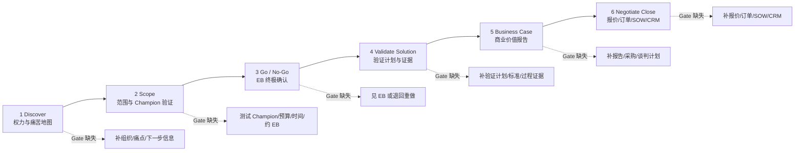
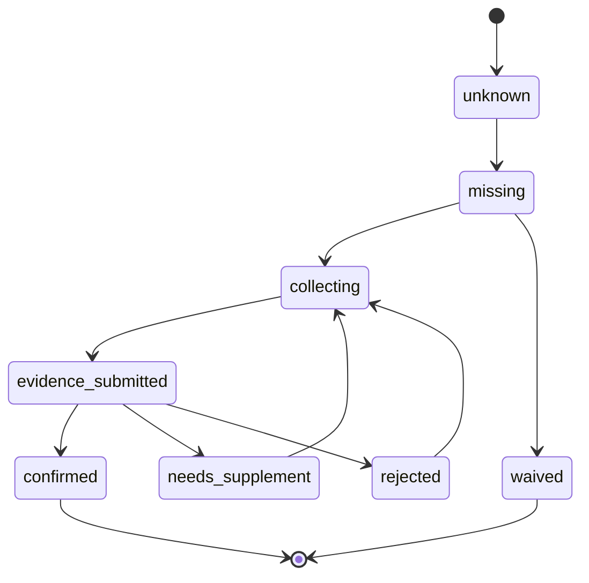

# DEV-30 销售六步法 Gate 驱动运营设计

> 状态：销售场景权威标准
> 读者：产品、销售管理、Agent 编排、前后端、测试
> 依赖：DEV-23、DEV-28、DEV-29、DEV-32
> 权威来源：`D:\提示词收藏\MEDDIC销售助手` 与用户补充的销售六步法 gates

## 1. 核心结论

销售场景不能按泛化 CRM pipeline 设计。系统必须以销售六步法作为主干：

```text
Discover -> Scope -> Go/No-Go -> Validate Solution -> Business Case -> Negotiate Close
```

每个阶段都由 `Gate` 控制。Gate 不是备注，也不是销售自评，而是 Agent 推进商机阶段的验收条件。Gate 未达成时，系统不应只提示“请跟进”，而要生成具体的 `Information Gap`、推荐 `Activity`、采集问题、证据要求和下一步任务。

销售 Agent 的价值不是替销售幻想赢率，而是基于证据判断：这个机会现在卡在哪个 gate，缺什么信息，谁去补，怎么补，补完后是否足以进入下一阶段。

## 2. 设计原则

| 原则 | 说明 |
|---|---|
| Gate 优先 | 阶段名称只表示位置，Gate 状态才表示质量。 |
| 证据优先 | Champion、EB、预算、时间计划、验证结果、报价、SOW 等必须绑定 Evidence。 |
| CRM 一致性 | CRM 是原有业务事实层，Agent Gate 是运营判断层；读写 CRM 必须遵守 DEV-32 的 Mirror、Writeback Intent、Policy 和 Audit。 |
| 缺口产品化 | Gate 未达成必须生成 Information Gap，而不是藏在销售备注里。 |
| 活动可推荐 | 每个未达成 Gate 都要能反推出建议 Activity。 |
| 人类补传感器 | 销售负责补充客户现场信息、客户原话、会议细节和真实关系。 |
| Agent 做判断 | Agent 根据 CRM、记忆、知识、证据和销售反馈判断 gate 健康度。 |
| 不越权 | Agent 可建议 Go/No-Go，但高价值机会的放弃、报价、SOW、合同承诺需人确认。 |

## 3. 六阶段总图



## 4. Gate 状态机

Gate 必须有独立状态，不能只靠 Opportunity 阶段字段。



| 状态 | 含义 |
|---|---|
| unknown | 系统不知道该 Gate 是否满足。 |
| missing | 已知未满足，需要补动作。 |
| collecting | 已派发信息采集或销售动作。 |
| evidence_submitted | 已有证据，等待 Agent 或人验收。 |
| confirmed | Gate 达成，可用于阶段推进。 |
| needs_supplement | 证据不足，需要补充。 |
| rejected | 证据明确不支持 Gate 达成。 |
| waived | 负责人豁免，并记录风险。 |

阶段推进规则：

- 默认要求当前阶段所有必要 Gate 为 `confirmed` 或经负责人 `waived`。
- `Go/No-Go` 阶段必须有 EB 亲口或当面确认的证据，否则不得自动进入验证投入。
- `Negotiate Close` 阶段的报价、订单、SOW、CRM 状态必须分别检查，不能只看合同签署。

## 5. Discover 阶段

目标：绘制客户内部的权力与痛苦地图，判断机会是否值得进入正式管道。

### 5.1 Gates

| Gate ID | Gate | Agent 应追问 |
|---|---|---|
| D-G1 | 是否有 champion 或目标 champion | “这次互动里，谁提问或点评最多？谁听得最认真？谁更像未来会推动这件事的人？” |
| D-G2 | 客户关注点 | “他们今天明确讲到了哪些关注点？哪些是反复提到的？” |
| D-G3 | champion 部门、组织与分工 | “这个人属于哪个部门？你们有没有聊到相关组织、上下游协作或分工？” |
| D-G4 | 决策人、决策行为与 EB 判断 | “如果项目运作，可能有哪些决策人和决策动作？经济决策人现在有判断吗？” |
| D-G5 | 痛点与现状 | “对方有哪些痛点和现状，可能与我们的项目机会相关？” |
| D-G6 | 潜在竞争对手 | “有没有提到竞争对手、已有供应商或替代方案？” |
| D-G7 | 下一步行动计划 | “有没有约定明确下一步？时间、参与人、目标分别是什么？” |

补充文档化成果：

- 角色地图：Champion、目标 Champion、EB、技术评估者、最终用户、采购/法务等。
- 可解决痛苦：客户原话、痛苦是否可被我们解决。
- 痛苦影响：业务损失、成本、效率、风险、战略影响。
- 现状流程：当前 IT 流程、业务流程、采购历史。
- 下一步行动：双方认可的时间、动作和责任人。

### 5.2 Gate 未达成时的 Activities

| 缺口 | 推荐 Activity |
|---|---|
| 不清楚客户组织价值 | 调研客户定位、行业地位、营收规模、行业领导力、AI/数据相关动态。 |
| 不清楚人员结构 | 采集人员、组织架构、部门分工、汇报关系。 |
| 不清楚需求来源 | 追问需求来源、需求内容、谁提出、为什么现在提出。 |
| 不清楚痛点影响 | 用客户原话追问痛点、影响、业务价值和不解决的后果。 |
| 不清楚现状流程 | 采集当前 IT 流程、业务流程、工具、瓶颈。 |
| 不清楚采购历史 | 查询历史采购、合同、预算、合作伙伴、竞争对手。 |
| 没有下一步 | 要求销售推动客户确认下一次会议或明确材料动作。 |

### 5.3 验收

Discover 阶段完成，不等于“有客户愿意聊”。最低验收是：

- 至少有目标 Champion 或明确寻找 Champion 的计划。
- 有客户关注点、痛点、现状和影响的证据。
- 有初步 EB/决策链假设。
- 有明确下一步行动。

## 6. Scope 阶段

目标：把模糊需求变成项目范围、收益、时间、预算和 Champion 承诺。

### 6.1 Gates

| Gate ID | Gate | Agent 应追问 |
|---|---|---|
| S-G1 | Champion 当面或亲口确认项目收益 | “Champion 有没有亲口确认这个项目对他的组织有什么收益？” |
| S-G2 | Champion 当面或亲口确认时间计划 | “他有没有确认项目推进的时间计划、关键节点或期望上线时间？” |
| S-G3 | Champion 当面或亲口确认可能预算 | “有没有试探到可能预算、预算来源或预算区间？” |
| S-G4 | 对收益、时间、预算有书面确认 | “有没有通过邮件、微信、现场板书照片、会议纪要等方式确认？” |
| S-G5 | Champion 帮忙约 EB | “Champion 有没有愿意并实际帮助约 EB？” |

### 6.2 Gate 未达成时的 Activities

| 缺口 | 推荐 Activity |
|---|---|
| 收益不清 | 按销售咒语整理：现状、痛点、目标、收益、所需能力、指标、方案、特点。 |
| Champion 未验证 | 测试 Champion：是否提供内部信息、是否能约 EB、是否愿意帮你内部销售。 |
| 时间节奏不清 | 与 Champion 建立项目推进时间表。 |
| 预算不清 | 试探潜在预算、预算来源、付款条件和付款周期。 |
| 决策因素不清 | 追问验证触发点、决策因素、评分标准、价格分占比和价格公式。 |
| 商务流程不清 | 追问招采方式、合同签订形式、合同签订时间、采购/法务流程。 |
| 成本不清 | 做成本估算，判断毛利和资源投入是否合理。 |

### 6.3 Champion 判定

真正的 Champion 至少应满足：

- 有影响力或权力。
- 能接触或引荐 EB。
- 把项目成功视为个人成功。
- 能在销售不在场时替我们销售。

不能把友好、愿意聊天、愿意提供资料的人直接当 Champion。这类人可能只是 Coach。

## 7. Go / No-Go 阶段

目标：在投入验证资源前，由 EB 亲自确认项目是否值得继续。

### 7.1 Gates

| Gate ID | Gate | Agent 应追问 |
|---|---|---|
| G-G1 | EB 当面或亲口确认痛点、优先级、业务收益 | “EB 是否认可痛点？优先级排在哪里？是否认可业务收益？” |
| G-G2 | EB 当面或亲口确认流程、时间计划和预算 | “EB 是否确认决策流程、时间计划和预算范围？” |
| G-G3 | EB 确认供应商评估标准 | “EB 会怎样评估供应商？关键标准是什么？价格、能力、案例、风险各占多少？” |
| G-G4 | 约定验证后的 EB 会议 | “是否已经约好供应商评估或验证后的复盘会议？” |

### 7.2 Gate 未达成时的 Activities

| 缺口 | 推荐 Activity |
|---|---|
| 未见 EB | 优先动作是见 EB；可建议销售 leader 与销售共同拜访。 |
| EB 不认可痛点 | 回退 Discover，重新确认痛点和影响。 |
| EB 不认可收益 | 回退 Scope，重做商业价值和 Champion 共识。 |
| 没预算或没时间 | 标记 No-Go 风险，避免投入 POC 资源。 |
| 未约验证后会议 | 在 EB 会议结束前锁定下一次复盘时间。 |

### 7.3 Go/No-Go 判断

`Go` 信号：

- EB 认可痛点、优先级和业务收益。
- EB 确认流程、时间计划、预算或预算路径。
- EB 确认评估标准。
- 已约定验证后的复盘会议。

`No-Go` 或回退信号：

- 无法见 EB。
- EB 不认可痛点或优先级。
- EB 不给预算、不确认时间、不愿约下一步。
- Champion 无法推动 EB，且没有替代路径。

## 8. Validate Solution 阶段

目标：用可控验证证明方案能解决客户问题，并系统性收集证据。

### 8.1 Gates

| Gate ID | Gate | Agent 应追问 |
|---|---|---|
| V-G1 | 与 Champion 当面讨论并制定验证计划与标准 | “验证形式是 POC、Demo、案例考察、企业考察还是行业报告？标准是谁定的？” |
| V-G2 | 验证计划与标准有书面确认 | “POC 或验证标准是否有邮件、微信、会议纪要、确认文档？” |
| V-G3 | 验证过程清楚 | “我们要做什么？客户要做什么？谁提供数据、环境、人员、反馈？” |

### 8.2 Gate 未达成时的 Activities

| 缺口 | 推荐 Activity |
|---|---|
| 验证形式不清 | 制定验证计划：行业报告、案例、POC、Demo、企业考察。 |
| 成功标准不清 | 与 Champion 共创验证标准，避免客户中途改口径。 |
| 证据不足 | 收集截图、报告、差异点、客户反馈、验证结果。 |
| 过程不清 | 明确我们做什么、客户做什么、时间表、权限、数据、环境。 |
| 商务流程未确认 | 并行确认商务流程：行为、人和时间表。 |
| 需要外部咨询 | 安排验证咨询电话或专家交流。 |

### 8.3 验收

验证阶段完成必须有：

- 验证计划。
- 验证标准。
- 过程记录。
- 证据包。
- 验证总结文档。
- 商务流程初步记录。

## 9. Business Case 阶段

目标：把验证结果转化为 EB 能接受的商业价值报告，并准备进入谈判。

### 9.1 Gates

| Gate ID | Gate | Agent 应追问 |
|---|---|---|
| B-G1 | 与 Champion 当面回顾验证报告 | “是否和 Champion 面对面复盘验证结果，并共同确认胜利点？” |
| B-G2 | 与 EB 当面汇报验证结论并确定方案 | “是否向 EB 汇报并获得方案认可？” |
| B-G3 | 通过 Champion 或 EB 引荐采购 | “是否已经建立采购、法务或后续流程联系？” |
| B-G4 | 内部制定谈判计划 | “销售团队内部是否有书面谈判计划、底线和交换条件？” |

### 9.2 Gate 未达成时的 Activities

| 缺口 | 推荐 Activity |
|---|---|
| 报告未完成 | 联合开发和完成 Business Case 报告。 |
| Champion 未对齐 | 与 Champion 回顾并完成报告，确保数据和措辞一致。 |
| EB 未认可 | 向 EB 提交业务报告，争取口头和书面认可。 |
| 未接触采购 | 通过 Champion 或 EB 引荐采购/法务。 |
| 谈判无计划 | 制定谈判计划：底线、可交换价值、对方风格、盟友和阻力。 |

### 9.3 Business Case 结构

Business Case 至少回答：

- Before：客户之前是什么状态，痛点是什么。
- After：解决后会是什么状态。
- Required Capabilities：客户需要哪些能力。
- Metrics：如何量化业务价值。
- How We Do It：我们如何实现。
- How We Do It Better：我们如何比竞争对手更好。
- Proof Points：验证证据、案例、报告、POC 结果。

## 10. Negotiate Close 阶段

目标：完成报价、订单、SOW、合同和 CRM 状态检查，确保收入可被正确确认。

### 10.1 Gates

| Gate ID | Gate | Agent 应追问 |
|---|---|---|
| N-G1 | 完成报价 | “报价是否完成？定价模型和合同金额是否一致？” |
| N-G2 | 完成订单检查 | “订单核对清单是否完成？联系人、PO、付款、发票、收入确认是否齐全？” |
| N-G3 | 完成 SOW 检查并与交付确认 | “SOW 是否检查？范围、验收、交付资源是否由交付确认？” |
| N-G4 | CRM 状态最终检查 | “CRM 机会链接是什么？阶段、金额、预计签约时间、附件是否准确？” |

### 10.2 Gate 未达成时的 Activities

| 缺口 | 推荐 Activity |
|---|---|
| 报价未完成 | 与 Champion 合作完成订单，确认价格和付款条件。 |
| 联系人不清 | 确认采购、法务、财务、签署、交付联系人。 |
| 合同未定 | 谈判并敲定价格和合同条款。 |
| 订单有缺项 | 检查订单确认项、合同文档、PO、付款、发票、收入确认。 |
| SOW 未确认 | 拉交付负责人检查范围、排除项、验收标准、资源和风险。 |
| CRM 不准 | 要求销售给出 CRM 机会链接并完成最终状态检查。 |

### 10.3 验收

Negotiate Close 完成至少要求：

- 报价完成且可追溯。
- 订单检查完成。
- SOW 与交付确认。
- 合同或订单文件进入正式流程。
- CRM 机会状态、金额、预计签约时间、附件和链接准确。

## 11. Sales Opportunity 对象补充

销售六步法需要在 Business Object 适配层中补充以下对象或字段。

| 对象/字段 | 说明 |
|---|---|
| SalesOpportunity.stage | 六步法阶段：discover、scope、go_no_go、validate_solution、business_case、negotiate_close。 |
| SalesOpportunity.crm_url | CRM 机会链接，Negotiate Close 必查。 |
| SalesOpportunity.stage_confidence | Agent 对当前阶段质量的置信度。 |
| SalesGateCheck | 每个 gate 的状态、证据、缺口、负责人和更新时间。 |
| SalesActivityRecommendation | Gate 未达成时的建议动作。 |
| ChampionProfile | Champion/目标 Champion 的部门、影响力、个人成功、EB access、测试记录。 |
| EconomicBuyerProfile | EB、预算权、优先级、评估标准、确认记录。 |
| ValidationPlan | 验证形式、标准、过程、双方责任、证据清单。 |
| BusinessCase | Before/After、能力、指标、方案、差异、证据。 |
| NegotiationPlan | 底线、交换条件、盟友、阻力、流程和时间表。 |
| OrderChecklist | 报价、订单、合同、PO、付款、开票、收入确认。 |
| SOWCheck | 范围、排除项、验收、交付资源、风险确认。 |

## 12. Agent 工作流

### 12.1 拜访前

Agent 应先检索：

- CRM 中的客户、机会、联系人、拜访记录。
- CRM Record Mirror 的最近同步时间、外部链接、阶段、金额、预计成交日和下一步。
- 记忆中的历史互动、人脉、偏好。
- 客户 AI/数据相关招投标记录、领导发言、新闻。
- 当前阶段 Gate 状态和缺口。

输出给销售：

- 本次拜访目标。
- 当前最关键的 Gate 缺口。
- 建议问题。
- 需要带回的证据。

### 12.2 拜访后

Human Twin Agent 应优先追问：

- 双方参与人员。
- 聊了什么。
- 客户原话和关注点。
- Champion/目标 Champion 变化。
- EB/决策链变化。
- 痛点、收益、预算、时间、竞争对手。
- 下一步行动。

Agent 再把反馈映射到 Gate 状态、Evidence、Information Gap 和下一步 Task。

如果这些反馈补齐了 CRM 中缺失的下一步、拜访纪要或联系人信息，Agent 不能直接覆盖关键 CRM 字段，而应生成 CRM Writeback Intent。低风险的 Note/Task 可按策略自动反写，金额、阶段、预计成交日、联系人关键字段需确认。

### 12.3 每日销售 Routine

可配置的默认节奏：

| 时间 | 目标 |
|---|---|
| 工作日 08:00 | 询问上午拜访计划，若有客户名称则触发客户调研。 |
| 工作日 12:00 | 询问下午拜访计划，并补上午拜访反馈。 |
| 工作日 18:00 | 询问当天拜访过程、参与人、内容和下一步。 |
| 工作日 20:00 | 基于六步法和 MEDDIC 做当日复盘，扫描活跃机会 Gate 缺口。 |
| 周五 17:00 | 推送周销售报告，重点复盘六步法动作和缺失拜访。 |

渠道输出原则：

- 通过企业微信等 IM 主动触达时，正文尽量控制在 50-300 字。
- 超过 300 字的长报告应生成文档交付，而不是把长文直接塞进 IM。
- 定时任务是准点启动，不是保证准点发出；如果 15 分钟后仍未发出，应自检并降级输出。

## 13. UI 要求

销售视角应命名为 `Sales Six-Step Lens`，而不是泛化的 `Sales Pipeline Lens`。

| 区域 | 必须显示 |
|---|---|
| 阶段条 | 六阶段当前位置、上次更新时间、阶段置信度。 |
| Gate 面板 | 当前阶段所有 gates 的状态、证据、负责人、截止时间。 |
| 缺口面板 | 未达成 Gate 对应的 Information Gaps。 |
| 推荐动作 | Gate 未达成时推荐 activities，不只显示“跟进”。 |
| 证据面板 | 客户原话、会议纪要、微信确认、邮件、截图、CRM 链接等。 |
| CRM 一致性面板 | CRM 阶段、Agent Gate 质量、最后同步时间、反写状态、冲突提示。 |
| Champion/EB 面板 | Champion 成色、测试记录、EB access、采购/法务联系。 |
| 复盘面板 | 今日/本周销售行为是否符合阶段要求。 |

## 14. 测试要求

| 测试 | 核心断言 |
|---|---|
| Discover Gate 检查 | 无 Champion、无痛点、无下一步时不得进入 Scope。 |
| Scope Gate 检查 | 未获得 Champion 对收益/时间/预算的确认时，不得认为 Scope 完成。 |
| Go/No-Go 检查 | 未见 EB 或 EB 未确认痛点/预算/标准时，不得自动进入验证投入。 |
| Validate Solution 检查 | POC/验证无书面标准时必须生成缺口和追问。 |
| Business Case 检查 | 未向 EB 汇报或未建立采购联系时不得进入谈判完成态。 |
| Negotiate Close 检查 | 报价、订单、SOW、CRM 任一缺失时不能判定 Closed-Won。 |
| Human Twin 追问 | 销售反馈模糊时，必须按当前阶段 Gate 追问，而不是泛泛复盘。 |
| 证据引用 | 每个 confirmed gate 必须引用 Evidence 或人工豁免记录。 |

## 15. 对既有故事库的影响

DEV-28 中的 `SS-*` 销售故事仍然保留，但它们是销售六步法的支撑故事，不是阶段主干。

后续销售功能研发应优先引用本文件中的 Gate ID：

```text
D-G1..D-G7
S-G1..S-G5
G-G1..G-G4
V-G1..V-G3
B-G1..B-G4
N-G1..N-G4
```

若一个销售功能只引用了泛化的 `SS-*` 故事，却没有说明它服务哪个六步法阶段或 Gate，应视为研发前设计不完整。
