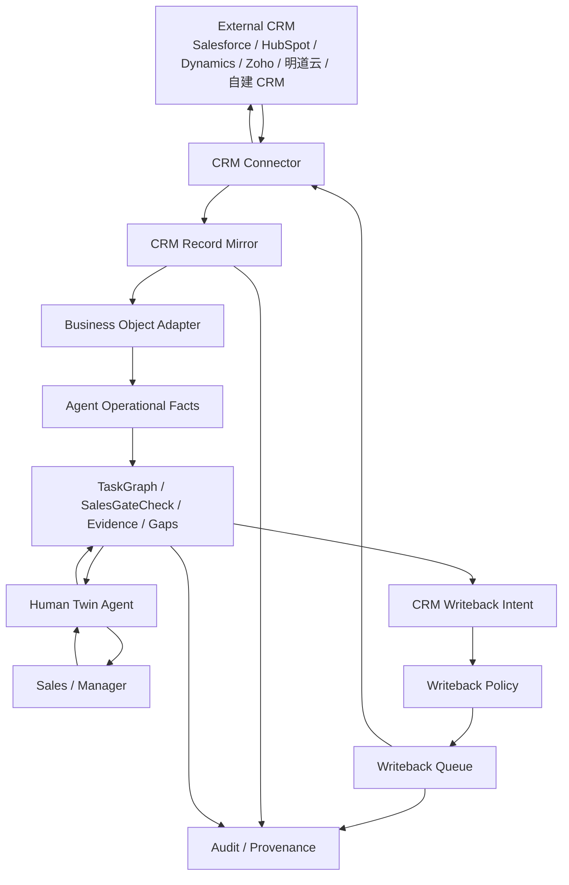

# DEV-32 CRM 事实层对接与双向同步机制

> 状态：研发前集成设计
> 读者：产品、架构、后端、Agent 编排、销售运营、测试
> 依赖：DEV-23、DEV-30、DEV-31
> 核心目的：预留并定义泛化 CRM 接入、反写、冲突处理和事实一致性机制，避免 CRM 事实层与 Agent 事实层分裂。

## 1. 核心结论

AI 原生运营系统不应替代企业已有 CRM。对于销售场景，CRM 通常已经是企业的客户、联系人、商机、金额、阶段、拜访记录、合同附件等业务事实系统。Agent 层要在 CRM 之上管理销售六步法 Gate、信息缺口、证据、建议动作、复盘和任务推进。

因此系统必须采用双事实层设计：

| 事实层 | 职责 | 典型对象 |
|---|---|---|
| CRM 事实层 | 原有业务事实与企业既有流程 | Account、Contact、Opportunity、Activity、Task、Note、Attachment、Amount、Stage、Close Date |
| Agent 运营事实层 | Agent 判断、Gate、证据、缺口、任务图谱和复盘 | TaskGraph、SalesGateCheck、Information Gap、Evidence、SalesActivityRecommendation、Review |

两层不能各自为政。系统必须提供：

- CRM 接入：读取、同步、镜像 CRM 事实。
- CRM 反写：把人类补充、Agent 结构化结果、下一步任务、复盘摘要按策略写回 CRM。
- 字段级事实归属：哪些字段以 CRM 为准，哪些字段以 Agent 为准，哪些需要人工确认。
- 冲突处理：CRM 与 Agent 或人类同时修改时，不静默覆盖。
- 来源可追溯：任何 Agent 判断必须能追溯到 CRM 记录、Evidence 或人工补充。

## 2. 不做什么

| 不做 | 原因 |
|---|---|
| 不把 CRM 阶段直接等同销售六步法 Gate | CRM 阶段可能被手动推进，Gate 必须看证据。 |
| 不默认覆盖 CRM 关键字段 | 金额、阶段、预计成交日、联系人等可能影响经营报表。 |
| 不要求所有 CRM 支持相同对象 | 各 CRM 的字段、权限、自定义能力差异很大。 |
| 不把 Agent 结论只留在 Agent 内部 | 销售仍会回到 CRM 工作，关键摘要和任务需要反写。 |
| 不把所有 Agent 细节都写回 CRM | CRM 不是 Agent 思考日志，反写要克制、可读、可审计。 |

## 3. 总体架构



## 4. 字段级事实归属

默认事实归属如下。实际项目可通过字段映射配置覆盖，但必须显式配置。

| 字段/对象 | 默认事实源 | Agent 可否反写 | 规则 |
|---|---|---|---|
| Account 基础信息 | CRM | 有条件 | 名称、统一社会信用代码等默认不自动覆盖。 |
| Contact 基础信息 | CRM | 有条件 | 新联系人可建议创建，关键职务变更需确认。 |
| Opportunity 金额 | CRM | 需确认 | Agent 可提出更新建议，不默认覆盖。 |
| Opportunity 阶段 | CRM | 需确认 | CRM 阶段可反写，但不能绕过 Gate 证据。 |
| 预计成交日 | CRM | 需确认 | Agent 可基于 Gate 和客户承诺建议更新。 |
| 下一步行动 | Agent + CRM | 可反写 | 可写回 CRM Task/Activity/Next Step。 |
| 拜访纪要 | 人类 + Agent | 可反写 | Human Twin 结构化后写 CRM Note/Activity。 |
| 销售六步法 Gate | Agent | 可反写摘要 | Gate 原始状态保留在 Agent 层，CRM 只写摘要或自定义字段。 |
| Evidence | Agent | 可反写摘要/链接 | 敏感证据不默认全文写回 CRM。 |
| Information Gap | Agent | 可反写任务 | 可写为 CRM Task 或待办。 |
| 报价、订单、SOW | CRM/合同系统/Agent | 需确认 | Agent 可检查和引用，不默认改合同事实。 |

## 5. CRM Connector 能力模型

不同 CRM 的 API 能力差异很大，不能假设都支持自定义对象或强事务。Connector 必须声明能力。

```json
{
  "connector_id": "crm_mingdao_demo",
  "provider": "mingdao",
  "capabilities": {
    "read_objects": ["account", "contact", "opportunity", "activity", "task", "note", "attachment"],
    "write_objects": ["activity", "task", "note"],
    "update_fields": ["opportunity.next_step", "opportunity.close_date"],
    "custom_fields": true,
    "custom_objects": false,
    "webhooks": true,
    "attachments": true,
    "record_url": true,
    "etag_or_version": true
  }
}
```

### 5.1 能力分级

| 等级 | 能力 | 适用情况 |
|---|---|---|
| C0 Read Only | 只能读取 CRM 数据 | 先跑 Agent 分析，不反写。 |
| C1 Notes/Tasks Writeback | 可写 Note、Activity、Task | P1 推荐默认，风险低。 |
| C2 Field Writeback | 可更新机会字段、下一步、预计成交日 | 需字段级策略和确认。 |
| C3 Custom Fields/Object | 可写六步法 Gate 摘要、自定义对象 | 成熟 CRM 集成。 |
| C4 Bidirectional Workflow | 支持 webhook、任务闭环、附件、冲突处理 | 深度集成。 |

P1 不要求所有 CRM 达到 C3/C4，但必须按能力分级降级工作。

## 6. CRM Record Mirror

系统内部必须保留 CRM 记录镜像，而不是每次临时查 CRM 后丢弃。镜像不是替代 CRM，而是 Agent 判断时的可追溯输入快照。

```json
{
  "id": "mirror_opp_001",
  "connection_id": "crm_conn_001",
  "object_type": "opportunity",
  "external_id": "crm_opp_abc123",
  "external_url": "https://crm.example.com/opportunity/crm_opp_abc123",
  "source_updated_at": "2026-05-26T09:30:00+08:00",
  "mirrored_at": "2026-05-26T09:31:00+08:00",
  "version_token": "etag_7788",
  "normalized_refs": {
    "opportunity_id": "opp_demo_001",
    "account_id": "acct_demo_001"
  },
  "raw_hash": "sha256:...",
  "field_snapshot": {
    "name": "ACME 数据智能项目",
    "stage": "Discovery",
    "amount": "500000",
    "close_date": "2026-06-30",
    "next_step": "待确认下一次会议"
  }
}
```

## 7. 同步入口

### 7.1 读取 CRM

| 触发 | 行为 |
|---|---|
| 用户提到客户/机会 | 按客户名、机会名、联系人检索 CRM，创建或刷新镜像。 |
| 定时销售 Routine | 扫描活跃机会、近期拜访、待办和阶段变化。 |
| CRM webhook | 增量同步变更记录。 |
| 周销售报告 | 拉取本周拜访、机会阶段、下一步、金额、预计成交日。 |
| Gate 校验 | 拉取当前机会上下文、活动记录、附件和 CRM 链接。 |

### 7.2 反写 CRM

| 触发 | 可反写内容 | 默认策略 |
|---|---|---|
| Human Twin 整理拜访反馈 | CRM Note/Activity | 可自动写摘要，敏感内容需确认。 |
| Agent 发现下一步行动 | CRM Task/Next Step | 可创建任务；改字段需确认。 |
| Gate 巡检完成 | Gate 摘要、缺口任务 | 优先写 Note/Task；有自定义字段时写字段。 |
| 销售确认客户信息 | Contact/Opportunity 字段 | 需确认后写。 |
| 周销售报告 | 管理摘要和待办 | 默认写管理 Note 或生成文档链接。 |
| Negotiate Close 检查 | CRM 链接、报价/SOW/订单检查状态 | 只写检查结果，不替代合同系统。 |

## 8. CRM Writeback Intent

Agent 不应直接调用 CRM 更新关键字段。它应先生成 `CRM Writeback Intent`，再由策略决定自动、确认或拒绝。

```json
{
  "id": "crm_wbi_001",
  "connection_id": "crm_conn_001",
  "target": {
    "object_type": "opportunity",
    "external_id": "crm_opp_abc123"
  },
  "operation": "create_task",
  "payload": {
    "title": "补充 Discover Gate：确认目标 Champion",
    "due_at": "2026-05-27T18:00:00+08:00",
    "description": "请补充本次互动中谁提问或点评最多、所在部门、是否可能帮助约 EB。"
  },
  "source": {
    "agent_id": "agent_pm_sales_001",
    "task_id": "task_discover_gate_check",
    "gap_id": "gap_discover_champion_001",
    "gate_id": "D-G1",
    "evidence_ids": ["ev_meeting_001"]
  },
  "risk_level": "low",
  "requires_confirmation": false,
  "idempotency_key": "opp_demo_001:D-G1:create_task:2026-05-26"
}
```

## 9. Writeback Policy

| 写回类型 | 默认策略 | 说明 |
|---|---|---|
| 创建 CRM Task | 自动，留审计 | 低风险，便于销售回 CRM 工作。 |
| 创建 CRM Note/Activity 摘要 | 自动或首次确认 | 取决于组织策略和敏感级别。 |
| 更新 next_step | 首次确认，之后可 L2 自动 | 仍需保留原始证据。 |
| 更新 close_date | 需确认 | 影响预测。 |
| 更新 amount | 需确认 | 影响经营报表。 |
| 更新 stage | 需确认 | 必须检查六步法 Gate，不允许仅由 Agent 乐观推进。 |
| 创建联系人 | 需确认 | 避免脏数据。 |
| 上传附件 | 需确认 | 涉及敏感信息和权限。 |
| 写自定义 Gate 字段 | 组织配置后可自动 | 必须是摘要，不是完整推理日志。 |

## 10. 一致性与冲突处理

### 10.1 冲突类型

| 冲突 | 示例 | 处理 |
|---|---|---|
| CRM 新于镜像 | 销售在 CRM 改了阶段 | 刷新镜像，重新计算 Agent Gate 建议。 |
| Agent 建议覆盖 CRM 人工更新 | Agent 建议 close_date，但 CRM 已被经理改过 | 标记冲突，需人确认。 |
| CRM 阶段高于 Gate 质量 | CRM 已到 Proposal，但 Go/No-Go gates 缺 EB 确认 | 不降 CRM 阶段，标记“阶段质量风险”。 |
| CRM 字段缺失但 Agent 有证据 | CRM 无下一步，会议纪要有明确下一步 | 生成 writeback intent。 |
| CRM 不支持字段 | 无自定义 Gate 字段 | 降级写 Note/Task。 |

### 10.2 冲突原则

- CRM 原字段不被静默覆盖。
- 人工明确修改优先于 Agent 建议，但 Agent 可提示风险。
- Agent 派生事实必须保留来源证据和计算时间。
- CRM 阶段与六步法 Gate 不一致时，二者都保留，并在 UI 中显式显示。
- 反写成功后必须读回或记录外部返回 ID，形成闭环。

## 11. 人类补充与调用信息

### 11.1 人类补充信息

人类通过 IM、任务页或 CRM 直接补信息时，系统必须记录来源。

| 来源 | 进入 Agent 层 | 是否反写 CRM |
|---|---|---|
| IM 反馈 | Human Twin 整理为 Evidence | 视策略写 Note/Activity |
| 任务页表单 | Evidence + Information Gap closure | 可写 Note/Task |
| CRM Note | 同步为 CRM Mirror + Evidence 摘要 | 已在 CRM，无需重复写 |
| CRM 字段更新 | 更新 Mirror，触发 Gate 重新计算 | 不重复 |
| 文件/截图 | Evidence，敏感级别标记 | 可写链接或摘要 |

### 11.2 人类调用信息

当销售或经理询问客户/机会时，Agent 回答必须合并：

- CRM 当前事实：客户、联系人、机会、金额、阶段、下一步、活动记录。
- Agent 运营事实：六步法 Gate、缺口、证据、推荐 Activity、风险。
- 记忆与知识：历史互动、行业信息、客户调研。
- 新鲜度提示：哪些信息来自 CRM，最后同步时间是什么；哪些是 Agent 推断。

输出必须避免把 Agent 推断伪装成 CRM 事实。

## 12. Sales Six-Step 与 CRM 映射

| 六步法对象 | CRM 典型落点 | Agent 层保留 |
|---|---|---|
| D-G1 至 D-G7 | Note/Task/自定义字段摘要 | SalesGateCheck、Evidence、Gap |
| S-G1 至 S-G5 | Note/Task/Champion 字段/下一步 | ChampionProfile、SalesGateCheck |
| G-G1 至 G-G4 | Note/Meeting/自定义字段摘要 | EconomicBuyerProfile、Go/No-Go 判断 |
| V-G1 至 V-G3 | Activity/Attachment/POC Task | ValidationPlan、Evidence |
| B-G1 至 B-G4 | Attachment/Note/Procurement Contact/Task | BusinessCase、NegotiationPlan |
| N-G1 至 N-G4 | Quote/Order/SOW/CRM URL/Stage | OrderChecklist、SOWCheck、Evidence |

## 13. Generic CRM Adapter 接口草案

```json
{
  "interface": "GenericCrmAdapter",
  "methods": [
    "describeCapabilities()",
    "describeSchema(objectType)",
    "search(objectType, query)",
    "getRecord(objectType, externalId)",
    "listChanges(objectType, cursor)",
    "createActivity(target, payload, idempotencyKey)",
    "createTask(target, payload, idempotencyKey)",
    "createNote(target, payload, idempotencyKey)",
    "updateFields(target, fields, versionToken, idempotencyKey)",
    "uploadAttachment(target, fileRef, metadata, idempotencyKey)",
    "getRecordUrl(objectType, externalId)"
  ]
}
```

所有写操作必须：

- 支持 `idempotencyKey`。
- 返回外部记录 ID 或错误。
- 写入审计事件。
- 标记是否需要读回验证。

## 14. UI 要求

| UI | 必须显示 |
|---|---|
| CRM Connection | Provider、能力等级、同步状态、最近错误、权限范围。 |
| Opportunity Header | CRM 阶段、Agent 六步法阶段质量、最后同步时间、CRM 链接。 |
| Gate 面板 | Gate 状态、证据、是否已反写 CRM、对应 CRM Task/Note。 |
| Conflict Inbox | CRM 与 Agent 不一致的字段、建议处理动作。 |
| Writeback Queue | 待确认、待执行、成功、失败、重试中的反写任务。 |
| Evidence Review | 是否写回 CRM、写回摘要、敏感级别。 |

## 15. P1/P2/P3 边界

### P1

- 定义 Generic CRM Adapter 接口。
- 支持 CRM 读取与 Record Mirror。
- 支持 Account、Contact、Opportunity、Activity、Task、Note 的最小映射。
- 支持 CRM URL 和 Snapshot 作为 Evidence。
- 支持低风险反写：Task、Note、Activity 摘要。
- 支持 Writeback Intent、Policy、Queue、Audit。
- 支持 CRM 阶段与 SalesGateCheck 不一致的风险提示。

### P2

- 支持字段级反写：next_step、close_date、stage。
- 支持自定义字段写入六步法 Gate 摘要。
- 支持 webhook 增量同步。
- 支持附件和验证文档链接。
- 支持 Conflict Inbox。

### P3

- 支持多 CRM 并存。
- 支持复杂字段映射 UI。
- 支持 CRM 内嵌 Agent 面板。
- 支持跨 CRM 归并和客户主数据治理。

## 16. 测试要求

| 测试 | 断言 |
|---|---|
| CRM 读取 | 同一 external_id 多次同步只更新 mirror，不重复创建业务对象。 |
| 反写幂等 | 同一 idempotency_key 重试不会创建重复任务。 |
| 字段归属 | amount/stage/close_date 未确认不得自动覆盖。 |
| Gate 与 CRM 阶段不一致 | CRM 阶段高但 Gate 缺证据时显示风险，不静默修改 CRM。 |
| 降级能力 | CRM 不支持自定义字段时，写 Note/Task 摘要。 |
| 冲突处理 | version_token 不匹配时进入冲突队列。 |
| 权限 | 未授权用户不能读取或反写敏感 CRM 记录。 |
| 证据来源 | Agent 回答必须区分 CRM 事实、Evidence 和推断。 |

## 17. 对现有文档的约束

- DEV-30 的销售六步法 Gate 是销售阶段质量标准。
- DEV-31 的 SalesGateCheck 是 Agent 层 Gate 事实，不等于 CRM 阶段字段。
- DEV-32 规定 CRM 与 Agent 之间通过 Mirror、Intent、Policy、Queue 和 Audit 保持一致。
- 后续任何销售功能如果读取或写入客户、联系人、机会、活动、任务、报价、SOW、CRM 阶段，都必须说明 CRM 事实归属和反写策略。
