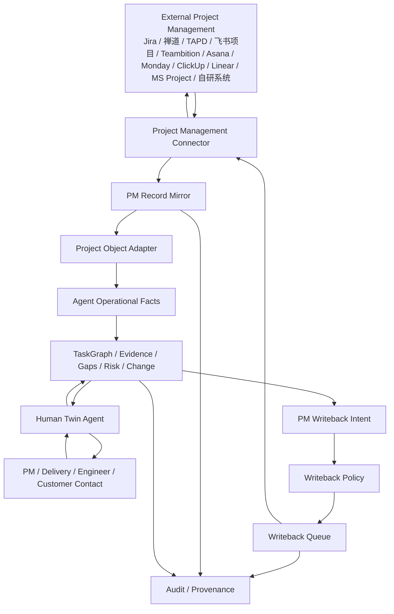

# DEV-33 项目管理事实层对接与双向同步机制

> 状态：研发前集成设计
> 读者：产品、架构、后端、Agent 编排、交付管理、项目经理、测试
> 依赖：DEV-23、DEV-28、DEV-29、DEV-31、DEV-32
> 核心目的：预留并定义泛化项目管理系统接入、反写、冲突处理和事实一致性机制，避免客户原有项目管理事实层与 Agent TaskGraph 事实层分裂。

## 1. 核心结论

AI 原生运营系统不应强行替代企业已有项目管理系统。很多客户已经在 Jira、禅道、TAPD、飞书项目、Teambition、Asana、Monday、ClickUp、Linear、Microsoft Project，或者自研项目管理系统中维护项目、迭代、任务、里程碑、负责人、状态、评论、附件和工时。

Agent 层要做的不是把这些系统重新做一遍，而是在其之上维护“运营判断事实”：范围是否清楚、客户责任是否明确、任务是否有证据、风险是否升级、变更是否经过确认、验收是否满足标准、TaskGraph 是否需要重规划。

因此项目管理系统也必须采用双事实层设计：

| 事实层 | 职责 | 典型对象 |
|---|---|---|
| 项目管理事实层 | 客户或团队已有项目执行事实与既有流程 | Project、Epic、Issue、Task、Subtask、Sprint、Milestone、Assignee、Status、Priority、Dependency、Comment、Attachment、Due Date |
| Agent 运营事实层 | Agent 判断、信息缺口、证据、验收、风险、变更、重规划和复盘 | TaskGraph、Task、Information Gap、Evidence、Risk、Change Request、Acceptance Check、Review |

两层必须一致但不能混同：

- 项目管理接入：读取、同步、镜像外部项目事实。
- 项目管理反写：把 Agent 结构化结论、人类补充、风险提示、待办、纪要和验收摘要按策略写回外部系统。
- 字段级事实归属：哪些字段以外部项目系统为准，哪些字段以 Agent 为准，哪些需要人工确认。
- 冲突处理：外部项目状态、负责人、截止时间和 Agent TaskGraph 不一致时，不静默覆盖。
- 来源可追溯：任何 Agent 判断必须能追溯到外部项目记录、Evidence 或人工补充。

## 2. 与 CRM 对接的共同模式

DEV-32 定义 CRM 与 Agent 的事实一致性机制。项目管理系统应复用同一套外部事实同步模式，而不是另起一套。

| 通用模式 | CRM 专线 | 项目管理专线 |
|---|---|---|
| External System Connection | CRMConnection | PMConnection |
| External Record Mirror | CRMRecordMirror | PMRecordMirror |
| External Writeback Intent | CRMWritebackIntent | PMWritebackIntent |
| Writeback Policy | CRM Writeback Policy | PM Writeback Policy |
| Writeback Queue | CRMWritebackQueue | PMWritebackQueue |
| Field Mapping | CRMFieldMapping | PMFieldMapping |
| Audit / Provenance | CRM Audit | PM Audit |

研发实现时可以先做独立命名，避免过早抽象；但数据模型和接口设计必须能自然收敛到 `ExternalSystemConnection`、`ExternalRecordMirror`、`ExternalWritebackIntent` 这一组通用对象。

## 3. 不做什么

| 不做 | 原因 |
|---|---|
| 不把外部项目状态直接等同 Agent Task 状态 | 外部系统状态常用于协作看板，Agent Task 状态还要看证据、缺口和验收。 |
| 不默认覆盖外部项目系统的负责人、截止时间、优先级 | 这些字段会影响客户或团队既有管理流程。 |
| 不要求所有项目系统支持同一套对象 | Jira、禅道、TAPD、飞书项目和自研系统对象差异很大。 |
| 不把 Agent 的完整推理日志写入外部系统 | 外部项目系统面向协作，不是 Agent 思考记录。 |
| 不让外部项目系统反向驱动所有 TaskGraph 重规划 | 外部状态变化是重要输入，但重规划必须保留原因、证据和版本。 |
| 不把“同步成功”当作“任务完成” | 任务完成必须经过证据或豁免规则，而不是看外部状态文字。 |

## 4. 总体架构



## 5. 字段级事实归属

默认事实归属如下。实际项目可通过字段映射配置覆盖，但必须显式配置。

| 字段/对象 | 默认事实源 | Agent 可否反写 | 规则 |
|---|---|---|---|
| 外部 Project 基础信息 | 项目管理系统 | 有条件 | 名称、归属空间、归档状态默认不自动覆盖。 |
| Epic/需求/模块 | 项目管理系统 + Agent | 需确认 | Agent 可建议拆分或归并，不默认改客户既有结构。 |
| Issue/Task 标题 | 项目管理系统 | 需确认 | Agent 可建议改名或补充上下文。 |
| Issue/Task 描述 | 项目管理系统 + Agent | 有条件 | 低风险补充验收标准或背景可写摘要，高风险需确认。 |
| Assignee | 项目管理系统 | 需确认 | Agent 可建议更换负责人，不默认覆盖。 |
| Status | 项目管理系统 | 需确认 | 外部状态可反写，但不能绕过 Agent Evidence 和 Acceptance Check。 |
| Priority | 项目管理系统 | 需确认 | Agent 可基于关键路径和风险建议调整。 |
| Due Date | 项目管理系统 | 需确认 | 影响团队承诺和客户预期，默认需确认。 |
| Comment | Agent + 人类 | 可反写 | 可写入摘要、风险、缺口请求和验收结论。 |
| Attachment / Link | Agent + 项目管理系统 | 有条件 | 可写 Evidence 链接，敏感附件需确认。 |
| Sprint / Iteration | 项目管理系统 | 需确认 | Agent 可建议挪动，不默认改迭代归属。 |
| Milestone | 项目管理系统 + Agent | 需确认 | Agent 可建议风险提示或检查项。 |
| Dependency | Agent + 项目管理系统 | 有条件 | Agent 内部依赖保留在 TaskGraph；外部依赖只写可读摘要或系统支持的依赖字段。 |
| Acceptance Criteria | Agent | 可反写摘要 | Agent 原始验收规则保留在 Agent 层，可写到外部描述或评论。 |
| Information Gap | Agent | 可反写任务/评论 | 可写为评论、子任务或待办。 |
| Evidence | Agent | 可反写摘要/链接 | 敏感证据不默认全文写回。 |
| Risk / Change Request | Agent + 项目管理系统 | 有条件 | 可创建风险评论、标签或任务；变更执行需确认。 |

## 6. Project Management Connector 能力模型

不同项目管理系统 API 能力差异极大。Connector 必须声明能力，而不是假设所有系统都能创建字段、接收 webhook 或维护复杂依赖。

```json
{
  "connector_id": "pm_jira_demo",
  "provider": "jira",
  "capabilities": {
    "read_objects": ["project", "epic", "issue", "subtask", "sprint", "milestone", "comment", "attachment"],
    "write_objects": ["comment", "subtask"],
    "update_fields": ["issue.description", "issue.labels"],
    "custom_fields": true,
    "custom_objects": false,
    "webhooks": true,
    "attachments": true,
    "record_url": true,
    "etag_or_version": true,
    "dependency_links": true
  }
}
```

### 6.1 能力分级

| 等级 | 能力 | 适用情况 |
|---|---|---|
| P0 Read Only | 只能读取项目、任务、评论、附件 | 先做 Agent 分析，不反写。 |
| P1 Comments/Links Writeback | 可写评论、Evidence 链接、风险摘要 | 首批推荐默认，风险低。 |
| P2 Task/Subtask Writeback | 可创建外部任务或子任务 | 可把 Information Gap、整改项、客户责任写回。 |
| P3 Field Writeback | 可更新描述、标签、优先级、截止时间、状态 | 需字段级策略和确认。 |
| P4 Workflow Integration | 支持 webhook、状态流、依赖、附件、冲突处理 | 深度集成。 |
| P5 Embedded Agent Panel | 可在外部系统内嵌 Agent 面板 | 成熟客户或高频交付团队。 |

P1 不要求所有项目管理系统达到 P3/P4，但必须按能力分级降级工作。自研项目管理系统至少应支持 P0/P1 的 HTTP 或数据库只读镜像方案。

## 7. PM Record Mirror

系统内部必须保留外部项目管理记录镜像。镜像不是替代外部系统，而是 Agent 判断时的可追溯输入快照。

```json
{
  "id": "pm_mirror_issue_001",
  "connection_id": "pm_conn_001",
  "provider": "jira",
  "object_type": "issue",
  "external_id": "ACME-128",
  "external_url": "https://pm.example.com/browse/ACME-128",
  "source_updated_at": "2026-05-26T10:20:00+08:00",
  "mirrored_at": "2026-05-26T10:21:00+08:00",
  "version_token": "etag_9911",
  "normalized_refs": {
    "project_id": "delivery_project_001",
    "task_id": "task_env_access_check"
  },
  "raw_hash": "sha256:...",
  "field_snapshot": {
    "title": "确认客户测试环境 VPN 权限",
    "status": "In Progress",
    "assignee": "li_si",
    "priority": "High",
    "due_date": "2026-05-29",
    "labels": ["customer-blocker", "access"]
  }
}
```

### 7.1 镜像粒度

| 外部对象 | Agent 标准映射 | 说明 |
|---|---|---|
| Project / Space | Work Unit / Project | 外部项目通常对应一个交付项目或客户空间。 |
| Epic / Feature | Delivery Scope / Change Request / TaskGroup | 可能是范围，也可能是变更，需按上下文判断。 |
| Issue / Task | Task 或业务引用 | 不能简单一一等同，Agent Task 还包含证据和验收。 |
| Subtask | Task / Assignment | 可映射为 TaskGraph 子任务或外部子任务引用。 |
| Sprint / Iteration | Run 或时间窗口 | 取决于客户使用方式。 |
| Milestone | Project Milestone / Acceptance Gate | 可触发验收、付款或风险检查。 |
| Comment | Evidence / Interaction | 评论可成为证据，但需要保留作者和时间。 |
| Attachment | Evidence / Deliverable | 附件可作为交付物或证据。 |
| Dependency / Link | Dependency / External Dependency | 如果外部系统支持依赖，需同步为 Agent 可解释依赖。 |

## 8. 同步入口

### 8.1 读取项目管理系统

| 触发 | 行为 |
|---|---|
| 用户提到项目/任务 | 按项目名、任务号、标题、负责人检索外部系统，创建或刷新镜像。 |
| 交付 Routine | 扫描活跃项目、逾期任务、阻塞标签、近期评论、里程碑变化。 |
| 外部 webhook | 增量同步任务状态、评论、附件、负责人和截止时间变化。 |
| TaskGraph 生成 | 拉取外部项目任务和里程碑作为初始上下文。 |
| 验收/风险检查 | 拉取相关任务、评论、附件、外部链接和最近状态。 |
| 周交付报告 | 拉取本周完成、逾期、阻塞、变更、风险和客户评论。 |

### 8.2 反写项目管理系统

| 触发 | 可反写内容 | 默认策略 |
|---|---|---|
| Human Twin 整理现场反馈 | Comment / Attachment Link | 可自动写摘要，敏感内容需确认。 |
| Agent 发现 Information Gap | Comment / Subtask / Task | 评论可自动；创建任务按组织策略。 |
| Agent 发现风险 | Comment / Label / Risk Task | 低风险评论可自动；改优先级需确认。 |
| 任务验收完成 | Comment / Evidence Link / Status Suggestion | 写验收摘要；改外部状态需确认。 |
| 交付物提交 | Attachment Link / Comment | 写链接和摘要，附件上传需确认。 |
| 变更识别 | Change Task / Comment | 可创建变更草稿，执行需确认。 |
| 周交付报告 | Summary Comment / Report Link | 默认写项目级摘要或报告链接。 |

## 9. PM Writeback Intent

Agent 不应直接调用外部项目管理系统更新关键字段。它应先生成 `PM Writeback Intent`，再由策略决定自动、确认或拒绝。

```json
{
  "id": "pm_wbi_001",
  "connection_id": "pm_conn_001",
  "target": {
    "object_type": "issue",
    "external_id": "ACME-128"
  },
  "operation": "create_comment",
  "payload": {
    "body": "Agent 验收发现仍缺客户 VPN 测试账号截图。请现场同事补充：账号申请单、VPN 登录成功截图、客户 IT 确认人。"
  },
  "source": {
    "agent_id": "agent_pm_delivery_001",
    "task_id": "task_env_access_check",
    "gap_id": "gap_vpn_access_evidence_001",
    "evidence_ids": ["ev_kickoff_minutes_001"]
  },
  "risk_level": "low",
  "requires_confirmation": false,
  "idempotency_key": "delivery_project_001:ACME-128:gap_vpn_access:create_comment:2026-05-26"
}
```

## 10. Writeback Policy

| 写回类型 | 默认策略 | 说明 |
|---|---|---|
| 创建 Comment | 自动，留审计 | 低风险，便于团队在原系统继续协作。 |
| 写 Evidence 链接 | 自动或首次确认 | 取决于敏感级别和访问权限。 |
| 创建 Subtask/Task | 首次确认，之后可 L2 自动 | 避免外部系统出现大量重复任务。 |
| 更新 Description | 需确认 | 可能改变客户或团队对任务范围的理解。 |
| 更新 Status | 需确认 | 不能绕过 Agent 证据和外部流程。 |
| 更新 Assignee | 需确认 | 影响责任归属。 |
| 更新 Due Date | 需确认 | 影响承诺和客户预期。 |
| 更新 Priority | 需确认 | 影响团队排序。 |
| 上传 Attachment | 需确认 | 涉及敏感信息和权限。 |
| 写自定义字段 | 组织配置后可自动 | 必须是摘要，不是完整推理日志。 |

## 11. 一致性与冲突处理

### 11.1 冲突类型

| 冲突 | 示例 | 处理 |
|---|---|---|
| 外部系统新于镜像 | PM 在 Jira 改了任务状态 | 刷新镜像，重新计算 Agent 验收和风险建议。 |
| Agent 建议覆盖人工更新 | Agent 建议延期，但外部 due date 已被经理改过 | 标记冲突，需人确认。 |
| 外部状态高于 Agent 证据质量 | 外部任务已 Done，但缺交付物或客户确认 | 不改外部状态，标记“完成质量风险”。 |
| Agent TaskGraph 认为已完成但外部仍未完成 | Agent 有 Evidence，但外部状态仍 In Progress | 生成 writeback intent 或提醒 PM 处理。 |
| 外部负责人和 Agent 责任人不同 | Jira assignee 是张三，TaskGraph assignment 是李四 | 显示双责任，不静默合并。 |
| 外部依赖缺失但 TaskGraph 有依赖 | Agent 发现 A 阻塞 B，但外部系统无依赖字段 | 写评论摘要或标签，外部字段按能力降级。 |
| 外部系统不支持字段 | 自研系统没有评论 API | 降级为系统内提醒、报告链接或只读镜像。 |

### 11.2 冲突原则

- 外部项目系统原字段不被静默覆盖。
- 人工明确修改优先于 Agent 建议，但 Agent 可提示风险。
- Agent 派生事实必须保留来源证据和计算时间。
- 外部状态与 Agent Task 状态不一致时，二者都保留，并在 UI 中显式显示。
- 反写成功后必须读回或记录外部返回 ID，形成闭环。
- 对客户自研系统，若缺少版本号或 etag，必须使用 `raw_hash + source_updated_at` 做弱冲突检测。

## 12. 人类补充与调用信息

### 12.1 人类补充信息

人类通过 IM、任务页或外部项目管理系统直接补信息时，系统必须记录来源。

| 来源 | 进入 Agent 层 | 是否反写外部项目系统 |
|---|---|---|
| IM 反馈 | Human Twin 整理为 Evidence | 视策略写 Comment/Task。 |
| 任务页表单 | Evidence + Information Gap closure | 可写 Comment/Task。 |
| 外部 Comment | 同步为 PM Mirror + Evidence 摘要 | 已在外部系统，无需重复写。 |
| 外部字段更新 | 更新 Mirror，触发验收/风险重新计算 | 不重复。 |
| 文件/截图 | Evidence，敏感级别标记 | 可写链接或摘要。 |
| 现场信息 | Evidence + Risk/Gap 判断 | 可写现场摘要。 |

### 12.2 人类调用信息

当项目经理、交付负责人或执行者询问项目时，Agent 回答必须合并：

- 外部项目事实：项目、任务、负责人、状态、优先级、截止时间、评论、附件、外部链接。
- Agent 运营事实：TaskGraph、依赖、信息缺口、证据、验收、风险、变更、重规划原因。
- 人类现场事实：IM、现场照片、会议纪要、客户确认。
- 新鲜度提示：哪些信息来自外部项目系统，最后同步时间是什么；哪些是 Agent 推断。

输出必须避免把 Agent 推断伪装成外部项目系统事实。

## 13. 交付故事与项目系统映射

| 交付故事 | 外部项目系统典型落点 | Agent 层保留 |
|---|---|---|
| PD-01 创建交付 Project | Project / Space / Board | Work Unit、Delivery Project、Run |
| PD-08 需求采集任务 | Issue / Task / Form Link | Information Gap、Evidence、Requirement |
| PD-09 现场/环境采集 | Comment / Attachment / Subtask | Evidence、现场信息 schema、Risk |
| PD-13 生成交付 TaskGraph | Epic / Issue / Milestone | TaskGraph、Dependency、Acceptance Criteria |
| PD-20 进度采集 | Comment / Status / Timesheet | Evidence、Risk、Progress Summary |
| PD-21 交付物提交 | Attachment / Link / Comment | Deliverable、Evidence |
| PD-22 Agent 质量检查 | Comment / Label / Review Task | Acceptance Check、缺陷、补充任务 |
| PD-27 范围蔓延识别 | Change Issue / Comment | Change Request、Impact Analysis |
| PD-29 延期风险 | Risk Label / Comment / Escalation Task | Risk、Replan、Escalation |
| PD-33 预验收检查 | Milestone / Checklist Issue | Acceptance Checklist、Evidence |
| PD-35 正式验收 | Acceptance Task / Attachment | Acceptance Result、Payment Trigger |
| PD-40 项目复盘 | Report Link / Project Comment | Review、Template Candidate、Skill Candidate |

## 14. 自研项目管理系统适配

客户自研系统不能被当成“特殊例外”，而应通过同一套 Generic Project Management Adapter 接入。

### 14.1 最低接入方式

| 方式 | 适用条件 | 风险 |
|---|---|---|
| REST API | 自研系统有接口和 token | 最优先，支持增量和反写。 |
| Webhook | 自研系统可推送变更 | 适合增量同步，仍需补读接口。 |
| Database View | 客户允许读只读视图 | 只能读，不建议直接写库。 |
| Export File | 周期导出 CSV/Excel/JSON | 可做 P0 镜像，实时性弱。 |
| RPA/页面抓取 | 无接口但页面稳定 | 仅作兜底，风险高，需客户确认。 |

### 14.2 自研系统映射配置

```json
{
  "provider": "custom_pm",
  "connection_id": "pm_conn_custom_001",
  "object_mapping": {
    "project": "project_master",
    "task": "project_task",
    "comment": "task_comment",
    "attachment": "task_file"
  },
  "field_mapping": {
    "task.external_id": "task_id",
    "task.title": "task_name",
    "task.status": "status_code",
    "task.assignee": "owner_user_id",
    "task.due_date": "planned_finish_date",
    "task.updated_at": "last_modified_at"
  },
  "status_mapping": {
    "10": "todo",
    "20": "in_progress",
    "30": "blocked",
    "40": "done"
  },
  "writeback_allowed": ["comment.create"],
  "version_field": "last_modified_at"
}
```

## 15. Generic Project Management Adapter 接口草案

```json
{
  "interface": "GenericProjectManagementAdapter",
  "methods": [
    "describeCapabilities()",
    "describeSchema(objectType)",
    "search(objectType, query)",
    "getRecord(objectType, externalId)",
    "listChanges(objectType, cursor)",
    "listChildren(parentRef)",
    "listComments(target)",
    "listAttachments(target)",
    "createComment(target, payload, idempotencyKey)",
    "createTask(parentRef, payload, idempotencyKey)",
    "createSubtask(parentRef, payload, idempotencyKey)",
    "updateFields(target, fields, versionToken, idempotencyKey)",
    "uploadAttachment(target, fileRef, metadata, idempotencyKey)",
    "getRecordUrl(objectType, externalId)"
  ]
}
```

所有写操作必须：

- 支持 `idempotencyKey`。
- 返回外部记录 ID 或错误。
- 写入审计事件。
- 标记是否需要读回验证。
- 记录外部系统能力降级原因。

## 16. UI 要求

| UI | 必须显示 |
|---|---|
| PM Connection | Provider、能力等级、同步状态、最近错误、权限范围、只读/可写状态。 |
| Project Header | 外部项目状态、Agent 项目健康度、最后同步时间、外部链接。 |
| Task Detail | 外部任务状态、Agent Task 状态、证据、缺口、验收、冲突提示。 |
| Delivery Control Lens | 范围、里程碑、风险、变更、验收、外部系统链接。 |
| Information Gap Inbox | 是否已写外部评论或子任务、外部记录链接。 |
| Conflict Inbox | 外部项目系统与 Agent 不一致字段、建议处理动作。 |
| Writeback Queue | 待确认、待执行、成功、失败、重试中的反写任务。 |
| Evidence Review | 是否写回外部系统、写回摘要、敏感级别。 |
| Admin Integration | 字段映射、状态映射、权限、webhook、降级策略。 |

## 17. P1/P2/P3 边界

### P1

- 定义 Generic Project Management Adapter 接口。
- 支持项目管理系统读取与 Record Mirror。
- 支持 Project、Issue/Task、Comment、Attachment、Milestone 的最小映射。
- 支持外部 URL 和 Snapshot 作为 Evidence。
- 支持低风险反写：Comment、Evidence Link、风险摘要。
- 支持 PM Writeback Intent、Policy、Queue、Audit。
- 支持外部任务状态与 Agent Task 状态不一致的风险提示。
- 支持自研系统 P0/P1 接入：只读镜像或评论级反写。

### P2

- 支持创建外部 Task/Subtask。
- 支持字段级反写：description、labels、priority、due_date、status。
- 支持 webhook 增量同步。
- 支持附件上传和交付物链接。
- 支持 Conflict Inbox。
- 支持 Jira、禅道、TAPD、飞书项目中的至少两个深度适配器。

### P3

- 支持多项目管理系统并存。
- 支持复杂字段映射 UI 和状态流映射。
- 支持外部系统内嵌 Agent 面板。
- 支持跨系统任务归并、客户项目主数据治理和资源统一视图。

## 18. 测试要求

| 测试 | 断言 |
|---|---|
| 项目系统读取 | 同一 external_id 多次同步只更新 mirror，不重复创建业务对象。 |
| 反写幂等 | 同一 idempotency_key 重试不会创建重复评论或任务。 |
| 字段归属 | status/assignee/due_date/priority 未确认不得自动覆盖。 |
| 外部 Done 但缺证据 | 外部状态完成但 Evidence 缺失时显示完成质量风险。 |
| Agent 完成但外部未完成 | 生成 writeback intent 或提醒，不静默改外部状态。 |
| 降级能力 | 外部系统不支持字段时，写 Comment 或系统内提醒。 |
| 自研系统弱版本 | 没有 etag 时使用 raw_hash/source_updated_at 检测冲突。 |
| 权限 | 未授权用户不能读取或反写敏感项目记录。 |
| 证据来源 | Agent 回答必须区分外部项目事实、Evidence 和推断。 |

## 19. 对现有文档的约束

- DEV-31 的 TaskGraph 是 Agent 运营事实中心，不等于外部项目系统的 issue/task 列表。
- DEV-33 规定项目管理系统与 Agent 之间通过 Mirror、Intent、Policy、Queue 和 Audit 保持一致。
- 后续任何交付功能如果读取或写入外部项目、任务、里程碑、状态、负责人、截止时间、评论、附件，都必须说明项目管理事实归属和反写策略。
- CRM 与项目管理系统都属于 External Fact Sync 的具体专线；销售场景优先遵守 DEV-32，交付和项目执行场景优先遵守 DEV-33。
