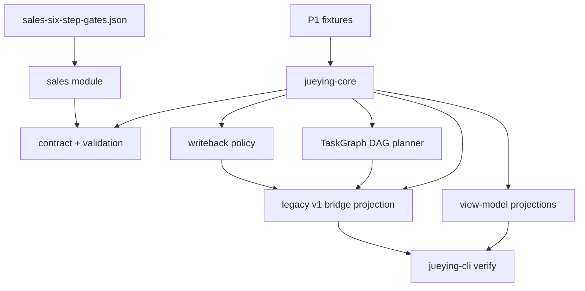

# Rust Architecture

Rust mainline starts from the executable business core, not from the historical v1 service tree.

Key split:

- `TaskGraph` remains the domain execution graph.
- Legacy `workflow_plan.stage_chain` is only an adapter projection.
- The DAG planner is not a passive formatter: it rejects duplicate dependencies, dangling dependencies, duplicate task ids, cycles, and execution states that outrun unresolved prerequisites.
- Current executable enums are authoritative for Rust v0.1.
- Future state-machine vocabulary requires schema versioning before entering Rust enums.
- Management Command Center projection keeps the JS mainline operating surface while enforcing identity and ownership: unknown active users get no fallback role, and commands/tasks must reference each other reciprocally.
- External writeback policy is recomputed during validation; stored `policy_decision` may be more conservative, but not more permissive than the computed policy.
- Sales Gate fixture verification is tied to the authoritative gate model, not just the `D-G1` style id pattern.
- Legacy bridge preview uses checked projection: validate TaskGraph first, then linearize the DAG with an explicit lossy projection note for the v1 workflow adapter.
- Bridge parity tests lock `subject_ref`, snake_case writeback policy decisions, and audit results against the current JS adapter semantics.
