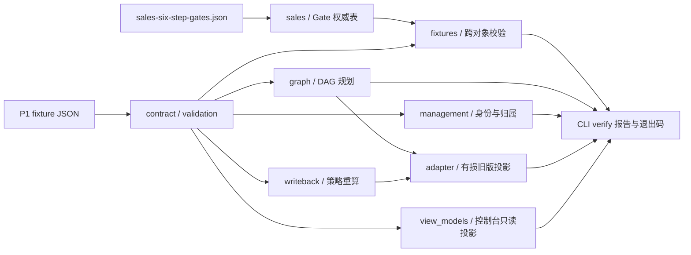

# Rust 架构与边界

本目录是独立的、可执行的业务内核迁移，不是旧版 v1 服务树的 Rust 复刻，也尚未替换 JS/MJS 的 Ops Console 与 HTTP 运行时。当前工作区为 `jueying-core`（纯业务规则与投影）和 `jueying-cli`（读取 P1 fixture 并验证）；CLI 不派发真实任务，也不写外部系统。

```mermaid
flowchart LR
  F["P1 fixture JSON"] --> C["contract / validation"]
  G["sales-six-step-gates.json"] --> S["sales / Gate 权威表"]
  C --> D["graph / DAG 规划"]
  C --> P["writeback / 策略重算"]
  C --> M["management / 身份与归属"]
  S --> V["fixtures / 跨对象校验"]
  C --> V
  D --> B["adapter / 有损旧版投影"]
  P --> B
  V --> Q["CLI verify 报告与退出码"]
  D --> Q
  M --> Q
  B --> Q
  C --> W["view_models / 控制台只读投影"]
  W --> Q
```

## 规则归属

| 层 | 当前责任 | 不应承担的责任 |
|---|---|---|
| `contract` / `validation` | 当前 JSON 合同的类型、字段和局部语义 | 把未来状态机直接加入 v0.1 枚举 |
| `graph` | 校验 Task ID、依赖、环与依赖状态；生成拓扑顺序、并行层、阻塞关系 | 为了旧版 `stage_chain` 改写业务 DAG |
| `sales` / `fixtures` | Gate 权威表与 P1 跨对象引用检查 | 以 ID 前缀代替 Gate 权威表校验 |
| `writeback` | 从意图内容重新计算策略并拒绝更宽松的存储决策 | 信任外部传入的 `policy_decision` 作授权依据 |
| `management` / `view_models` | 校验角色身份、命令与任务双向归属；构建只读角色视图 | 将未知用户降级为默认管理者 |
| `adapter` | 在通过合同检查后将 DAG 拓扑投影成旧版线性 payload | 把线性 payload 当作 TaskGraph 的真相源 |

图谱箭头表示**逻辑数据流**（来源 → 消费者），不是 Rust 函数调用方向。例如 adapter 在调用时会请求 graph 规划，但消费的是 graph 的拓扑结果。旧版线性化会丢失并行语义，只有 `TaskGraph` 保留依赖与并行层。

验证边界：CLI 汇总合同错误并以非零状态退出，`--json` 读取/规划失败也输出 `ok:false` 和错误信息；`TaskGraph` 的 checked projection 会先检查图。桥接 preview 对 TaskGraph、Gap、Evidence、Writeback Intent、引用与决策 ID 做整体预检，发现问题时 `ok:false` 且四类 payload 均为空。单独导出的低层投影函数仍允许直接调用，调用者不能绕过预检把其返回值当作可派发结果。

反写决策分为计算建议和最终决定。Rust 与 JS 桥接都用 `intent_id` 关联两者，拒绝重复、未知、缺失或比重算策略更宽松的决定；审计投影保留最保守的有效决定。销售 Gate 的证据需同时匹配商机和权威 Gate 要求的类型，TaskGraph 也不允许一个任务借用另一个任务的证据或缺口证据。反写来源如果声明 `source.task_id`，其证据必须属于同一任务；不声明任务时才表示跨任务汇总。管理任务的最新更新必须归属于同一任务，并且是该任务按严格 RFC3339 时间排序的最新记录；时间无效或更新 ID 重复时失败关闭。

## 部署与迁移边界

当前验证链是 `npm run verify` → Rust 格式/Clippy/测试 → Rust CLI fixture 验证 → JS 测试与应用冒烟。CLI 结果是离线合同证据，不等于在线 v1 服务、真实 CRM/项目系统连接、权限执行或数据库持久化已验证。在线联调脚本先完成 bridge preview 且确认 `ok:true`，再检查服务健康状态并发送请求；预检失败时零请求、零派发。

下一步应建立字段级 JS/Rust golden parity、JSON Schema 双向对比、随机 DAG/状态迁移测试；要替换 JS 运行时，还须设计持久化事务、幂等与并发控制、鉴权和真实连接器的失败重试。图谱中的 `status: planned` 表示目标而非现有服务。
